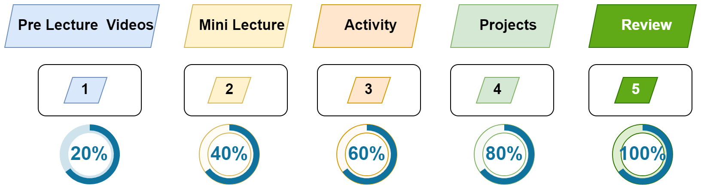

# This Week in Brief

> [!IMPORTANT]  
> - [Homework](./material/Homework.md) for this Week.
> - About Privacy
> - [Team Formation](./material/teams.md)
> - [9 Proven Time Management Techniques and Tools](https://www.usa.edu/blog/time-management-techniques/)
> - Advices from past participants
>   - [Translated](./material/feedback-translated.md)
>   - [Original](./material/feedback-original.md)
> - [Effective prompt for learning with an LLM](https://gist.github.com/Dowwie/5a66cd8df639e4c98043fc7f507dab9e)
> - [Bug Bounty](./material/bug-bounty.md)

---

> [!NOTE]  
> - Tentative Timeline per session
>   - Mini lecture (~35min)
>   - Group / Pair programming `+ Break` (~50min)
>   - Mini lecture (~35min)
>   - Group / Pair programming (~35min)

----

> [!TIP] 
> - Zoom Recordings
> - [How Stanford Teaches AI-Powered Creativity (13min)](https://youtu.be/wv779vmyPVY?feature=shared&t=185)
> - Tools for Developers
>   - [Web utilities for developers, designers, and creators](https://webutils.io/about)
>   - [Developer Cheat Sheets](https://www.devsheets.io/)
>   - [Design Resources For Developers](https://github.com/bradtraversy/design-resources-for-developers)
> - [Free GitHub Pro account for verified learners](https://github.com/education)

----

### How You'll Learn in This Course

We'll follow a 5-step learning cycle as shown in the figure below:

1. **Watch Pre-Lecture Videos**: Get a 20% grasp of the topic.
2. **Mini Lecture**: Increase your understanding to 40%.
3. **Pair Programming**: Collaborate to reach 60% comprehension.
4. **Apply Knowledge to the Project**: Deepen your understanding to 80%.
5. **Extra Digging**: Achieve full mastery, bringing your understanding to 100%.

----
## Topics

### Wednesday Morning:

- **Tools**: Set up your computer with essential tools: Node.js, npm, Git and Visual Studio Code.
  - [Summary](./material/unified-setup.md)
- **Review Linux Commands**: Review basic Linux commands to navigate your system efficiently.
  - [Summary](./material/Linux.md)
  - [Activity](./material/Linux-activity.md)
- **Node Modules**: We will cover custom and built-in modules. Third-party modules will be discussed in the afternoon session.
  - [Summary](./material/node.md)
  - [Activity](./material/node-activity.md)  
- **JavaScript**:  Review some basics in JavaScript such as `Basics & Types`, `Objects` and `Functions & Arrow functions`.
  - [Summary](./material/JS.md)
  - [Activity](./material/JS-activity.md)

### Wednesday Afternoon:

- **Start with Git and GitHub**: Connect to GitHub from within Visual Studio Code.
  - [Summary](./material/github.md)
  - [Activity](./material/github-activity.md)
- **Explore npm Packages**: Discover npm packages, which act as building blocks for your projects.
  - [Summary](./material/npm.md)
  - [Activity](./material/npm-activity.md)
- **Introduction to Express.js**: Introduction to Express.js, build a basic server, and an overview of HTTP requests and responses.
  - [Summary](./material/express.md)
  - [Activity](./material/express-activity.md)
  

### Friday Morning: 

- ~~Reveal/Drawio~~
- [Zoom Recordings](https://metropoliafi-my.sharepoint.com/:f:/g/personal/samiben_metropolia_fi/IgBYnOeLH9e5SJLiDkoqxQagAQmjHsqltbXFOoC_GZsXulU)
- Announcements:
  - [Homework for week2](https://github.com/tx00-web-en/Learning-Material-And-Tasks/blob/week2/material/Homework.md)
- **Introduction to Agile and Scrum**: Understand how to work as a team to build software using Agile and Scrum methodologies.
  - [Summary](./material/scrum.md)
  - [Activity](./material/scrum-activity.md)
  - [Slides](./material/scrum.pdf)
- **Sprint 1**
  - [Project Ideas](./material/project-ideas.md)
  - [UI & AI](./material/UI.md)
  - [Sprint 1: Deadline 2025-11-07](https://github.com/tx00-web-en/Project/)
  - [Agenda for Team Meeting](./material/group-agenda.md)  
  - [Activity](./material/scrum-activity2.md)
  
### Friday Afternoon (13:00-16:00):

- You will have an autonomous group session.
- Brainstorm to decide on a project idea and begin Sprint 1 planning. Here are [**examples to inspire your group**](./material/project-ideas.md) — you may use one as‑is, adapt it, or take it in a completely new direction.
- [Agenda for Team Meeting](./material/group-agenda.md)

---
### Friday Afternoon (Optional - 16:00-19:00):

- **Explore npm Packages**: Discover npm packages, which act as building blocks for your projects.
  - [Summary](./material/npm.md)
  - [Activity](./material/npm-activity.md)  
- **Git Basics**: Learn how to use Git to track changes in your code.
  - [Summary](./material/github.md)
  - [Activity](./material/github-activity2.md)

<!-- 
Metropolia  PRE-INCUBATOR/yrityshautomo
https://turbiini.net/
https://turbiini.net/3149-2/
https://www.linkedin.com/company/turbiini-campus-incubator
-->
<!-- design templates: https://www.phlox.pro/ -->

<!-- 
- [The many, many, many JavaScript runtimes of the last decade](https://buttondown.com/whatever_jamie/archive/the-many-many-many-javascript-runtimes-of-the-last-decade/) 
- [Startup ideas YouTube channel](https://www.youtube.com/@GregIsenberg/videos)
- Pair programming begins in Week 3. You’ll be paired with different classmates to work on projects and benefit from each other’s strengths.
-->

<!-- 

> [!NOTE]  
> Highlights information that users should take into account, even when skimming.

> [!TIP]
> Optional information to help a user be more successful.

> [!IMPORTANT]  
> Crucial information necessary for users to succeed.

> [!WARNING]  
> Critical content demanding immediate user attention due to potential risks.

> [!CAUTION]
> Negative potential consequences of an action. 

-->