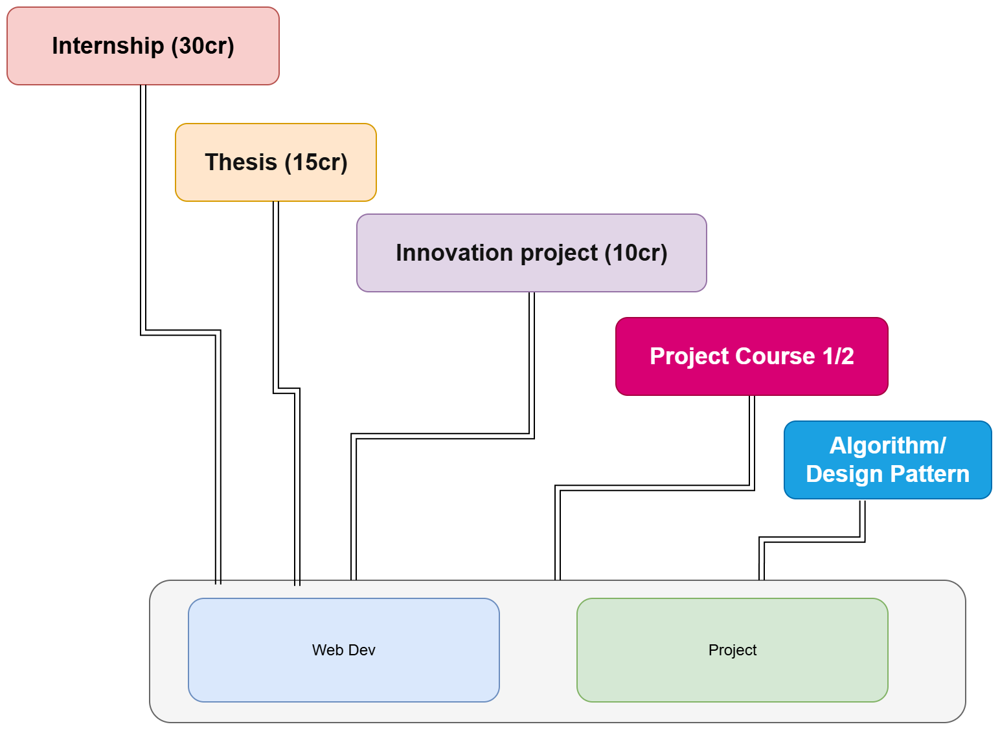
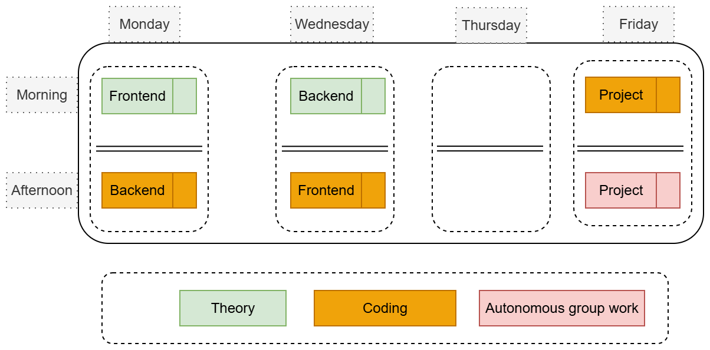

# About the web course(s)

- [WHY?]  - Benefits
- What?
- How?

---
## Intro

- Grades past course(s)
- Advices from past participants
  - [Translated](./material/feedback-translated.md)
  - [Original](./material/feedback-original.md)
- [Demo Projects](./material/img/gr7.png)
- Showcase
  - [eCommerce Platform ](https://github.com/bradtraversy/proshop-v2)
  - [Full Stack React Projects](https://github.com/PacktPublishing/Full-Stack-React-Projects-Second-Edition)
  - More
    - [Jobify]
    - [Next.JS]
    - [Gatsby.JS]
    - [Misc.]
    - [JavaScript Mastery]

<!-- - [Google for Startups](https://startup.google.com/) -->
<!-- - Reflection journals 6 vs 3 -->

### Industry's Global Demand

- Web development knows no borders
- Companies receive applications worldwide
- Competence on a global stage

### Transition to Industry 5.0

- Industry shift from 4.0 to 5.0
- Changes in education and teaching role
- Emphasis on productivity and adaptability
- Integration of AI for productivity boost
- [Use of AI in the course: copilot / ChatGPT]

----
## [Benefits](./material/description.md#competence-after-finishing-the-course)

- Competence
- [Financial Opportunities](https://careerfoundry.com/en/blog/web-development/full-stack-developer-salary-guide/)
  - [Over 7,000 open positions](https://www.indeed.com/jobs?q=full+stack+developer&l=usa&vjk=b9da5da96494bee5)
  - [Salary](https://www.indeed.com/career/full-stack-developer/salaries?from=top_sb)
  - [How to negotiate your full-stack developer salary](https://www.salaryexpert.com/)
- Exceptional Value e.g. [Bootcamp: EDX](https://www.edx.org/boot-camps/coding)
- Soft skills
- Backbone for other courses/Internship
<!--  -->

------
## [Roadmap](./material/description.md#session-2)

- Roadmap BE
- Roadmap FE
- [Roadmap FS](https://roadmap.sh/full-stack)
- DevOps
- Security
- `Fullstack web` vs [Fullstack ML](https://fullstackdeeplearning.com/)

<!-- Full stack developers need to integrate AI-driven solutions into applications, from personalized recommendations to chatbots. Familiarity with AI libraries and frameworks will become increasingly important for developers aiming to enhance user engagement. -->

----

## [Course Dynamics](./material/course-dynamics.md)

- A balanced approach:
  - **One foot in industry:** Real-world applications and practical skills
  - **One foot academia:** A solid foundation in theories and concepts
- Schedule
- Optional Sessions
- Important Dates
- [5-step learning cycle](./material/course-dynamics.md#1-flipped-classroom-approach)
- Grading
- [Self Assessment](./material/self-assesment.xlsx)
- Challenges
  - Fast paced
  - Different paradigm e.g. functional programming
  - Comfort zone vs rock the boat
- **Group Formation**: *Find your circle*, *like minded link*, etc.
  - [Questions](./material/group-q.md)
  - [Analysis](./material/group-analysis.md)
- `Time Management Techniques`
  - [9 Proven Time Management Techniques and Tools](https://www.usa.edu/blog/time-management-techniques/)
  - [The 26 most effective time management techniques](https://clockify.me/time-management-techniques)
  - [6 Strategies to Better Manage Your Time](https://www.coursera.org/articles/time-management)
- [Timeline](./material/timeline.md)

---
## ToDo

- [AI ideas (Simple)](./material/ideas.md)
- [Homework](./material/homework.md)
- [Unified Setup](./material/unified-setup.md)
- AI Related
  - [Use of AI in the course: copilot / ChatGPT]
  - [GitHub Copilot](https://github.com/features/copilot)
  - [Cody](https://sourcegraph.com/cody) 
  - [Ollama](https://ollama.com/), [Qwen2.5-Coder](https://github.com/QwenLM/Qwen2.5-Coder)
  - [Vercel AI SDK](https://sdk.vercel.ai/docs/introduction): a toolkit designed to help developers build AI-powered applications using JavaScript and TypeScript.
  <!-- Simplifies the process of integrating large language models (LLMs) into your applications by providing a unified API that works with different model providers -->

<!-- Links -->
[Use of AI in the course: copilot / ChatGPT]:https://github.com/tx00-web-en/Learning-Material-And-Tasks/blob/main/material/AI.md
[WHY?]:https://simonsinek.com/books/start-with-why/
[Gatsby.JS]:https://www.gatsbyjs.com/
[Next.JS]:https://nextjs.org/
[Misc.]:https://www.johnsmilga.com/
[JavaScript Mastery]:https://www.youtube.com/@javascriptmastery/playlists
[Jobify]:https://jobify.live/login