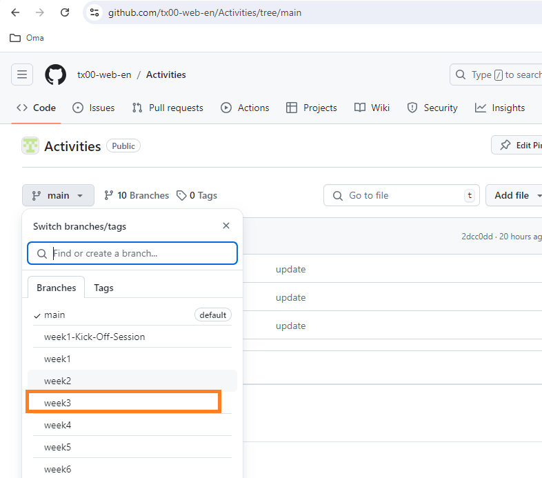

# Homework
-----

The video homework uses emojis to represent the significance of each video. Below are the explanations:

| **Category**  | **Description**       | **Emoji** |
|---------------|-----------------------|-----------|
| **Importance**| Very Important        | :star:        |
|               | Important             | :bell:        |
|               | Good to Know          | :blue_book:        |
| **Difficulty**| Easy                  | :blush:        |
|               | Challenging           | :sweat_smile:        |

### Monday Morning:

- :star: [React Tutorial for Beginners (20min)](https://www.youtube.com/watch?v=hn80mWvP-9g)
- :star: [PROPS in React explained (12min](https://youtu.be/uvEAvxWvwOs?si=PBoBuzE1HTya-zmu)
- :star: [React: how to add CSS styles (8min)](https://youtu.be/r3SMd0YTSZs?si=9QExkyNxhe9FDRNu)
- Review [Arrow functions](https://youtu.be/fRRRkognpOs?si=8dmlvfquytBVCRNj) 

### Monday Afternoon: 

- Please [download](https://www.postman.com/downloads/) and install Postman on your machine, then [register](https://www.postman.com/) to access and use Postman for free.
- :bell: [Learn Postman in 15 Minutes]
- JavaScript:
  - :blue_book: [Callback Functions: (first 18 min only)]
  - :bell: [JSON vs JavaScript Object Literals: (5 min)]
  - :bell: [JavaScript Template Literals: (5 min)]
  - :bell: [Learn JavaScript ARROW FUNCTIONS in 8 minutes!](https://www.youtube.com/watch?v=fRRRkognpOs)
 
### Wednesday Morning:

- :star: [Learn JavaScript CALLBACKS in 7 minutes!](https://www.youtube.com/watch?v=i2SPq-nb3NQ)
- :star: [JavaScript filter() method in 6 minutes!](https://youtu.be/VvSEKHKFvpQ?si=zaVlb_PZKYOEquG2)
- :blue_book: [JavaScript: Filter and Find (15 min)](https://youtu.be/KeYxsev737s)
- :star: [Express JS Crash Course: 58min](https://youtu.be/L72fhGm1tfE): The section on middleware (**from 23:53 to 31:10**) will be covered in week 3.

### Wednesday Afternoon:

- :bell: [How to use Props.Children in React? (2min)](https://www.youtube.com/watch?v=JpM9hiQTlAk)
- :star: [How to CONDITIONAL RENDER in React? (10min)](https://youtu.be/XvURBpFxdGw)
- :star: [React CARD components (12min)](https://youtu.be/yYiwxYqQ9vg?si=sq50RKwzhf75eZ6f)
- :blue_book: Review of React Basics: [Learn React 18 – Full Tutorial for Beginners] **From start till 2h 22min**

### Friday

- [Git & GitHub Tutorial | Visualized Git Course for Beginner & Professional Developers](https://www.youtube.com/watch?v=S7XpTAnSDL4)
- Please register on the following platforms:
  - [Figma]
  - [Scrimba]
  - [Figma for beginners](https://www.youtube.com/playlist?list=PLKId0A0XCIbUYx3c_NYn13W9Z_kkIiA2m)
- :blue_book: [Scrum in 20 mins] - **with Figma files**
- Figma:
  - :blue_book: [Figma Tutorial for Beginners](https://www.youtube.com/watch?v=ezldKx-jPag)
  - :blue_book: [Figma UI Design Tutorial: Get Started in Just 24 Minutes]
- :blue_book: [How To Use TRELLO for Beginners: (14 min)]

<!-- 
JavaScript tutorial for beginners 🌐 
https://www.youtube.com/playlist?list=PLZPZq0r_RZOO1zkgO4bIdfuLpizCeHYKv
-->

----
### Note

> **Homework** for Week 3 can be found in [the respective branch](https://github.com/tx00-web-en/Learning-Material-And-Tasks/tree/week3), as shown in the figure below.

### Refresher

- HTTP & Express.js
  - [Express JS Crash Course: (first 16 min only)]
  - [How The Web Works: (12 min)]
  - [HTTP Methods: (3 min)] 
- Git & GitHub
  - [Part 1: Git (Duration **36 min**)](https://www.youtube.com/watch?v=hrTQipWp6co)
  - [Part 2: GitHub (Duration **56 min**)](https://www.youtube.com/watch?v=1ibmWyt8hfw)
- CSS
  - https://web.dev/learn/css
  - https://internetingishard.netlify.app/html-and-css/

<!-- Links -->
[Scrimba]:https://scrimba.com/
[Figma]:https://www.figma.com/
[GitHub]:https://github.com/
[Modern JavaScript Tutorial]:https://www.youtube.com/playlist?list=PL4cUxeGkcC9haFPT7J25Q9GRB_ZkFrQAc
[Modern JavaScript From The Beginning (12 Hours)]:https://youtu.be/BI1o2H9z9fo
[Git & GitHub Tutorial for Beginners]:https://www.youtube.com/playlist?list=PL4cUxeGkcC9goXbgTDQ0n_4TBzOO0ocPR
[Introduction to Scrum - 7 Minutes]:https://youtu.be/9TycLR0TqFA
[Scrum in 20 mins]:https://youtu.be/SWDhGSZNF9M
[Figma UI Design Tutorial: Get Started in Just 24 Minutes]:https://youtu.be/FTFaQWZBqQ8
[Callback Functions: (first 18 min only)]:https://youtu.be/QSqc6MMS6Fk
[How The Web Works: (12 min)]:https://youtu.be/hJHvdBlSxug
[HTTP Methods: (3 min)]:https://youtu.be/tkfVQK6UxDI
[JSON vs JavaScript Object Literals: (5 min)]:https://youtu.be/912_cPllMyg
[JavaScript Template Literals: (5 min)]:https://youtu.be/NgF9-pdTDGs
[Express JS Crash Course: (first 16 min only)]:https://youtu.be/L72fhGm1tfE
[How To Use TRELLO for Beginners: (14 min)]:https://youtu.be/6drUzoeHZkg
[How To Use Postman (8min)]:https://youtu.be/wmz1sGZp814
[Learn Postman in 15 Minutes]:https://www.youtube.com/watch?v=ypKHnRmPOUk
[Learn React 18 – Full Tutorial for Beginners]:https://youtu.be/Flbw5BX_AX0?si=Pch8zLMRoSJwQzTQ

