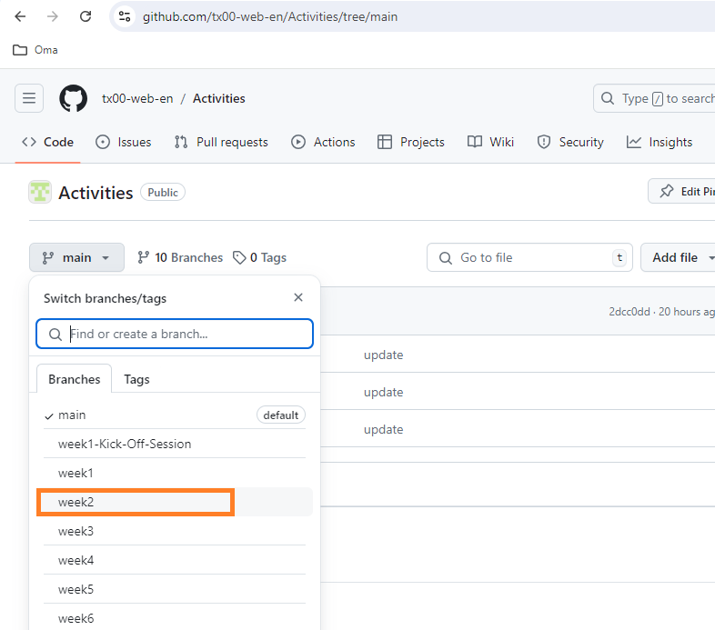

# Homework
-----

### Before Wednesday Morning: 

- :bell: [Node.js Tutorial for Beginners: (**First 53min only**)](https://youtu.be/TlB_eWDSMt4)
- Review the following JavaScript video tutorials:
  - :star: [Basics & Types](https://youtu.be/FhguwBJeqWs)
  - :star: [Functions & Arrow functions](https://youtu.be/xUI5Tsl2JpY)
  - :star: [Objects](https://youtu.be/X0ipw1k7ygU)

### Before Wednesday Afternoon: 

- HTTP
  - :star: :blush:  [How The Web Works: (12 min)]
  - :star: :blush:  [HTTP Methods: (3 min)]
- Express.js
  - :bell: [Express JS Crash Course: (first 16 min only)]
- :bell: [NPM Crash Course](https://youtu.be/jHDhaSSKmB0)

### Before Friday: 

- :star: :blush:  [Introduction to Scrum - 7 Minutes]
- :bell: Please register on [GitHub].
- :bell: [NPM Crash Course](https://youtu.be/jHDhaSSKmB0)
- Git & GitHub
  - :bell: [Part 1: Git (Duration **36 min**)](https://www.youtube.com/watch?v=hrTQipWp6co)
  - :bell: [Part 2: GitHub (Duration **56 min**)](https://www.youtube.com/watch?v=1ibmWyt8hfw)

### Refresher

Here are some recommended resources:
- [Modern JavaScript From The Beginning (the first 8 Hours)]
- [HTML & CSS & VsCode - Course (Duration **6 hours**)](https://www.youtube.com/watch?v=G3e-cpL7ofc)
- [HTML & CSS Full Course](https://youtu.be/HGTJBPNC-Gw?si=EDOeIG1alzTk2vXB)
- [JavaScript Course  (First **11 hours/22 hours**)](https://www.youtube.com/watch?v=EerdGm-ehJQ)
- [Modern JavaScript Tutorial]
- [CSS3 in 30 Days](https://www.youtube.com/playlist?list=PLWKjhJtqVAbl1AfjiGyYxwpdAPi5v-1OU)

----
### Note

- Recommended Courses (Free for Metropolia's students)
  - [Tailwind CSS From Scratch - Learn by Building Projects](https://metropolia.finna.fi/Record/nelli15.5680000000060713?sid=4846325380)
  - [Figma for UI/UX: Master Web Design in Figma](https://metropolia.finna.fi/Record/nelli15.5850000000052946?sid=4846325074)
- Homework for Week 2 can be found in [the respective branch](https://github.com/tx00-web-en/Learning-Material-And-Tasks/tree/week2), as shown in the figure below.

- The video homework uses emojis to represent the significance of each video. Below are the explanations:

| **Category**  | **Description**       | **Emoji** |
|---------------|-----------------------|-----------|
| **Importance**| Very Important        | :star:        |
|               | Important             | :bell:        |
|               | Good to Know          | :blue_book:        |
| **Difficulty**| Easy                  | :blush:        |
|               | Challenging           | :sweat_smile:        |

<!--emoji code : https://gist.github.com/rxaviers/7360908 -->

<!-- Links -->
[Scrimba]:https://scrimba.com/
[Figma]:https://www.figma.com/
[GitHub]:https://github.com/
[Modern JavaScript Tutorial]:https://www.youtube.com/playlist?list=PL4cUxeGkcC9haFPT7J25Q9GRB_ZkFrQAc
[Modern JavaScript From The Beginning (the first 8 Hours)]:https://youtu.be/BI1o2H9z9fo
[Git & GitHub Tutorial for Beginners]:https://www.youtube.com/playlist?list=PL4cUxeGkcC9goXbgTDQ0n_4TBzOO0ocPR
[Introduction to Scrum - 7 Minutes]:https://youtu.be/9TycLR0TqFA
[Scrum in 20 mins]:https://youtu.be/SWDhGSZNF9M
[Figma UI Design Tutorial: Get Started in Just 24 Minutes]:https://youtu.be/FTFaQWZBqQ8
[Callback Functions: (first 18 min only)]:https://youtu.be/QSqc6MMS6Fk
[How The Web Works: (12 min)]:https://youtu.be/hJHvdBlSxug
[HTTP Methods: (3 min)]:https://youtu.be/tkfVQK6UxDI
[JSON vs JavaScript Object Literals: (5 min)]:https://youtu.be/912_cPllMyg
[JavaScript Template Literals: (5 min)]:https://youtu.be/NgF9-pdTDGs
[Express JS Crash Course: (first 16 min only)]:https://youtu.be/L72fhGm1tfE
[How To Use TRELLO for Beginners: (14 min)]:https://youtu.be/6drUzoeHZkg
[How To Use Postman (8min)]:https://youtu.be/wmz1sGZp814
[How To Use TRELLO for Beginners: (14 min)]:https://youtu.be/6drUzoeHZkg
[Learn Postman in 15 Minutes]:https://www.youtube.com/watch?v=ypKHnRmPOUk
[Learn React 18 – Full Tutorial for Beginners]:https://youtu.be/Flbw5BX_AX0?si=Pch8zLMRoSJwQzTQ

