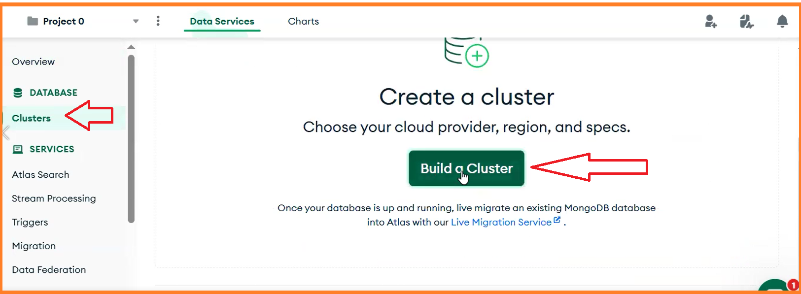
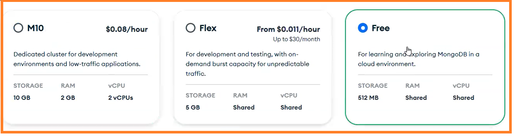
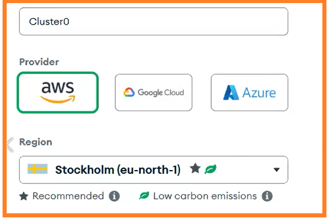
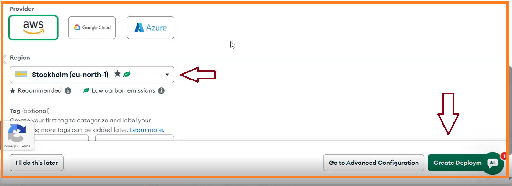
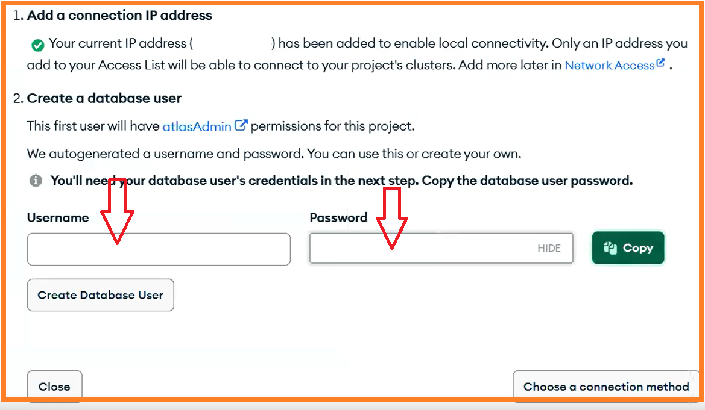
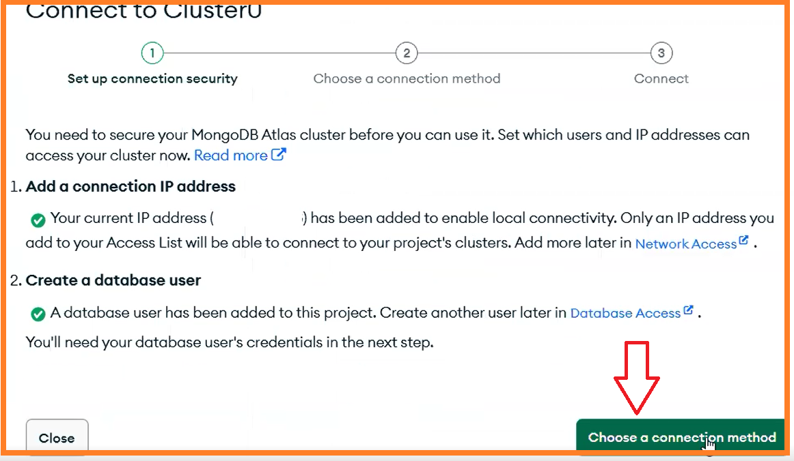
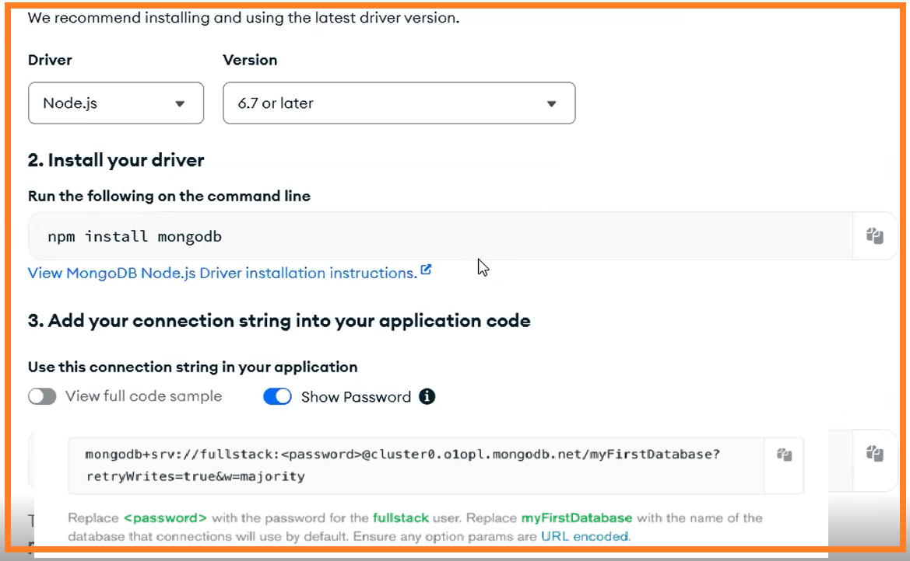
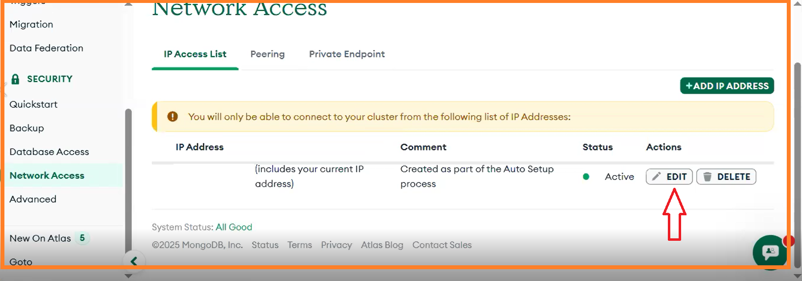
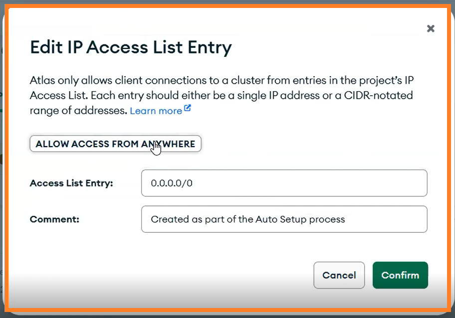
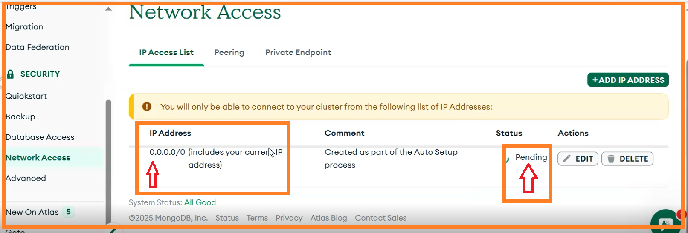

# Registering with MongoDB Atlas

You can run MongoDB locally on your computer, but using a cloud-based service can simplify your setup. For this course, we will use [MongoDB Atlas](https://www.mongodb.com/atlas/database), a cloud-based MongoDB service.

These resources provide a **general overview of the process**, but since MongoDB Atlas frequently updates its interface and setup instructions, some steps may differ slightly from what is shown. You may need to adapt certain details, such as menu options, based on the latest version of Atlas. 

1. Watch this [2-minute video tutorial](https://youtu.be/DMlWdd6Z66Q?feature=shared).
2. Follow the instructions provided below:

---
### Steps to Set Up MongoDB Atlas

1. **Create and Log In to Your MongoDB Atlas Account**:
   - Visit [MongoDB Atlas](https://www.mongodb.com/atlas/database) and sign up for an account or log in if you already have one.

2. **Create a Free Cluster**:
   - Once logged in, click on `build Cluster`:
     

   - Choose the free-tier option for a cloud database:
     

   - Select a cloud provider (AWS, Azure, Google Cloud) and a region for your cluster e.g. `Stockholm` or `Frankfurt`:
     

   - Click on `Create Deployment`:
     

3. **Create Database User Credentials**:
   - Create new user credentials specifically for your application. These credentials are separate from your MongoDB Atlas account credentials and will be used by your application to connect to the database:
     


5. **Get the Connection String**:
   - Click on **Connect** to get the connection details for your cluster:
     

   - Choose **Connect your application**:
     

   - You will see the **MongoDB URI**, which is the connection string you will use in your application to connect to the database:
     ```sh
     mongodb+srv://<username>:<password>@cluster0.o1opl.mongodb.net/?retryWrites=true&w=majority
     ```

4. **Set Up IP Whitelisting**:
   - Configure the IP addresses that are allowed to access your database. 
        
     
   - For simplicity, you can allow access from all IP addresses by adding `0.0.0.0/0`:
     

   - This process might take a few seconds:
     


You are now set up and ready to use MongoDB Atlas with your application. 

<!-- 
### About MongoDB

MongoDB is a [document database](https://en.wikipedia.org/wiki/Document-oriented_database) that stores data in a flexible, JSON-like format. Unlike relational databases, which use tables and rows, document databases organize data in collections of documents. MongoDB is categorized as a [NoSQL](https://en.wikipedia.org/wiki/NoSQL) database.

To learn more about MongoDB’s data organization, check out the chapters on [collections](https://docs.mongodb.com/manual/core/databases-and-collections/) and [documents](https://docs.mongodb.com/manual/core/document/) in the MongoDB manual. 


### References
- [Fullstack GitHub Repository](https://github.com/fullstack-hy2020/fullstack-hy2020.github.io/blob/source/src/content/3/en/part3c.md#mongodb)

-->
