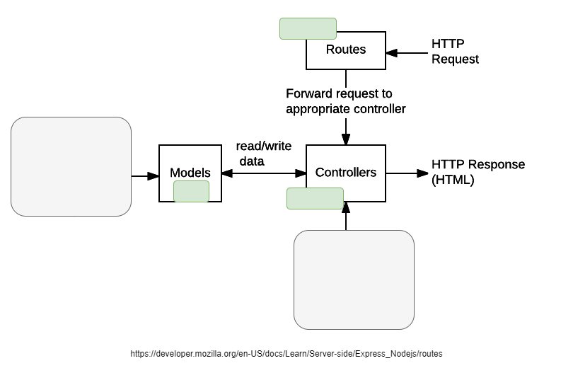

# Theory: Organizing an API Server with the MVC Architecture

When building an API server, adopting the **MVC (Model-View-Controller)** architecture can significantly enhance code organization, maintainability, and scalability. This architecture separates the application logic into three main components: the **Model**, **View**, and **Controller**, each with a distinct responsibility. By adhering to this pattern, you can create a well-structured and easy-to-manage codebase.




## The MVC Components

### 1. Model

The **Model** represents the data and the [business logic](#links) of the application. It is responsible for managing the data, whether it comes from a database like MongoDB, mock data stored in arrays, or any other data source. The Model also defines the structure and methods to interact with the data.

- **Data**: The Model holds the application's data and is directly responsible for handling database interactions or data storage. For example, a `BlogPostModel` could define the schema for blog posts, validate incoming data, and provide methods to create, read, update, and delete posts.

### 2. View

The **View** is responsible for displaying data to the user. In the context of an API server, the "View" is often handled by a separate front-end application, such as a React.js client. The View layer fetches data from the API and renders it to the user in an interactive format.

- **React as the View**: When using React.js, the View components request data from the API server and dynamically display it to users. React provides a smooth user experience by updating the UI efficiently based on the state changes.


### 3. Controller

The **Controller** serves as an intermediary between the Model and the View. It handles incoming HTTP requests, processes data using the Model, and sends responses back to the client. The Controller contains the business logic that determines how the data is handled and returned.

### 4. Router

The **Router** defines the application's endpoints and maps them to specific controller functions. It determines which controller function should handle a particular route, providing a clear separation of concerns between the application's routing logic and its business logic.

- **Example: Blog Post Router**
  ```javascript
  // routes/blogPostRoutes.js

  const express = require('express');
  const router = express.Router();
  const { getPosts, createPost } = require('../controllers/blogPostController');

  // Define routes and map to controller functions
  router.get('/api/posts', getPosts);
  router.post('/api/posts', createPost);

  module.exports = router;
  ```

### 5. Middleware

**Middleware** functions process requests before they reach the Controller. Middleware can perform various tasks, such as authentication, logging, data validation, and error handling. Middleware can be applied globally to all routes or to specific routes as needed.

- **Example: Logger Middleware**
  ```javascript
  // middleware/logger.js

  // Custom middleware to log incoming requests
  const logger = (req, res, next) => {
    console.log(`${req.method} request to ${req.url}`);
    next(); // Pass control to the next middleware function
  };

  module.exports = logger;
  ```

- **Usage in the Main Server File:**
  ```javascript
  // server.js

  const express = require('express');
  const logger = require('./middleware/logger');
  const blogPostRoutes = require('./routes/blogPostRoutes');

  const app = express();

  app.use(express.json()); // Built-in middleware to parse JSON bodies
  app.use(logger); // Apply custom logger middleware

  app.use('/blogs',blogPostRoutes); // Apply routes

  const PORT = process.env.PORT || 5000;
  app.listen(PORT, () => console.log(`Server running on port ${PORT}`));
  ```

## Example Folder Structure

To implement the MVC architecture effectively, it is crucial to have a well-organized folder structure. Here's an example of how you might structure your project:

```
/server
  /controllers
    blogPostController.js
  /models
    blogPostModel.js
  /routes
    blogPostRoutes.js
  /middleware
    logger.js
  app.js
/client
  /src
    /components
      BlogPosts.js
    App.js
    index.js
```

This structure keeps the code clean and organized by separating concerns into different directories, such as `controllers` for handling requests, `models` for managing data, `routes` for defining API endpoints, and `middleware` for custom functions that process requests.

### Example Code Snippets

For further reference, you can check out [this repository](https://github.com/tx00-resources-en/api-pets-mvc).


## Conclusion

The MVC architecture helps create a well-structured, maintainable, and scalable API server by organizing code into distinct sections—Model, View, Controller, Router, and Middleware. This separation of concerns allows each part of the application to be managed, developed, and tested independently, making the codebase easier to understand and extend. As your application grows, the MVC pattern will help ensure that it remains manageable and efficient.


## Links

- [Extra: How To Use And Write Express Middleware](https://blog.webdevsimplified.com/2019-12/express-middleware-in-depth/)
- [Understaing MVC for MERN stack](https://www.pumped.dev/blog/posts/understanding-mvc-mern)
- [MERN Stack Project Structure: Best Practices](https://dev.to/kingsley/mern-stack-project-structure-best-practices-2adk)
- [A Comprehensive Guide to Successful MERN Stack Development](https://ellow.io/mern-stack-development/)
- [Business Logic: What It Is and How to Use It](https://www.g2.com/articles/business-logic)
