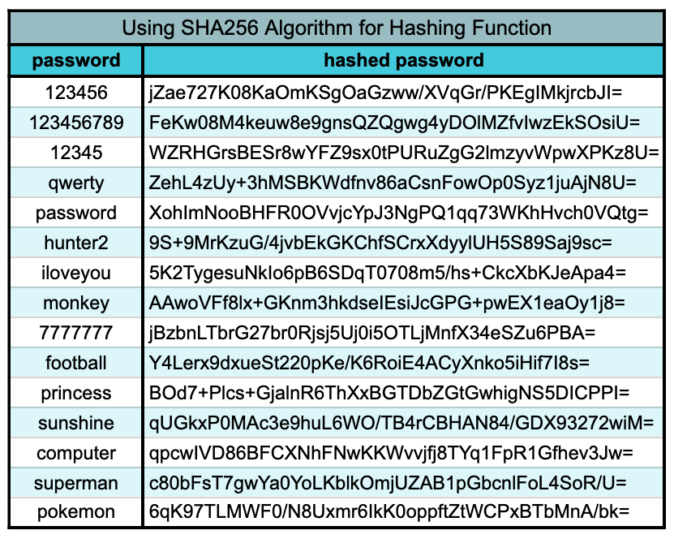

# Backend authentication

In this reading, you will gain insights into fundamental aspects of password security and the pivotal role you play in safeguarding your users' passwords. By the end, you will be equipped to:

- Understand the importance of never storing plain-text passwords.
- Grasp the mechanics of hash functions.
- Appreciate why hashing passwords is a crucial initial step in enhancing password security.

---
## Password Hashing


### The Perils of Plain-Text Passwords

For web application users, a cardinal rule of password security is never to reuse the same password across multiple websites. The rationale behind this rule is simple: if your password is ever exposed in plain text, it puts all your accounts that share that password at risk.

On the flip side, for developers, a paramount rule in password security is to never store passwords as plain text. Storing passwords in plain text creates a vulnerability whereby any developer with access to the production database can obtain a user's password and potentially misuse it, even with good intentions, such as updating user information. Regardless of intent, this constitutes a major security breach.

While the dangers of storing plain-text passwords are evident, it is surprising how many notable companies have made this mistake in the past. A quick look at a list of such offenders reveals examples from various industries, including travel, e-commerce, and higher education.

For instance, even Google, which generally adheres to best practices in password security, acknowledged in 2019 that a subset of its accounts had plain-text passwords stored. These plain-text passwords allowed account administrators to recover passwords for their team members, which, although convenient, constituted a security breach that required immediate investigation and rectification.

### Understanding Hash Functions

Today's standard for secure password storage involves both hashing and salting. This section will focus on hashing, with another dedicated to salting.

Recalling from Module Two, a hash function is a mathematical operation that takes an input and produces an output. Two crucial characteristics of hash functions are:

1. The output cannot be reversed to obtain the original input.
2. Providing the same input to the hash function will consistently yield the same output.

Hashing a password entails passing plain text through a hash function to generate an output that represents the password. While the output cannot be reversed into plain text, rehashing the same plain-text password will consistently produce the same output.

This process can be illustrated in pseudocode:

```javascript
function hashingFunction(input) {
    // Complex logic to transform the input into the output
    return output;
}

const input1 = "password";
const input2 = "newPassword";
const input3 = "password"; // Same as input1

const hashedPasswords = [ 
    hashingFunction(input1), // "13p98oihgaskdhjf"
    hashingFunction(input2), // "fh23984hdk1o3"
    hashingFunction(input3)  // "13p98oihgaskdhjf" // Same as output of input1
];
```

In this example, if the first plain-text password (input1) were to be leaked, the third password (input3) would also be vulnerable because the matching outputs confirm that `input1 === input3`. This underscores the importance of using uncommon and unpredictable passwords as a user to minimize the risk of password sharing.

### The Significance of Hashing Passwords

Hashing passwords adds an extra layer of security. If a hashed password is leaked, it is challenging (though not impossible) to deduce the original plain-text password. As a developer, it is your responsibility to store hashed passwords instead of plain text, safeguarding your users against potential malicious actions by members of your development team or unauthorized access in case of data leaks.

As demonstrated in the example above, there are ways to deduce the input from a leaked hashed password, particularly if multiple outputs can be matched to the same input. Therefore, you must never expose hashed passwords.

Further insights into this topic will be provided next, along with instructions on how to incorporate salting to enhance password security before storing them.


---
## Rainbow Table Attacks

In this section, we will delve into Rainbow Table Attacks. By the end, you will be equipped to:

- Understand how a Rainbow Table Attack operates.
- Recognize actions, both for individuals and developers, that can mitigate Rainbow Table Attacks.

### Understanding Rainbow Table Attacks

Hashing functions transform plain-text inputs into distinct outputs. These input-output pairs, if exposed, can be stored using a hash table (commonly referred to as a Rainbow Table) to establish connections between plain-text passwords and their respective hashed representations.

If a malicious actor possesses a hash table containing leaked passwords and their corresponding hash values, they can employ this table to deduce plain-text user passwords, particularly those that are frequently used or repeated. Their process may unfold as follows:

1. Apply a hashing function to randomly generated potential passwords to obtain hash outputs.
2. Record both the plain-text password and its corresponding hash value in the hash table.
3. Repeat steps 1 and 2 with as many passwords as possible to amass a substantial dataset.

Consider an example of a rainbow table constructed using the SHA256 algorithm as the hashing function:



Subsequently, when the malicious actor gains access to leaked hashed passwords, they execute the following steps:

1. Compare each leaked hashed password with the hashed passwords stored in the hash table.
2. Upon finding a match, retrieve the corresponding plain-text password from the matched record.
3. Exploit the plain-text password to gain unauthorized access to the user's account.

This Rainbow Table Attack strategy capitalizes on the deterministic nature of hashing functions. When identical inputs are provided to a hashing function, they will invariably yield identical outputs. Consequently, although reversing the hashing function itself is infeasible, inferring the input becomes possible when matching outputs are identified.

### Preventing Rainbow Table Attacks

Both developers and website users can take several measures to avert this threat.

#### Developer Actions

- **Never Expose Hashed Passwords:** Developers must ensure that hashed passwords are never exposed to the client. Rainbow Table Attacks only succeed if malicious users gain access to leaked hashed passwords. Instances like the 2012 [LinkedIn breach] underscore the importance of this precaution. Developers can also implement additional security measures, such as password salting, which will be discussed next.

#### User Actions

- **Use Unique and Complex Passwords:** As a website user, it is crucial to employ distinct passwords for each website you access. Additionally, ensure that your passwords are not easily guessable. Rainbow Table Attacks can only compromise accounts when the input for a leaked password matches an entry in the hash table. Bear in mind that once an attacker gains access to your password for one website, all other accounts sharing that same password are also at risk of compromise.

This section equips you with an understanding of Rainbow Table Attacks and provides actionable steps to safeguard against them. Implement these precautions to bolster your security and protect your online presence.

[LinkedIn breach]:https://blog.linkedin.com/2012/06/06/linkedin-member-passwords-compromised

---
## Salting Passwords for Enhanced Security

Hashing passwords before storing them can bolster security, but it has a limitation—identical passwords yield the same hashed output, making them susceptible to Rainbow Table Attacks. This section explores the technique of salting passwords before hashing, which mitigates this risk. You will gain insights into:

- The salting process
- The distinctions between salted and hashed passwords and solely hashed passwords
- The enhanced security of storing salted and hashed passwords

### The Salting Process

Salting involves appending a randomly generated string of characters to a plain-text password before using it as input for the hashing function. The salt itself comprises the string of characters added to the password. Key points to note about salting:

- Salts are typically 32 characters or longer.
- Salts can be added at the beginning, end, or middle of a password.
- Salts are applied before hashing:

```sh
    // Most common way of applying a salt
    hashInput = salt + plainTextPassword
    hashOutput = hashingFunction(hashInput)
```

For instance, if the original plain-text password is "password," the salted version might appear as "shueowbofnesosnwkrnrekeneldenekepassword." While the plain-text password is still recognizable, the 32-character salt has been prefixed to it.

### Salted and Hashed Passwords vs. Hashed Passwords

Consider a user employing the weak password "password. If multiple users utilized this same password, their stored hashed passwords would be identical, creating vulnerability to a potential Rainbow Table attack.

Note: The examples in this section employ simplified salts and hashing functions for visual clarity. Real-world salts and hashing functions are far more complex.

| USER | PLAIN-TEXT-PASSWORD | HASHED-PASSWORD |
|------|---------------------|-----------------|
| 1    | "password"          | "apssowdr"      |
| 2    | "newPassword"       | "enPwsawsrod"   |
| 3    | "password"          | "apssowdr"      |

However, by introducing a random salt to the password before hashing, identical passwords yield different outputs:

| USER | PLAIN-TEXT-PASSWORD | SALTED-PASSWORD  | SALTED-AND-HASHED-PASSWORD |
|------|---------------------|-------------------|-----------------------------|
| 1    | "password"          | "jhsdfpassword"  | "hjdspfsawsrod"            |
| 2    | "newPassword"       | "nwsifpnewPassword" | "wnispfenPwsawsrod"       |
| 3    | "password"          | "ksiblpassword"  | "skbiplsawsrod"            |

In this simplified example, salted and hashed passwords no longer produce identical outputs, further reducing susceptibility to Rainbow Table attacks. To enhance security, multiple rounds of salting and hashing can be employed, rendering it highly improbable for identical outputs to exist in a Rainbow Table after this process.

To decipher the original plain-text password, a hacker would need to match the exact salt, in the precise position, with the plain-text password to generate an identical result to an entry in their Rainbow Table. This requires various attempts, such as:

- `saltedAndHashedPassword === hashingFunction(salt + password);`
- `saltedAndHashedPassword === hashingFunction(password + salt);`
- `saltedAndHashedPassword === hashingFunction(password.slice(0, 4) + salt + password.slice(4));`
- ...and so forth.

### Key Takeaways

Salting passwords before hashing them is a best practice to thwart Rainbow Table attacks and enhance security, particularly for users with common passwords. While this approach significantly enhances security, it may still be vulnerable to attacks by malicious users employing tools like [John the Ripper](https://www.openwall.com/john/), which employ machine learning to deduce plain-text passwords from leaked salted and hashed passwords.

To bolster security, it is imperative to NEVER expose salted and hashed passwords to clients. 

---
## Using bcrypt for Secure Password Management

Ensuring robust password security practices is paramount in web development. In this section, you will discover how to employ the bcrypt package to implement these practices effectively. By the end, you will be equipped to:

- Understand what bcrypt is.
- Install and import the bcrypt package.
- Salt and hash a password using bcrypt.
- Compare a salted and hashed password with a plain-text password.

### Understanding bcrypt

While you now comprehend the concepts behind salting and hashing passwords, it is highly discouraged to attempt to create your own custom code for implementing these security measures. Crafting your own algorithms may lead to vulnerabilities, as attackers can potentially decipher them. Instead, it is advisable to consistently employ trusted, up-to-date algorithms for salting and hashing in your applications.

**bcrypt**, pronounced as "bee-kript," stands as a dependable hashing algorithm to salt and hash passwords.

**bcryptjs** is the Node.js module used to implement the bcrypt hashing algorithm within Node.

### Installing bcrypt

To use bcrypt in a Node.js project, you must initially install the npm package, **bcryptjs**.

```bash
npm install bcrypt
```

or

```bash
npm install bcryptjs
```

Next, import bcrypt into your JavaScript file:

```javascript
const bcrypt = require('bcrypt');
```


```javascript
const bcrypt = require('bcryptjs');
```

### Salting and Hashing a Password Using bcrypt

Once you've successfully imported bcrypt, you can use the following syntax to generate a salted and hashed password:

```javascript
const saltedAndHashedPassword = bcrypt.hashSync(plainTextPassword);
```

The `hashSync` method simplifies the process of generating a salted and hashed password. It requires a plain-text password as a mandatory parameter and defaults to using a salt with 10 random characters (unless you specify a different number as the second optional argument).

The method begins by generating a random salt, appending it to the plain-text password, and then hashing the result. It returns the salted and hashed password. For more details, consult the [hashSync method documentation](https://www.npmjs.com/package/bcryptjs#hashsync).

### Comparing a Salted and Hashed Password with User Input

After salt and hash a password with bcrypt, you can securely store it in your database. Each time a user attempts to log in with their password (provided as plain text), you must compare it with the salted and hashed version stored in the database to determine if they match.

For this comparison, you can employ bcrypt's `compareSync` method:

```javascript
bcrypt.compareSync(plainTextPassword, saltedAndHashedPassword);
```

This method assesses the plain-text string entered in the login form against the salted and hashed password from the database. It returns a Boolean value, indicating whether they are equivalent.

- If the function returns `true`, you have successfully authenticated the user, granting them access to resources.
- If the function returns `false`, authentication has failed. In this scenario, you should inform the user of the login issue and offer them the opportunity to retry.

### Key Takeaways

In this article, you have acquired the knowledge and syntax required to employ bcrypt effectively for implementing best practices in password security. This includes salting and hashing passwords before storage and comparing stored data with user input.

While you might be tempted to create your custom algorithms for password salting and hashing, this practice is discouraged. Trusting bcrypt to handle this critical security task is the preferred approach, as it ensures robust protection against potential threats.


----
## Ref

- appacademy.io

<!-- 
---
## Links used in the lecture

- [Encryption](https://en.wikipedia.org/wiki/Encryption)
- [Symmetric-key algorithm](https://en.wikipedia.org/wiki/Symmetric-key_algorithm)
- [Public-key cryptography](https://en.wikipedia.org/wiki/Public-key_cryptography)
- [Decoding](https://en.wikipedia.org/wiki/Decoding)
- [Decode from Base64 format](https://www.base64decode.org/)
- [Encode to Base64 format](https://www.base64encode.org/)
- [MD5](https://en.wikipedia.org/wiki/MD5)
- [SHA-2](https://en.wikipedia.org/wiki/SHA-2)
- [Blowfish (cipher)](https://en.wikipedia.org/wiki/Blowfish_(cipher))
- [Schneier on Security](https://www.schneier.com)
- [bcrypt](https://en.wikipedia.org/wiki/Bcrypt)
- [An Update on LinkedIn Member Passwords Compromised](https://blog.linkedin.com/2012/06/06/linkedin-member-passwords-compromised)
- [Salt (cryptography)](https://en.wikipedia.org/wiki/Salt_(cryptography))
- [Rainbow table](https://en.wikipedia.org/wiki/Rainbow_table)
- [MERN-Auth-Tutorial](https://github.com/iamshaunjp/MERN-Auth-Tutorial/tree/lesson-17)
- [What Is the CIA Security Triad? ](https://www.bmc.com/blogs/cia-security-triad/)
 -->
