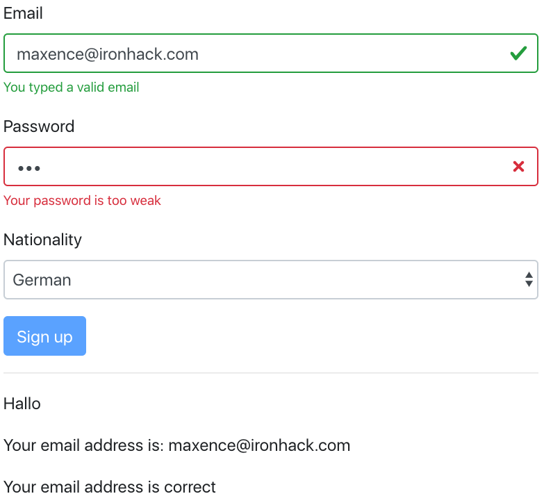
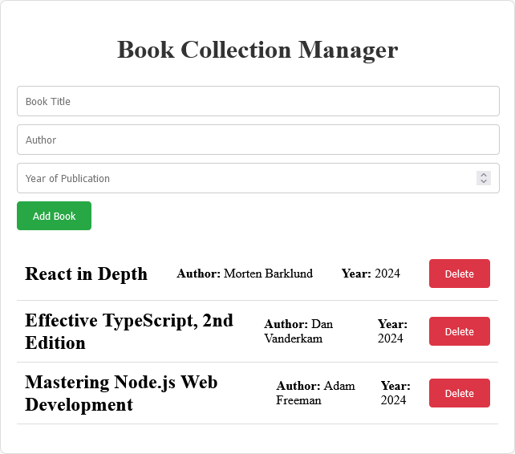

# Coding Marathon 

Welcome to the first Coding Marathon focused on React! In this marathon, you'll put all the React concepts you've learned into practice by building components in a collaborative environment. You’ll also gain experience with Git branching and merging.

> [!IMPORTANT]  
> **Please submit the following to OMA after completing this group activity:**

> 1. **GitHub repository link(s)**  
>    - Include **all branches**.  
>    - Make sure your **Self Assessment** is included. 
> 2. **Link to the deployed app on GitHub Pages**  
>    - The related repository must be **public**, otherwise deployment will not work.
> 3. **If you have questions about the coding marathon:**  
>    - You can ask during tomorrow’s session (09:00–12:00), **or**  
>    - Reserve a 30‑minute time slot for your whole group between **17:00–19:00**.


---
## Overview

- **Goal**: Create a dynamic, single-page application using React components.
- **Skills Used**: React fundamentals (list rendering, `useState` hook, controlled forms), Git branching, and merging.
- **Group Work**: You will work in groups, with each member responsible for building one component.

---
## Success Criteria

Your project will be evaluated based on the following criteria:
1. Correct use of React hooks (`useState`) and controlled forms: **20 Points**.
2. Clean, readable, and well-organized code: **20 Points**.
3. Effective use of Git branching and merging: **20 Points**.
4. Deployment to GitHub: **20 Points**.
5. Self-assessment of your code: **20 Points**. You can use the [following template](./cm-template.md).

---
## Phase 0: Preparation

Before starting this coding marathon, ensure that 

1. All team members are familiar with the Git branching workflow. Review the [steps for creating branches, making changes, and merging them to collaborate effectively](./git-branches.md).
2. You are able to deploy React Apps to GitHub.  Review the following [guideline](./demo-deployment.md).


---
## Phase 1: Git Setup and Collaboration


1. **Clone the starter code:**
   - One group member should clone the starter code: 
   ```sh
   git clone https://github.com/tx00-resources-en/cm1
   ```
   - Remove the `.git` folder.
   - Update the `package.json` and `vite.config.js` to ensure the project works with GitHub Pages. Instructions are provided [here](./demo-deployment.md).
   - Make sure you can view the React App deployed on GitHub Pages.
   - Install react router: ` npm i react-router-dom` 

2. **Create a Branch for Each Member:**
   - Follow these steps to set up your repository. Each Member:
     - Clones the main repository: `git clone <repo-url>`
     - Creates a new branch: `git checkout -b <your-branch-name>`
     - Pushes the branch to GitHub: `git push origin <your-branch-name>`

3. **Plan Your Work:**
   - Discuss with your team to decide who will build which component. Each member should select a different component from the list provided below.

---
## Phase 2: Component Development

Each member will choose and develop one component from the following options: **SignupPage**, **BookCollectionManager, ContactListManager, RecipeManager,** or **ShoppingCart**.

There is [starter code available for all these components](./react2.md#how-to-adapt-the-to-do-list-for-other-apps), based on the ToDoList app code provided in the homework video. However, the provided code requires several modifications:

1. **Refactor to Extract Components**:  
   Currently, all code is in a single file. Refactor the code to separate the main item into its own component:
   - **BookCollectionManager**: Extract a `Book` component.
   - **ContactListManager**: Extract a `Contact` component.
   - **RecipeManager**: Extract a `Recipe` component.
   - **ShoppingCart**: Extract an `Item` component.

2. **Expand Input Fields**:  
   The example code uses only two input fields. You should expand the input fields to capture additional details as follows:
   - **BookCollectionManager**: `title`, `author`, `year`, `publisher`, `ISBN`
   - **ContactListManager**: `name`, `email`, `phone`, `address`, `company`
   - **RecipeManager**: `name`, `ingredients`, `instructions`, `prepTime`, `nutritionInfo`
   - **ShoppingCart**: `item name`, `quantity`, `price` , `category`, `discount`

3. **`Optional`: Add CSS for Styling**:  
   The starter code does not include any styles. You are expected to create and apply CSS to improve the visual presentation of your component.

A detailed explanation of the components is provided below. You will implement code for all CRUD operations, except "update." Specifically, you will focus on reading data, deleting data, and adding data using a form.


### Choose a Component to Build

---
#### 1. SignupPage Component

> There is no starter code for the SignupPage.

Create a `SignupPage` component with the following elements:

- An `input` of type `"email"` (bonus: make the input green/red when the email is valid/invalid)
- An `input` of type `"password"` (bonus: make the input green/red when the password is strong/weak)
- A `select` input, used for selecting a nationality, with possible options/values: `"fi"`, `"en"`, `"de"`, `"fr"`
- A paragraph displaying `"Moi"`, `"Hello"`, `"Hallo"` or `"Bonjour"` based on the selected nationality
- A text "Your email is john@doe.com"

**Example**

```jsx
<SignupPage />
```

**Output**


<!--  -->

---
#### 2. BookCollectionManager Component

Develop a Book Collection Manager that allows users to add, view, and delete books:
- **State Management**: Use the `useState` hook to manage the book list and input fields (`title`, `author`, `year`, `publisher`, `ISBN`).
- **Controlled Forms**: Ensure all inputs are controlled components.
- **List Rendering**: Render the list of books using the `.map()` method.
- **Functions**: Implement functions to add and delete books.

**Example**

```jsx
<BookCollectionManager />
```

<!-- **Output**

 -->

---
#### 3. ContactListManager Component

Create a simple Contact List Manager to add, view, and delete contacts:
- **State Management**: Use the `useState` hook to handle the contact list and input fields (`name`, `email`, `phone`, `address`, `company`).
- **Controlled Forms**: Manage input values using controlled components.
- **List Rendering**: Render contacts dynamically with the `.map()` method.
- **Functions**: Provide functions to add and delete contacts.

**Example**

```jsx
<ContactListManager />
```

---
#### 4. RecipeManager Component

Build a Recipe Manager that lets users add, view, and delete recipes:
- **State Management**: Use the `useState` hook for the recipe list and input fields (`name`, `ingredients`, `instructions`, `prepTime`, `nutritionInfo`).
- **Controlled Forms**: Handle inputs as controlled components.
- **List Rendering**: Render the recipe ingredients and instructions as list items.
- **Functions**: Add and delete recipes through functions.


**Example**

```jsx
<RecipeManager />
```

---
#### 5. ShoppingCart Component

Develop a Shopping Cart where users can add, update quantities, and remove items:
- **State Management**: Use the `useState` hook to manage cart items and input fields (`item name`, `quantity`, `price` , `category`, `discount`).
- **Controlled Forms**: Use controlled components for inputs.
- **List Rendering**: Display items dynamically with the `.map()` function.
- **Functions**: Implement functions to add items, update quantities, and remove items.

**Example**

```jsx
<RecipeShoppingCartManager />
```

---
## Phase 3: Merge and Review

1. **Merge Branches:**
   - Once all members have completed their components:
     - Create a pull request to merge each branch into the main branch.
     - Review each other's code for consistency, readability, and proper usage of React concepts.
     - Merge the branches after resolving any conflicts.

2. **Final Testing:**
   - Test the integrated application to ensure all components work together smoothly.


---
## Phase 4: Deploy your app to GitHub

- To deploy your app to GitHub, please follow this [guideline](./demo-deployment.md).
<!-- 

Notes:
- When deploying a React app to **GitHub Pages**, it’s recommended to use `HashRouter` instead of `BrowserRouter` for handling routing. This is because `BrowserRouter` relies on the HTML5 history API, which requires server-side configuration to support client-side routing. Without this configuration, refreshing a page or directly navigating to a route can result in a 404 error on GitHub Pages, since it only serves static files and lacks server-side routing support.
- In contrast, `HashRouter` uses the hash portion of the URL (e.g., `example.com/#/page1`) to simulate different routes on the client side without requiring server configuration. This makes it a better fit for static hosting environments like GitHub Pages, ensuring that all routes work correctly even when the page is reloaded or accessed directly. 
- [GitHub Actions to automate the deployment of your React app to GitHub ](./cicd.md)
-->


---
## Success Criteria

Your project will be evaluated based on the following criteria:
1. Correct use of React hooks (`useState`) and controlled forms: **15 Points**.
2. Clean, readable, and well-organized code: **15 Points**.
3. Effective use of Git branching and merging: **20 Points**.
4. Deployment to GitHub: **15 Points**.
5. Self-assessment of your code: **15 Points**. You can use the [following template](./cm-template.md).


---

Happy coding! 🚀


