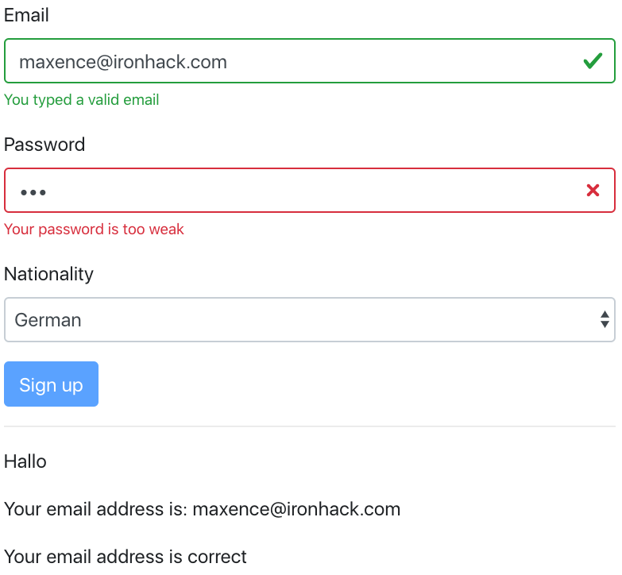
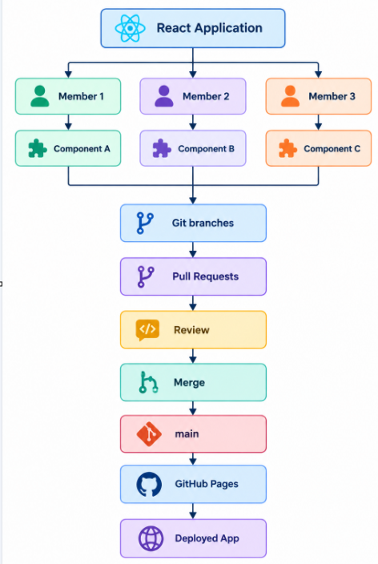

# Coding Marathon: React

Welcome to the **React Coding Marathon**!

In this activity, you will work in a team to build a small React application. Each team member will develop one component on their own Git branch. You will then merge your work, review each other's code, and deploy the final application to GitHub Pages.

The goal is to bring together the React concepts you have learned so far:

* React components
* `useState`
* Controlled forms
* List rendering with `.map()`
* Create, Read, and Delete operations
* Component extraction
* Git branches and merging
* Code review
* GitHub Pages deployment

---

# 1. What You Will Build

Your team will build a single React application containing several independent components.

Each team member will choose **one** component to develop:

1. `BookCollectionManager`
2. `ContactListManager`
3. `RecipeManager`
4. `ShoppingCart`
5. `SignupPage`

Each person is responsible for their own component and must work on a separate Git branch.

At the end of the marathon, all components will be merged into the `main` branch and deployed to GitHub Pages.

---

# 2. Assessment

The marathon is worth **80 points**.

## Individual: 45 points

| Criteria                                       | Points |
| ---------------------------------------------- | -----: |
| Correct use of `useState` and controlled forms |     15 |
| Clean, readable, and well-organized code       |     15 |
| Self-assessment                                |     15 |
| **Total**                                      | **45** |

## Group: 35 points

| Criteria                            | Points |
| ----------------------------------- | -----: |
| Effective Git branching and merging |     20 |
| GitHub Pages deployment             |     15 |
| **Total**                           | **35** |

### Self-assessment

Each team member must complete a `self-assessment.md` file inside their component folder.

For example:

```text
src/
└── components/
    └── BookCollectionManager/
        ├── BookCollectionManager.jsx
        ├── Book.jsx
        ├── self-assessment.md
        └── ...
```

Your self-assessment must include:

* Your individual score
* Your group score
* A short explanation of your contribution
* An honest assessment of your code

**Do not overgrade yourself.** If you overgrade yourself or fail to complete the self-assessment, your self-assessment score will not be counted.

---

# 3. Before You Start

Make sure you understand:

* Basic React components
* `useState`
* Controlled inputs
* `.map()`
* Event handlers
* Basic Git commands
* Git branches

You should also review:

* [Git branching guide](./git-branches.md)
* [GitHub Pages deployment guide](./demo-deployment.md)

---

# 4. Phase 1: Set Up the Project

## Step 1: Create the Repository

One team member should start by cloning the starter project:

```sh
git clone https://github.com/tx00-resources-en/cm1
```

Move into the project:

```sh
cd cm1
```

Remove the existing Git history:

```sh
rm -rf .git
```

Create your team's GitHub repository and connect the project to it.

---

## Step 2: Configure GitHub Pages

Update:

* `package.json`
* `vite.config.js`

Follow the deployment instructions in [deployment guide](./demo-deployment.md)

Before starting development, make sure the React application runs correctly.

For example:

```sh
npm install
npm run dev
```

---

# 5. Phase 2: Choose Your Component

As a team, decide who will develop each component.

Each team member should choose a **different** component.

You can choose from:

| Component             | Main Model |
| --------------------- | ---------- |
| BookCollectionManager | Book       |
| ContactListManager    | Contact    |
| RecipeManager         | Recipe     |
| ShoppingCart          | Item       |
| SignupPage            | User       |

---

# 6. Phase 6: Create Your Branches

Every team member must work on their own branch.

Clone the team's repository:

```sh
git clone <repo-url>
```

Create a branch:

```sh
git switch -c <your-branch-name>
```

For example:

```sh
git switch -c book-collection
```

Push the branch:

```sh
git push origin <your-branch-name>
```

### Important

Do **not** have multiple team members working directly on `main`.

Each person should:

1. Create their own branch.
2. Develop their component.
3. Commit their changes.
4. Push their branch.
5. Create a pull request later.

---

# 7. Phase 4: Build Your Component

Once everyone has chosen a component, start development. 

All components must follow the same basic pattern.

Your component should:

1. Store data using `useState`.
2. Use controlled form inputs.
3. Allow the user to add data.
4. Display the data using `.map()`.
5. Allow the user to delete data.
6. Extract the individual item into a separate component where required.
7. Include the additional field specified below.
8. Use clear and readable code.

You are implementing:

### Create

Add a new item using a form.

### Read

Display all items in a list.

### Delete

Remove an item from the list.

> **Update is not required for this marathon.**

Therefore, the required operations are:

**Create → Read → Delete**

---

# 8. Component 1: BookCollectionManager

## Goal

Create a book collection where users can add, view, and delete books.

### Required fields

Your book should contain:

* `title`
* `author`
* `genre`
* `language`
* `edition`
* `pages`
* `rating`
* `year`

### New field: `year`

The `year` field represents the publication year of the book.

Example:

```text
Title: The Hobbit
Author: J.R.R. Tolkien
Genre: Fantasy
Language: English
Edition: First Edition
Pages: 310
Rating: 4.8
Year: 1937
```

### Requirements

Use `useState` to manage:

* The book list
* The form inputs

All inputs must be controlled components.

Render the books using `.map()`.

Extract an individual book into:

```text
Book.jsx
```

The `Book` component should receive the required data through props.

### Suggested input types

```text
title : text
author: text
genre : text
language  : text
edition   : text
pages : number
rating: number
year  : number
```

---

# 9. Component 2: ContactListManager

## Goal

Create a contact list where users can add, view, and delete contacts.

### Required fields

Your contact should contain:

* `name`
* `email`
* `phone`
* `job_title`
* `birthday`
* `notes`
* `website`
* `favorite`

### New field: `phone`

The `phone` field represents the contact's telephone number.

Example:

```text
Name: Jane Doe
Email: jane@example.com
Phone: +358 40 123 4567
Job title: Designer
Birthday: 1995-05-20
Notes: Works with our design team.
Website: https://example.com
Favorite: Yes
```

### Requirements

Use `useState` to manage:

* The contact list
* The form inputs

All inputs must be controlled components.

Render contacts using `.map()`.

Extract an individual contact into:

```text
Contact.jsx
```

### Suggested input types

```text
name   : text
email  : email
phone  : tel
job_title  : text
birthday   : date
notes  : textarea
website: url
favorite   : checkbox
```

---

# 10. Component 3: RecipeManager

## Goal

Create a recipe manager where users can add, view, and delete recipes.

### Required fields

Your recipe should contain:

* `name`
* `description`
* `cuisine`
* `difficulty`
* `cookTime`
* `servings`
* `allergens`
* `ingredients`

### New field: `ingredients`

The `ingredients` field contains the ingredients needed for the recipe.

For this assignment, you may store the ingredients as a simple string.

Example:

```text
Name: Pasta Carbonara
Description: Classic Italian pasta dish
Cuisine: Italian
Difficulty: Medium
Cook time: 25 minutes
Servings: 4
Allergens: Gluten, dairy, eggs
Ingredients: Pasta, eggs, parmesan, pancetta, black pepper
```

### Requirements

Use `useState` to manage:

* The recipe list
* The form inputs

All inputs must be controlled components.

Render recipes using `.map()`.

Extract an individual recipe into:

```text
Recipe.jsx
```

### Suggested input types

```text
name     : text
description  : textarea
cuisine  : text
difficulty   : select
cookTime : number
servings : number
allergens: text
ingredients  : textarea
```

For `difficulty`, use:

```text
Easy
Medium
Hard
```

---

# 11. Component 4: ShoppingCart

## Goal

Create a shopping cart where users can add, view, and delete items.

### Required fields

Your item should contain:

* `name`
* `brand`
* `quantity`
* `subtotal`
* `tax`
* `availability`

### New field: `quantity`

The `quantity` field represents how many units of the product are being purchased.

Example:

```text
Name: Wireless Mouse
Brand: ExampleBrand
Quantity: 2
Subtotal: €40
Tax: €9.60
Availability: In stock
```

### Requirements

Use `useState` to manage:

* The cart item list
* The form inputs

All inputs must be controlled components.

Render items using `.map()`.

Extract an individual item into:

```text
Item.jsx
```

### Suggested input types

```text
name     : text
brand    : text
quantity : number
subtotal : number
tax      : number
availability : select
```

For `availability`, use:

```text
In stock
Out of stock
```

### Optional challenge

Calculate a total based on the quantity:

```text
total = subtotal × quantity + tax
```

This is optional and is not required for the basic assignment.

---

# 12. Component 5: SignupPage

## Goal

Create a signup form using controlled inputs.

There is no starter code for this component.

### Required fields

Your signup page should contain:

* `email`
* `password`
* `confirmPassword`
* `nationality`

### New field: `confirmPassword`

The user must enter their password a second time.

Example:

```text
Email: john@doe.com
Password: ********
Confirm password: ********
Nationality: fi
```

### Nationality options

Use:

```text
fi
en
de
fr
```

Display:

| Nationality | Message |
| ----------- | ------- |
| `fi`        | Moi     |
| `en`        | Hello   |
| `de`        | Hallo   |
| `fr`        | Bonjour |

The page should also display:

```text
Your email is john@doe.com
```

Replace the email with the value entered by the user.

### Suggested input types

```text
email       : email
password    : password
confirmPassword : password
nationality : select
```




### Optional

You can add validation that:

* Changes the email input appearance when the email is valid/invalid.
* Changes the password appearance when the password is strong/weak.
* Checks whether `password` and `confirmPassword` match.

---

# 13. Phase 5: Refactor Your Component

For the following components, you must extract the individual item into a separate component.

### BookCollectionManager

```text
BookCollectionManager.jsx
Book.jsx
```

### ContactListManager

```text
ContactListManager.jsx
Contact.jsx
```

### RecipeManager

```text
RecipeManager.jsx
Recipe.jsx
```

### ShoppingCart

```text
ShoppingCart.jsx
Item.jsx
```

The parent component should manage the list and pass the required information to the child component using props.

For example:

```jsx
<Book
  title={book.title}
  author={book.author}
  year={book.year}
  onDelete={() => deleteBook(index)}
/>
```

The child component is responsible for displaying the individual item.

---

# 14. Phase 6: Test Your Component

Before pushing your branch, test your component.

Use this checklist:

### Form

* [ ] All inputs work.
* [ ] All inputs are controlled.
* [ ] The form accepts valid data.
* [ ] Empty required fields are handled appropriately.

### Create

* [ ] A new item can be added.
* [ ] The new item appears immediately.

### Read

* [ ] Items are displayed correctly.
* [ ] `.map()` is used for list rendering.

### Delete

* [ ] An item can be deleted.
* [ ] The correct item is deleted.

### Component structure

* [ ] The individual item has been extracted where required.
* [ ] Props are used correctly.
* [ ] Components are readable and organized.

<!-- 
### Extra field

* [ ] The new required field works.
* [ ] The field is stored with the model.
* [ ] The field is displayed where appropriate. 
-->


---

# 15. Phase 11: Complete Your Self-Assessment

Each team member must complete:

```text
src/components/<your-component>/self-assessment.md
```

Your self-assessment should contain:

## Individual Score

Give yourself a score out of **45**.

Explain briefly how you earned the points.

## Group Score

Give the group a score out of **35**.

Explain how the team performed in:

* Git branching and merging
* Collaboration
* Deployment

## Reflection

Answer:

1. What did you implement?
2. What React concepts did you practice?
3. What was challenging?
4. What would you improve in your code?
5. How did your team collaborate?

Be honest when grading yourself and your group.

---

# 16. Phase 7: Commit and Push

Once your component works, commit your changes.

Example:

```sh
git status
```

Then:

```sh
git add .
```

Commit:

```sh
git commit -m "Add BookCollectionManager"
```

Push:

```sh
git push origin <your-branch-name>
```

Use a meaningful commit message that describes your work.

---

# 17. Phase 8: Code Review and Pull Requests

After everyone has finished their component:

1. Push all branches to GitHub.
2. Create a pull request for each branch.
3. Review each other's code.
4. Discuss problems or improvements.
5. Fix any issues.
6. Resolve merge conflicts.
7. Merge the pull requests into `main`.

During the review, check:

* Is the code readable?
* Are React hooks used correctly?
* Are the forms controlled?
* Is `.map()` used correctly?
* Are components properly extracted?
* Are props used correctly?
* Does the delete functionality work?
* Is the additional field implemented?
* Is the code consistent with the rest of the project?

---

# 18. Phase 9: Final Integration Test

After all branches have been merged into `main`, test the **whole application**.

Do not assume that because your individual component worked, the final application works.

Check:

* [ ] All components appear.
* [ ] All forms work.
* [ ] All components can add data.
* [ ] All lists render correctly.
* [ ] All components can delete data.
* [ ] No component breaks another component.
* [ ] There are no console errors.
* [ ] The application works after refreshing the page.

---

# 19. Phase 10: Deploy to GitHub Pages

Deploy the final application using:

```text
demo-deployment.md
```

The final repository must be public.

After deployment, open the GitHub Pages URL and test the deployed application.

Make sure:

* [ ] The application loads.
* [ ] All components are available.
* [ ] Forms work.
* [ ] Adding items works.
* [ ] Deleting items works.
* [ ] There are no broken assets or routes.

---

# 20. Final Submission Checklist

Before submitting, make sure everything below is complete.

## GitHub Repository

* [ ] Repository is public.
* [ ] All team branches are available.
* [ ] All branches have been merged into `main`.
* [ ] Pull requests have been completed.
* [ ] Code review comments have been addressed.

## React Application

* [ ] Each team member completed one component.
* [ ] `useState` is used correctly.
* [ ] Forms are controlled.
* [ ] `.map()` is used for list rendering.
* [ ] Create functionality works.
* [ ] Read/display functionality works.
* [ ] Delete functionality works.
* [ ] Required additional fields are implemented.
* [ ] Individual components have been extracted where required.
* [ ] Code is clean and readable.

## Self-Assessment

* [ ] Every team member completed their `self-assessment.md`.
* [ ] Individual score is included.
* [ ] Group score is included.
* [ ] Reflection is included.
* [ ] Scores are honest and reasonable.

## Deployment

* [ ] GitHub Pages deployment works.
* [ ] The deployed application can be opened.
* [ ] The deployed application has been tested.
* [ ] There are no obvious errors.

---

# 21. Submission

Submit the following to OMA:

### 1. GitHub repository link

The repository must include:

* All branches
* The completed project
* Self-assessments

### 2. GitHub Pages deployment link

Provide the URL of your deployed application.

The related GitHub repository must be **public** for the deployment to work.

---

# Final Goal

By the end of this coding marathon, your team should have:



The most important thing is not just getting the application to work. You should be able to demonstrate that you can **build a React component, manage state, work with forms, render data, collaborate with Git, review code, and deploy a project as a team.**

# Happy coding! 


<!-- 
```text
                    React Application
                           │
        ┌──────────────────┼──────────────────┐
        │                  │                  │
     Member 1           Member 2           Member 3
        │                  │                  │
   Component A        Component B        Component C
        │                  │                  │
        └──────────────────┼──────────────────┘
                           │
                      Git branches
                           │
                      Pull Requests
                           │
                         Review
                           │
                         Merge
                           │
                          main
                           │
                    GitHub Pages
                           │
                    Deployed App
``` 
-->