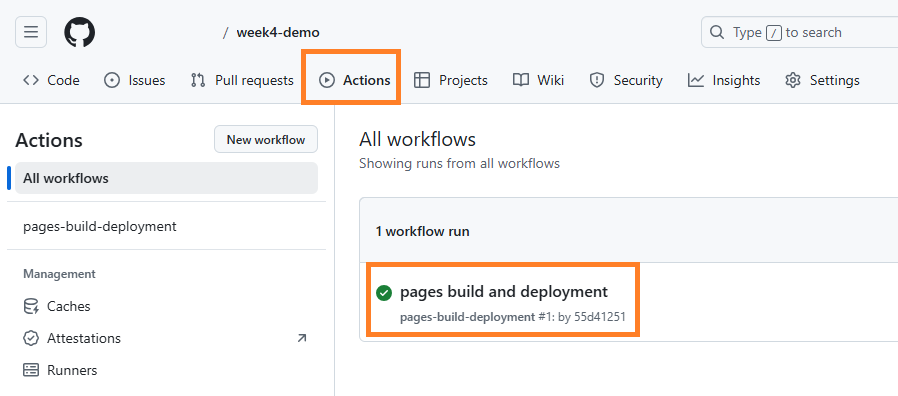
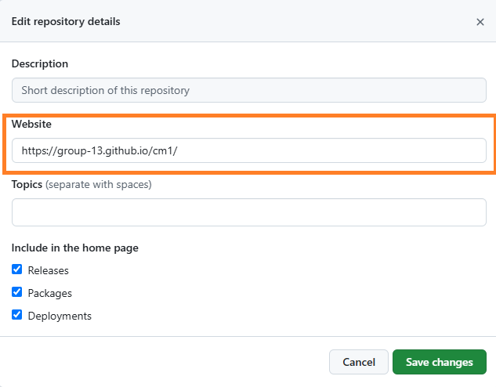

# Deploy React App to GitHub


### Goal:

- Deploy React App to the cloud

---
## Part 1/3

**Step 1: Project Setup**

- Open your terminal and run the following command to create a new React project using Vite:

```bash
npx create-vite@latest week4-demo --template react
```

- Change into the project directory:

```bash
cd week4-demo
```

- Install the project dependencies:

```bash
npm install
```

- Start the development server:

```bash
npm run dev
```

- Open your web browser and go to the provided local URL (e.g., `http://localhost:5173`). You should see the default Vite React welcome page.


**Step 2: Run the Development Server**

1. Run the following command to start the development server:

```bash
npm run dev
```

2. Open your web browser and go to the provided local URL (e.g., `http://localhost:5173`). You should see both the "Hello, React!" and "Goodbye, React!" messages rendered on the page.

---
## Part 2/3: [Push to GitHub](./push-to-github.md)

> Stop the development server `ctr+C`

1. Make the project directory a Git repository by running:

```bash
git init
```

2. Make sure that you have the `.gitignore` file. If it does not exist, create one and exclude the `node_modules` directory from version control:

```
node_modules/
``` 

3. Stage all the changes:

```bash
git add .
```

4. Commit the changes:

```bash
git commit -m  "Add message here"
```

4. Create a new repository on GitHub:

- Go to the GitHub website .
- Click on the plus sign icon in the top right corner of the page, and then select "New repository."
- Fill in the details for your new repository:
   - Repository name: Choose a name for your new repository.
   - Description (optional): Add a short description to explain the repository's purpose.
   - Visibility: Choose between "Public" or "Private," depending on who should have access.
   - Do not initialize the repository with a `README` file or a `.gitignore` file.
- Click the "Create repository" button to create your new repository.

2. Connect your local repository to the GitHub repository by following the steps provided by GitHub. There are three commands as shown in the screenshot below, in the green block diagram. You'll need to copy and paste the commands into your terminal, one at a time:


```bash
git remote add origin <GitHub Repository URL>
git branch -M main
git push -u origin main 
```

4. Refresh the GitHub repository page to see your changes.


---
## Part 3/3 Deploying a Vite/React App to GitHub Pages

GitHub Pages (gh-pages) is a feature provided by GitHub that allows you to host static websites directly from a GitHub repository. It’s commonly used for deploying portfolios, documentation, and apps built with static site generators.

In the context of deploying, **deployment** refers to the process of taking your web app from your local environment and making it available online for others to access, usually by hosting it on a server. With GitHub Pages, the deployment process hosts the static files (HTML, CSS, JS) created by your Vite/React build and makes them accessible via a GitHub-provided URL.

> To deploy your Vite/React app to GitHub Pages using `gh-pages`, follow these steps:

#### 1. Install the `gh-pages` package

First, you need to install the `gh-pages` package. This tool automates the process of publishing your build directory to the `gh-pages` branch of your repository, which GitHub Pages will serve.

Open your terminal in VS Code and run the following command:

```bash
npm install gh-pages -D
```

#### 2. Modify the `package.json` File

Next, you need to update your `package.json` to include deployment scripts. These scripts will handle the building and deploying of your app.

Add the following lines **before** the `"build": "vite build"` line in `package.json`:

```json
"predeploy": "npm run build",
"deploy": "gh-pages -d dist",
```

- **predeploy**: This script will automatically run the `build` command before deploying.
- **deploy**: This script publishes the contents of the `dist` folder (the build output) to the `gh-pages` branch.

Add the website URL by setting homepage in package.json
```json
"homepage": "https://username.github.io/repo-name/",
```


Here’s an example where the username is `sami` and the repository name is `week4-demo`:

```json
"homepage": "https://sami.github.io/week4-demo/"
```

#### 3. Update the `vite.config.js` File

In the `vite.config.js` file, you need to specify the base path for your app. This is essential because GitHub Pages serves your app from a subdirectory based on your repository name.

Locate the `vite.config.js` file and add this line **before** the `plugins: [react()]` part:

```js
base: "/YOUR_REPOSITORY_NAME/",
```

For example, if your repository name is `week4-demo`, the updated configuration would look like this:

```js
export default defineConfig({
  plugins: [react()],
  base: "/week4-demo/"
})
```

Make sure to replace `YOUR_REPOSITORY_NAME` with the actual name of your GitHub repository.

#### 4. Deploy the App

Once you've made the above changes, you can deploy your app to GitHub Pages. Run the following command in your terminal:

```bash
npm run deploy
```

This will build your app, create a `gh-pages` branch in your repository, and publish your site to GitHub Pages.

### 5. Verify the Deployment

To confirm that your React app has been successfully deployed:

1. Go to your GitHub repository.
2. Click on the **Settings** tab.
3. Scroll down to the **Pages** section, which is located under the **Code and automation** menu.
4. Here, you should see a URL where your app is hosted. It will typically look like `https://username.github.io/repository-name/`.
5. In the **Actions** section, ensure you see a green status message like `pages build and deployment`. This indicates a successful deployment, as shown in the image below:

   

#### 6. Updating the Deployment

Whenever you make changes to your app and want to update the deployed version, simply run the deployment command again:

```bash
npm run deploy
```

This will rebuild your app and redeploy it to GitHub Pages.


### 7. Add the URL to Your Repository’s "About" Section

1. **Go to Your GitHub Repository**.  
2. Look at the **"About"** section on the right side of the repository’s main page.  
3. You should see an **input field** for the **Website URL** with the **GitHub Pages link already filled in**.  
4. **Check the box next to the URL** to enable it.  
5. Click **Save** .   

   

<!-- 
### 7. Demo

Here are the links to explore the project:

- **Live Demo**: https://github.com/tx00-resources-en/cm1/ — View the deployed app on GitHub Pages.
- **GitHub `gh-pages` branch**: https://github.com/tx00-resources-en/cm1/tree/gh-pages — Contains the deployment files for GitHub Pages.
- **GitHub `main` branch**: https://github.com/tx00-resources-en/cm1/tree/main — Holds the source code for the project. 
-->

---
## Links

- [Deploying Vite / React App to GitHub Pages](https://dev.to/rashidshamloo/deploying-vite-react-app-to-github-pages-35hf)
- [Deploying Vite Deploying Vite App to GitHub Pages](https://medium.com/@aishwaryaparab1/deploying-vite-deploying-vite-app-to-github-pages-166fff40ffd3)