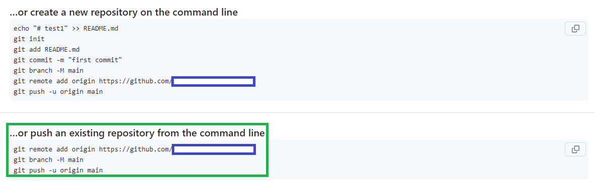

# Activity: Express 

> Before starting this activity, ensure you have a folder named "Dev" in your Documents directory. Inside the "Dev" folder, create another folder called "week1" if it doesn't already exist.

----
## Objective:

Express.js is a popular web application framework for Node.js that simplifies the process of building web applications and APIs. In this activity, we'll create simple applications using Express.js and push it to GitHub.

----
## Part 1/2: Building a "Hello World" Application using Express.js

#### Step 1: Setting up the Project

1. **Create a Project Directory**: Create a new directory for your project in the week1 directory. You can name it whatever you like. For example:
   ```bash
   mkdir express-lab1
   cd express-lab1
   ```

2. **Initialize npm**: Run the following command to initialize a new Node.js project and create a `package.json` file for managing dependencies:
   ```bash
   npm init -y
   ```

3. **Install Express**: Install Express.js as a project dependency using npm:
   ```bash
   npm install express
   ```

#### Step 2: Writing the Code

Create a new file named `app.js` in your project directory and write the following code:

```javascript
const express = require('express');
const app = express();
const port = 3001;

// Callback function for the root endpoint
const handleRootRequest = (req, res) => {
  res.send('Hello World!');
};

// Callback function for when the server starts listening
const handleServerListening = () => {
  console.log(`Example app listening on port ${port}`);
};

// Registering routes with the callback functions
app.get('/', handleRootRequest);

// Starting the server and listening on the specified port
app.listen(port, handleServerListening);
```


#### Step 3: Understanding the Code

- **Importing Express**: We import the Express.js library using the `require()` function and assign it to the variable `express`.

- **Creating an Express Application**: We create an Express application by calling the `express()` function and store the returned application object in the variable `app`.

- **Defining Routes**: We define a route for handling HTTP GET requests to the root URL (`'/'`). When a GET request is made to this route, Express executes the callback function handleRootRequest.

- **handleRootRequest**: This function takes two parameters, `req` (the request object) and `res` (the response object). Within this callback, the `res.send()` method is used to send the response "Hello World!" back to the client.

- **Starting the Server**: We start the Express server by calling the `listen()` method on the `app` object. The server listens on port `3001` (or any other port specified) for incoming connections. Once the server is running,
handleServerListening is called to log a message to the console indicating that the server is listening on port 3001.

#### Step 4: Running the Application

To run the Express application, execute the following command in your project directory:

```bash
node app.js
```

You should see the message "Example app listening on port 3001" logged to the console, indicating that the server is running. You can then open your web browser and navigate to `http://localhost:3001` to see the "Hello World!" message displayed in the browser.

- To stop the server, return to your terminal.
- Press `Ctrl + C` to terminate the server process.

#### Step 5: Code Refactoring

In practice, programmers often use anonymous functions as callback functions, as demonstrated below:

```javascript
const express = require('express');
const app = express();
const port = 3001;

app.get('/', (req, res) => {
  res.send('Hello World!');
});

app.listen(port, () => {
  console.log(`Example app listening on port ${port}`);
});
```

- Replace the existing code in your `app.js` file with the code above. Then, run the server by executing the following command in your project directory: `node app.js`.

You should see the message "Example app listening on port 3001" logged to the console, indicating that the server is running. Open your web browser and navigate to `http://localhost:3001` to see the "Hello World!" message displayed.

#### Step 6: Stop the Server

- To stop the server, return to your terminal and press `Ctrl + C` to terminate the server process.

#### Step 7: Push to GitHub

1. Make the project directory a Git repository by running:

```bash
git init
```

2. Make sure that you have the `.gitignore` file and exclude the `node_modules` directory from version control:

```
node_modules/
``` 

3. Stage all the changes:

```bash
git add .
```

4. Commit the changes:

```bash
git commit -m  "Add message here"

```

5. Create a new repository on GitHub:

- Go to the GitHub website .
- Click on the plus sign icon in the top right corner of the page, and then select "New repository."
- Fill in the details for your new repository:
   - Repository name: Choose a name for your new repository.
   - Description (optional): Add a short description to explain the repository's purpose.
   - Visibility: Choose between "Public" or "Private," depending on who should have access.
   - Do not initialize the repository with a `README` file or a `.gitignore` file.
- Click the "Create repository" button to create your new repository.

6. Connect your local repository to the GitHub repository by following the steps provided by GitHub. There are three commands as shown in the screenshot below, in the green block diagram. You'll need to copy and paste the commands into your terminal, one at a time:


```bash
git remote add origin <GitHub Repository URL>
git branch -M main
git push -u origin main 
```

7. Refresh the GitHub repository page to see your changes.

------
## Part 2/2: Getting Started with Express.js

1. **Create a Project Directory**: Create a new directory for your project. You can name it whatever you like. For example:
   ```bash
   mkdir express-lab2
   cd express-lab2
   ```

2. **Initialize Node.js Project:**
   - Navigate into the "express-lab2" directory:
     ```
     cd express-lab2
     ```
   - Initialize a new Node.js project with default settings by running:
     ```
     npm init -y
     ```

3. **Install Express.js:**
   - Install the Express.js package using npm:
     ```
     npm install express
     ```

4. **Create a Simple Server:**
   - Create a new file named `controllers.js` in the "express-lab2" directory.
   - Open `controllers.js` in a text editor.
   - Write the following code
```javascript
const getRoot = (req, res) => {
  res.send('I am endpoint get /');
};

module.exports = { getRoot };
```
   - Create a new file named `app.js` in the "express-lab2" directory.
   - Open `app.js` in a text editor.
   - Write the following code to create a simple Express server:
```javascript
const express = require("express");
const app = express();

const { getRoot } = require('./controllers'); // getRoot is imported

app.get('/', getRoot); // getRoot is used as a callback

const port = 3001;
// Start the server
app.listen(port, () => {
  console.log(`The server is running at http://localhost:${port}`);
});
```

5. **Start the Server:**
   - In your terminal, navigate to the "express-lab2" directory if you're not already there.
   - Start the Express server by running the following command:
     ```
     node app.js
     ```

6. **Visit localhost:3001:**
   - Open your web browser.
   - Enter the following URL in the address bar: `http://localhost:3001`.
   - You should see the message "Hello, World!" displayed in the browser window.

7. **Stop the Server:**
   - To stop the server, return to your terminal.
   - Press `Ctrl + C` to terminate the server process.


8. **Explanation of the Code Modules:**

Here’s a breakdown of what each module does and how they interact:

- `controllers.js`
   - The `getRoot` function is defined as a callback for handling HTTP GET requests to the root URL (`'/'`). It takes two parameters: `req` (the request object) and `res` (the response object).
   - Within the `getRoot` function, `res.send('I am endpoint get /')` sends a response back to the client with the message "I am endpoint get /".
   - The `module.exports` statement exports an object containing the `getRoot` function. This makes it available for other files to import and use.

- `app.js`
   - `const express = require("express");`: Imports the Express framework.
   - `const app = express();`: Creates an instance of an Express application.
   - `const { getRoot } = require('./controller');`: Imports the `getRoot` function from the `controllers.js` file. This allows `app.js` to use `getRoot` as a callback function for handling requests.
   - `app.get('/', getRoot);`: Defines a route for HTTP GET requests to the root URL (`'/'`). When a GET request is made to `'/'`, the `getRoot` function is used to handle the request and send the response.
   - `app.listen(port, () => { console.log(`The server is running at http://localhost:${port}`); });`: Starts the server and listens on port 3001. When the server starts, it logs a message to the console indicating that it is running and on which port.

9. **Push to GitHub**

- Make the project directory a Git repository by running:

```bash
git init
```

- Make sure that you have the `.gitignore` file and exclude the `node_modules` directory from version control:

```
node_modules/
``` 

- Stage all the changes:

```bash
git add .
```

- Commit the changes:

```bash
git commit -m  "Add message here"

```

**Create a new repository on GitHub:**

- Go to the GitHub website .
- Click on the plus sign icon in the top right corner of the page, and then select "New repository."
- Fill in the details for your new repository:
   - Repository name: Choose a name for your new repository.
   - Description (optional): Add a short description to explain the repository's purpose.
   - Visibility: Choose between "Public" or "Private," depending on who should have access.
   - Do not initialize the repository with a `README` file or a `.gitignore` file.
- Click the "Create repository" button to create your new repository.

**Connect your local repository to the GitHub repository**

Follow the steps provided by GitHub. There are three commands as shown in the screenshot below, in the green block diagram. You'll need to copy and paste the commands into your terminal, one at a time:


```bash
git remote add origin <GitHub Repository URL>
git branch -M main
git push -u origin main 
```



- Refresh the GitHub repository page to see your changes.


------
<details>

<summary>Optional Task</summary>


## Mock Server


1. **Create a Project Directory**: Create a new directory for your project. You can name it whatever you like. For example:
   ```bash
   mkdir express-lab3
   cd express-lab3
   ```

2. **Initialize Node.js Project:**
   - Navigate into the "express-lab3" directory:
     ```
     cd express-lab3
     ```
   - Initialize a new Node.js project with default settings by running:
     ```
     npm init -y
     ```

3. **Install Express.js:**
   - Install the Express.js package using npm:
     ```
     npm install express
     ```

4. **Create a Simple Server:**
   - Create a new file named "controllers.js" in the "express-lab3" directory.
   - Open "controllers.js" in a text editor.
   - Write the following code
```javascript
// getEndpoint1 callback
const getEndpoint1 = (req, res) => {
  res.send("I am endpoint get /endpoint1");
};

// getEndpoint2 callback
const getEndpoint2 = (req, res) => {
  res.send("I am endpoint get /endpoint2");
};

// getEndpoint3 callback 
const getEndpoint3 = (req, res) => {
  res.send("I am endpoint get /endpoint3");
};

// getRoot callback
const getRoot = (req, res) => {
  res.send("I am endpoint get /");
};

module.exports = {
  getEndpoint1,
  getEndpoint2,
  getEndpoint3,
  getRoot,
};
```
   - Create a new file named "app.js" in the "express-lab3" directory.
   - Open "app.js" in a text editor.
   - Write the following code to create a simple Express server that responds with "Hello, World!" when accessed:
```javascript
const express = require("express");
const app = express();
const port = 3001;

// Import callbacks
const { getEndpoint1, getEndpoint2, getEndpoint3, getRoot } = require("./controllers");

// Define routes
app.get("/", getRoot);
app.get("/endpoint1", getEndpoint1);
app.get("/endpoint2", getEndpoint2);
app.get("/endpoint3", getEndpoint3);

// Start the server
app.listen(port, () => {
  console.log(`The server is running at http://localhost:${port}`);
});
```

5. **Start the Server:**
   - In your terminal, navigate to the "express-lab2" directory if you're not already there.
   - Start the Express server by running the following command:
     ```
     node app.js
     ```

6. **Test endpoints**
   - Open your web browser.
     - Enter the following URL in the address bar: `http://localhost:3001`. You should see the message "Hello, World!" displayed in the browser window.
     - Enter the following URL in the address bar: `http://localhost:3001/endpoint1`
     - Enter the following URL in the address bar: `http://localhost:3001/endpoint2`   
     - Enter the following URL in the address bar: `http://localhost:3001/endpoint3`
   


7. **Stop the Server:**
   - To stop the server, return to your terminal.
   - Press `Ctrl + C` to terminate the server process.

8. **Push to GitHub**

- Make the project directory a Git repository by running:

```bash
git init
```

- Make sure that you have the `.gitignore` file and exclude the `node_modules` directory from version control:

```
node_modules/
``` 

- Stage all the changes:

```bash
git add .
```

- Commit the changes:

```bash
git commit -m  "Add message here"

```

**Create a new repository on GitHub:**

- Go to the GitHub website .
- Click on the plus sign icon in the top right corner of the page, and then select "New repository."
- Fill in the details for your new repository:
   - Repository name: Choose a name for your new repository.
   - Description (optional): Add a short description to explain the repository's purpose.
   - Visibility: Choose between "Public" or "Private," depending on who should have access.
   - Do not initialize the repository with a `README` file or a `.gitignore` file.
- Click the "Create repository" button to create your new repository.

**Connect your local repository to the GitHub repository**

Follow the steps provided by GitHub. There are three commands as shown in the screenshot below, in the green block diagram. You'll need to copy and paste the commands into your terminal, one at a time:


```bash
git remote add origin <GitHub Repository URL>
git branch -M main
git push -u origin main 
```

- Refresh the GitHub repository page to see your changes.
</details>