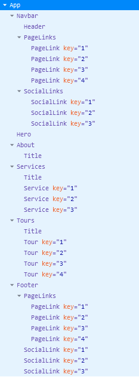
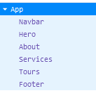
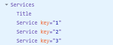
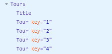
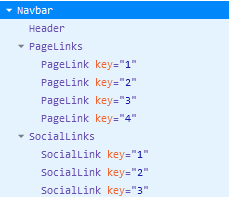

# Front End Pair programming

In this pair programming activity, we will transform an existing HTML webpage into a React app with the following component structure:



<!-- 
Border shows incorrectly with the image. 
solution 1: delete:     border: 0.5rem solid var(--clr-primary-5);
solution 1: delete:   top: -1.5rem;left: -1.5rem; 
-->

## Setup

1. Create a new repository on GitHub with the name `week3-fe-pair-programming`.
2. Make sure to add your pair as collaborators to the repository. 
3. Please follow [**this workflow**](./github-push-pull.md) when collaborating on GitHub. 
4. After **each iteration**, make sure to commit your changes with a [relevant message](./github-push-pull.md#commit-messages), such as: **"Extract Navbar section, convert to JSX, and create NavBar component."**
4. In your reflection journal, provide the link to the created repository. 
5. Keep the repository private until Sunday.
6. Include in your reflection journal the style you used during the pair programming session. For reference, here’s a brief introduction to the different styles of pair programming: [The Different Styles of Pair Programming](https://www.drovio.com/blog/the-different-styles-of-pair-programming/).  

## Instructions


### Iteration 0: Project Setup

In this iteration, you'll use this [starter code](https://github.com/tx00-resources-en/react-pp2) for the project.

1. Clone the starter using the following command:
  ```bash
  git clone https://github.com/tx00-resources-en/react-pp2 week3-fe-pair-programming
  ```
- Navigate to the cloned directory:
  ```bash
  cd week3-fe-pair-programming
  ```

- Remove the `.git` folder:
    - **Windows Users:** Run the following command to remove the Git history: `Remove-Item -Recurse -Force .git`
    - **macOS/Linux Users:** Run the following command to remove the repository's Git history: `rm -rf .git` 

2. Navigate to the cloned directory and run the following commands:

   ```sh
   npm install
   npm run dev
   ```

   These commands will install the necessary dependencies and start the React app. Ensure that the React app is running.


The `week3-fe-pair-programming` folder includes two main folders: "public" and "src" It's essential to understand the purpose of each folder and what's expected of you in this phase. for a detailed overview of the main components in the project and their roles, [check this reading](../vite-project.md)

1. **Public Folder**
   - The **`public`** folder contains essential files and assets used by your project that should not be modified.
1. `index.html`  
   -  In our React app, we are using Font Awesome icons in the `SocialLink` component. Make sure the following link is added to `index.html`:

    ```html
    <link
      rel="stylesheet"
      href="https://cdnjs.cloudflare.com/ajax/libs/font-awesome/6.6.0/css/all.min.css"
    />
    ```

2. **Source (Src) Folder**
   - The "src" folder is where you'll spend most of your time working on the project. It contains various files and subfolders, some of which are already partially completed, while others will require your attention and coding expertise.

3. **Ready-to-Use Files**
   - You will find three files in the "src" folder that are ready to use, meaning they already contain the necessary code for the project:
     - `main.jsx`: This file acts as the entry point for your React application. 
     - `data.js`: Here, you will find predefined data that your application will use.
     - `App.css`: This file contains the styling for your application.

4. **To-Be-Completed Components**
   - The heart of your application lies in the `src/App.jsx` file and "`src/components`" folder within the "src" directory. This is where you'll be spending a significant portion of your time.
   - Inside the "components" folder, you'll find several individual files. Each of these files represents a React component that needs your attention. Some components may have basic functionality in place, but they require further development to be fully functional. Your task is to enhance and complete these components.

5. **Images Folder**
   - Inside the `src/assets `folder, you'll find a subfolder named "images." This folder contains all the image assets required for your project. These images are ready to be used in your application.

The goal of this step is to get your development environment set up and understand the project's structure. Before you dive into coding, take a moment to familiarize yourself with the provided files and folders. In the upcoming steps, you'll be working on each component, ensuring that the entire project comes together seamlessly.

Happy coding, and remember that you're not alone! Pair up and collaborate as you tackle each component and bring your project to life.

----
### Iteration 1: 

1. We will be refactoring an HTML website into a React app. Open the `index.html` file located at [./Original-HTML/index.html](./Original-HTML/index.html) using Visual Studio Code. The HTML file contains six sections with starting and ending line numbers for each section:

   - Navbar: lines 15 - 48
   - Hero: lines 50 - 61
   - About: lines 63 - 88
   - Services: lines 90 - 128
   - Tours: lines 130 - 230
   - Footer: lines 232 - 265

2. Our first step is to extract the Navbar section and convert it to JSX. To achieve this, you can use an online tool for the conversion, such as [html-to-jsx](https://transform.tools/html-to-jsx). The converted JSX code for the Navbar should look like this:

```jsx
    <nav className="navbar">
      <div className="nav-center">
        <div className="nav-header">
          
          <button type="button" className="nav-toggle" id="nav-toggle">
            <i className="fas fa-bars"></i>
          </button>
        </div>
        <ul className="nav-links" id="nav-links">
          <li>
            <a href="#home" className="nav-link">
              home
            </a>
          </li>
          <li>
            <a href="#about" className="nav-link">
              about
            </a>
          </li>
          <li>
            <a href="#services" className="nav-link">
              services
            </a>
          </li>
          <li>
            <a href="#tours" className="nav-link">
              tours
            </a>
          </li>
        </ul>
        <ul className="nav-icons">
          <li>
            <a
              href="https://www.facebook.com"
              target="_blank"
              rel="noreferrer"
              className="nav-icon"
            >
              <i className="fab fa-facebook"></i>
            </a>
          </li>
          <li>
            <a
              href="https://www.x.com"
              target="_blank"
              rel="noreferrer"
              className="nav-icon"
            >
              <i className="fab fa-x-twitter"></i>
            </a>
          </li>
          <li>
            <a
              href="https://www.squarespace.com/"
              target="_blank"
              rel="noreferrer"
              className="nav-icon"
            >
              <i className="fab fa-squarespace"></i>
            </a>
          </li>
        </ul>
      </div>
    </nav>
```

3. Replace this existing snippet for the `Navbar` component in your React application with the converted JSX from step 2.

```jsx
    <div>
      <p className="section-dummy">About</p>
      <p className="section-dummy">...</p>
    </div>
```
- Finally, check your web browser to ensure that the React app is running and that the changes to the `Navbar` component are correctly reflected.
- To include the image, remove the old HTML tag: ``

----
### Iteration 2: 

1. Following the same procedure as before, convert the following sections of the HTML website into individual React components. You can use an online tool for the conversion, such as [htmltojsx.com](https://transform.tools/html-to-jsx).

   - For the Hero section, convert the HTML code located between lines 50 and 61 into a `Hero` component.
   - For the About section, convert the HTML code between lines  63 and 88 into an `About` component.
   - For the Services section, convert the HTML code between lines 90 and 128 into a `Services` component.
   - For the Tours section, convert the HTML code between lines 130 and 230 into a `Tours` component.
   - For the Footer section, convert the HTML code located between lines 232 and 265 into a `Footer` component.

2. Replace the respective sections in your React application with the converted JSX components from step 1. Ensure that each section is placed in its appropriate React component.

3. Test your React application in your web browser to confirm that the components are rendering correctly 

- You can use the React DevTools extension to inspect the component hierarchy. When you do, you should see the following structure:



### Iteration 3: 

- Replace the content of the `Title` component with the following JSX:

```jsx
const Title = ({ title, subTitle }) => {
  return (
    <div className='section-title'>
      <h2>
        {title} <span>{subTitle}</span>
      </h2>
    </div>
  );
};
export default Title;
```

- Replace the content of the `Service` component with the following JSX:

```jsx
const Service = ({ icon, title, text }) => {
  return (
    <article className='service'>
      <span className='service-icon'>
        <i className={icon}></i>
      </span>
      <div className='service-info'>
        <h4 className='service-title'>{title}</h4>
        <p className='service-text'>{text}</p>
      </div>
    </article>
  )
}
export default Service
```  

- Replace the content of `Services` component with the following JSX:
```jsx
import { services } from '../data'
import Title from './Title'
import Service from './Service'

const Services = () => {
  return (
    <section className='section services' id='services'>
      <Title title='our' subTitle='services' />

      <div className='section-center services-center'>
        {services.map((service) => {
          return <Service {...service} key={service.id} />
        })}
      </div>
    </section>
  )
}
export default Services
```

**Explanation:**

The React `Services` component is responsible for rendering a section of the website dedicated to displaying a list of services. Let's break down the code step by step:

1. **Data Import:**

   ```jsx
   import { services } from '../data';
   ```

   This line imports an array named `services` from a `data.js` file located in the parent directory. The `services` array contains data related to various services, such as their titles, descriptions, and icons.

2. **Component Imports:**

   ```jsx
   import Title from './Title';
   import Service from './Service';
   ```

   These lines import two other React components, `Title` and `Service`. `Title` is used for rendering a section title, and `Service` is used for displaying information about individual services.

3. **`Services` Component:**

   ```jsx
   const Services = () => {
   ```
   
   Here, the `Services` component is defined as a functional component. It doesn't receive any props.

4. **Rendering the Section:**

   ```jsx
   return (
     <section className='section services' id='services'>
   ```

   The component returns a section element with the class name "section services" and the id "services." This section likely represents the part of your website dedicated to displaying services.

5. **Title Component:**

   ```jsx
   <Title title='our' subTitle='services' />
   ```

   The `Title` component is used to display a section title with the main title set as "our" and the subtitle as "services." This provides a title for the services section.

6. **Service List:**

   ```jsx
   <div className='section-center services-center'>
     {services.map((service) => {
       return <Service {...service} key={service.id} />
     })}
   </div>
   ```

   This part of the code is responsible for rendering the list of services. The `services` array is mapped using the `.map()` function to create a list of `Service` components, passing each service's data as props. The `key` prop is set to `service.id` to help React efficiently manage and update the list of services.

   > If we did not use the spread syntax, we would need to explicitly pass each property of the `service` object as a prop to the `Service` component. Here's how it would look:

   ```jsx
    <div className='section-center services-center'>
      {services.map((service) => {
        return (
          <Service
            icon={service.icon}
            title={service.title}
            text={service.text}
            key={service.id}
          />
        );
      })}
    </div>
    ```

7. **Component Export:**

   ```jsx
   export default Services;
   ```

   Finally, the `Services` component is exported as the default export, making it available for use in other parts of your React application.


- You can use the React DevTools extension to inspect the component hierarchy. When you do, you should see the following structure:


----
### Iteration 4: 

Following the same procedure as in Iteration 3, rewrite the code for the `Tour` component. Then, refactor the `Tours` component to use the `Tour` component in a manner similar to how we used the `Services` component.

1. **The `Tour` Component:**

   In the the `Tour.jsx` file, rewrite the `Tour` component, and set up the necessary rendering logic. The `Tour` component will be responsible for rendering information related to individual tours.

2. **Refactor the `Tours` Component:**

   Within the `Tours` component, make the following changes:

   - Import the `Tour` component at the top of your file:

     ```jsx
     import Tour from './Tour';
     ```

   - In the `Tours` component's rendering logic, replace any existing code responsible for displaying tours with a mapping operation that iterates over an array of tours, creating instances of the `Tour` component for each tour. For example:

     ```jsx
     {tours.map((tour) => (
       <Tour key={tour.id} {...tour} />
     )}
     ```

     Here, we're using the `map()` function to iterate over an array of tour data and create a `Tour` component for each tour. The `key` prop is set to `tour.id` to ensure each component has a unique identifier.

   - Ensure that the `Tour` component receives the necessary props (e.g., `id`, `image`, `date`, `title`, `info`, `location`, `duration`, and `cost`) so that it can render the tour details correctly.

3. **Test Your Application:**

   After making these changes, test your application to ensure that the `Tour` component is rendering individual tours within the `Tours` component. Verify that the tour data is displayed correctly and that the `key` prop is set for each `Tour` component.

- You can use the React DevTools extension to inspect the component hierarchy. When you do, you should see the following structure:


----
### Iteration 5: 

- **The `PageLink` component**

Replace the code for the `PageLink` component with the following JSX:

  ```jsx
      const PageLink = ({ link, itemClass }) => {
        return (
          <li key={link.id}>
            <a href={link.href} className={itemClass}>
              {link.text}
            </a>
          </li>
        )
      }
      export default PageLink
  ```

- **The `PageLinks` Component:**

   Replace the code for the `PageLinks` component with the following JSX:

   ```jsx
   import { pageLinks } from '../data'
   import PageLink from './PageLink'

   const PageLinks = ({ parentClass, itemClass }) => {
     return (
       <ul className={parentClass} id='nav-links'>
         {pageLinks.map((link) => {
           return <PageLink key={link.id} link={link} itemClass={itemClass} />
         })}
       </ul>
     )
   }
   export default PageLinks
   ```

   The `PageLinks` component is designed to render a list of page links based on the data in `pageLinks`. It takes two props, `parentClass` and `itemClass`, which are used to style the parent `ul` and individual `li` elements.

1. **Refactor the Footer Component:**

   In the `Footer.jsx` file, replace this snippet 
    ```jsx
		  <ul className="footer-links" id="nav-links">
                <li><a href="#home" className="footer-link">home</a></li>
                <li><a href="#about" className="footer-link">about</a></li>
                <li><a href="#services" className="footer-link">services</a></li>
                <li><a href="#tours" className="footer-link">tours</a></li>
          </ul>
    ```
   
with the JSX code provided below:

```jsx
<PageLinks parentClass='footer-links' itemClass='footer-link' />
```

   This code replaces the static list of links with the `PageLinks` component, passing the appropriate `parentClass` and `itemClass` props to style the footer links. The `PageLinks` component will dynamically generate the links based on the data in `pageLinks`.

----
### Iteration 6: 

Do the same for the `Nav` component. Refactor it to use PageLinks

- You can use the React DevTools extension to inspect the component hierarchy. When you do, you should see the following structure:

- Do the same for the `SocialLinks` component. Refactor it to use `SocialLink`.

----
### Iteration 7: 

Currently, the `Navbar` component contains the `Header` component inside it:

```jsx
function Navbar() {
  return (
    <nav className="navbar">
      <div className="nav-center">
        <Header />
        <PageLinks parentClass="nav-links" itemClass="nav-link" />
        <SocialLinks parentClass="nav-icons" itemClass="nav-icon" />
      </div>
    </nav>
  );
}

export default Navbar;
```

**Your task:**  

Refactor the code so that the `Header` component becomes the parent, and it contains the `Navbar` inside it. In other words, instead of `Navbar` rendering `Header`, the `Header` should render `Navbar`.


**Why do we need this change?**

- **Semantic hierarchy:** A header usually represents the top section of a page (logo, navigation, branding). The navigation bar (`Navbar`) is just one part of that header. Structurally, it makes more sense for `Header` to wrap `Navbar` rather than the other way around.
- **Reusability:** If `Header` owns the `Navbar`, you can easily add other elements to the header later (like a search bar, user profile, or notifications) without cramming them into the `Navbar` component.
- **Clarity of responsibility:**  
  - `Header` → responsible for the overall page header layout.  
  - `Navbar` → responsible only for navigation links and social icons.  
  This separation of concerns makes the codebase easier to maintain and extend.
- **Accessibility & semantics:** Screen readers and accessibility tools expect a `<header>` element to contain navigation (`<nav>`). Wrapping it this way aligns with best practices in HTML5 semantics.


**Expected Outcome**

After refactoring:
- `Header` is the parent component.  
- `Navbar` is a child inside `Header`.  
- The structure reflects real-world semantics: **Header → Navbar → Links & Icons**.


----
### Iteration 8 (Optional): 

Refactor the global CSS file `App.css` into CSS modules e.g for the `Hero` component, you can follow these steps:

1. **Create a `Hero.module.css` File:**

   Create a new CSS module file for the `Hero` component. Name it something like `Hero.module.css`.

2. **Move and Organize the CSS Styles:**

   Move the CSS styles for the `Hero` component from `App.css` into the `Hero.module.css` file. You can structure the CSS as follows:

   ```css
   /* Hero.module.css */

   .hero {
     min-height: 100vh;
     background: var(--clr-primary-5);
     display: flex;
     justify-content: center;
     align-items: center;
   }

   .hero-banner {
     text-align: center;
     color: var(--clr-white);
     padding: 0 3rem;
   }

   .hero-banner h1 {
     text-transform: uppercase;
   }

   .hero-banner p {
     max-width: 35rem;
     margin-left: auto;
     margin-right: auto;
     color: var(--clr-white);
     letter-spacing: var(--spacing);
   }

   .hero-btn {
     padding: 0.9rem 1.6rem;
     font-size: 1.25rem;
     background: var(--clr-white);
     color: var(--clr-primary-5);
   }

   .hero-btn:hover {
     background: transparent;
     color: var(--clr-white);
     border-color: var(--clr-white);
   }

   @media screen and (min-width: 768px) {
     .hero {
       background: linear-gradient(rgb(44, 174, 186, 0.7), rgba(0, 0, 0, 0.7)),
         url('./images/main.jpeg') center/cover no-repeat;
     }

     .hero-banner {
       padding: 0;
     }

     .hero-banner p {
       max-width: 45rem;
     }
   }
   ```

3. **Import the CSS Module in the Hero Component:**

   In your `Hero.jsx` (or equivalent) file, import the CSS module at the top of the component file:

   ```jsx
   import React from 'react';
   import styles from './Hero.module.css'; // Import the CSS module
   ```

4. **Apply CSS Classes Using CSS Modules:**

   Update your JSX code in the `Hero` component to use the CSS classes from the imported module. Replace class names with the respective styles from the `styles` object:

   ```jsx
   <div className={styles.hero}>
     {/* ... */}
   </div>

   <div className={styles['hero-banner']}>
     {/* ... */}
   </div>

   <div className={styles['hero-btn']}>
     {/* ... */}
   ```

   - Ensure that you use square brackets for class names with special characters (e.g., `'hero-banner'`) within the `styles` object.
   - Note that we are using the bracket notation e.g  `styles['hero-banner']` not the dot notation
   - It's possible to use "hero-btn" style as `styles.heroBtn` instead of `styles['hero-btn']`.
- To apply two CSS classes to a React component, where one class uses bracket notation, you can do it like this:

    ```jsx
    <div className={`btn ${styles['hero-btn']}`}>{/* Your content here */}</div>
    <div className={`btn ${styles.heroBtn}`}>{/* Your content here */}</div>

    ```

    > For more information, visit this link: [Dot Notation vs Bracket Notation for Object Properties](https://www.freecodecamp.org/news/dot-notation-vs-square-brackets-javascript/)

