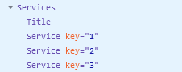
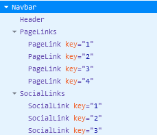

# Front End Pair Activity (Beginner-Friendly)

In this paired activity, you will transform an existing HTML webpage into a React app with the following component structure:


## How you will work (paired, not strict pair programming)

Some students feel nervous about “strict” pair programming. That's totally ok. For this activity, you will work as **two problem-solvers**:

- You can both talk, think, and type.
- Your goal is to **try together first**, then reveal help only if you need it.
- Each iteration below has a hidden solution you can expand/collapse.

Example format you will see:

```html
<details>
<summary>Solution</summary>

...hidden help here...

</details>
```

### Help ladder (use in order)

When you get stuck:

1. Re-read the instruction and the HTML section you're converting.
2. Ask your partner to explain their approach.
3. Try a tiny experiment (change one thing, refresh).
4. Open the solution for that iteration.
5. Ask the teacher.

### Recommended rhythm

- After each iteration, the app should still run.
- Commit after each iteration with a clear message.

## Setup

1. Create a new GitHub repository named `week3-fe-pair-programming`.
2. Add your partner as a collaborator.
3. Follow this GitHub workflow when collaborating: [./github-push-pull.md](./github-push-pull.md)
4. After each iteration, commit with a relevant message: [./github-push-pull.md#commit-messages](./github-push-pull.md#commit-messages)
5. Add the repo link to your reflection journal.
6. Keep the repository private until Sunday.
7. If any step is unclear or you're unable to complete it, don't hesitate to call the teacher to the breakout room for help.

## Instructions

### Iteration 0: Project Setup

Goal: get the app running locally and understand the folder structure.

Try it first (10 minutes):

1. [Clone the starter](https://github.com/tx00-resources-en/react-pp2) into a folder named `week3-fe-pair-programming`.
2. Remove the starter's Git history (`.git` folder) so you can connect it to your GitHub repo.
3. Install dependencies and start the dev server.
4. Confirm the page loads in the browser.

Quick orientation (beginner-friendly):

- `index.html` is the single page Vite serves.
- `src/main.jsx` mounts your React app into `<div id="root">`.
- `src/App.jsx` is your top-level component.
- `src/data.js` contains arrays you'll map over later.
- `src/App.css` already has the full styling.

If you want a gentle overview of Vite project structure, read: [./vite-project.md](./vite-project.md)

<details>
<summary>Solution (Iteration 0)</summary>

1) Clone the starter:

```bash
git clone https://github.com/tx00-resources-en/react-pp2 week3-fe-pair-programming
cd week3-fe-pair-programming
```

2) Remove the starter's Git history:

- Windows (PowerShell):

```powershell
Remove-Item -Recurse -Force .git
```

- macOS/Linux:

```bash
rm -rf .git
```

3) Install + run:

```bash
npm install
npm run dev
```

4) Sanity check: Font Awesome

Open `index.html` and verify this is in `<head>` (if it's already there, you're done):

```html
<link
  rel="stylesheet"
  href="https://cdnjs.cloudflare.com/ajax/libs/font-awesome/6.6.0/css/all.min.css"
/>
```

</details>

----

### Iteration 1: Navbar

Goal: replace the placeholder `Navbar` component with the real Navbar HTML converted to JSX.

Try it first (10–12 minutes):

1. Open [./Original-HTML/index.html](./fe-pair-programming/Original-HTML/index.html).
2. Identify the sections (so you know what you're converting):
   - Navbar: lines 15 - 48
   - Hero: lines 50 - 61
   - About: lines 63 - 88
   - Services: lines 90 - 128
   - Tours: lines 130 - 230
   - Footer: lines 232 - 265
3. Convert the Navbar HTML to JSX (tool suggestion: https://transform.tools/html-to-jsx).
4. Paste it into `src/components/Navbar.jsx`.
5. Fix the logo by importing it from `src/assets/images`.

Beginner tips:

- JSX uses `className`, not `class`.
- Images in React should be imported (don't keep `src="images/..."`).

<details>
<summary>Solution (Iteration 1)</summary>

Replace the placeholder code in `src/components/Navbar.jsx` with:

```jsx
import logo from '../assets/images/logo.svg'

const Navbar = () => {
  return (
    <nav className='navbar'>
      <div className='nav-center'>
        <div className='nav-header'>
          
          <button type='button' className='nav-toggle' id='nav-toggle'>
            <i className='fas fa-bars'></i>
          </button>
        </div>
        <ul className='nav-links' id='nav-links'>
          <li>
            <a href='#home' className='nav-link'>
              home
            </a>
          </li>
          <li>
            <a href='#about' className='nav-link'>
              about
            </a>
          </li>
          <li>
            <a href='#services' className='nav-link'>
              services
            </a>
          </li>
          <li>
            <a href='#tours' className='nav-link'>
              tours
            </a>
          </li>
        </ul>
        <ul className='nav-icons'>
          <li>
            <a
              href='https://www.facebook.com'
              target='_blank'
              rel='noreferrer'
              className='nav-icon'
            >
              <i className='fab fa-facebook'></i>
            </a>
          </li>
          <li>
            <a
              href='https://www.x.com'
              target='_blank'
              rel='noreferrer'
              className='nav-icon'
            >
              <i className='fab fa-x-twitter'></i>
            </a>
          </li>
          <li>
            <a
              href='https://www.squarespace.com/'
              target='_blank'
              rel='noreferrer'
              className='nav-icon'
            >
              <i className='fab fa-squarespace'></i>
            </a>
          </li>
        </ul>
      </div>
    </nav>
  )
}

export default Navbar
```

</details>

----
### Iteration 2: Hero, About, Services, Tours, Footer

Goal: convert the rest of the HTML sections into React components.

Try it first (12–15 minutes):

1. Open [./Original-HTML/index.html](./Original-HTML/index.html).
2. Convert each section (Hero/About/Services/Tours/Footer) to JSX.
3. Paste each JSX section into its matching component in `src/components/`.
4. Fix images by importing them from `src/assets/images`.
5. Confirm everything renders in the browser.

Expected component tree:


<details>
<summary>Solution (Iteration 2)</summary>

These are working reference solutions you can paste into each component.

`src/components/Hero.jsx`

```jsx
const Hero = () => {
  return (
    <section className='hero' id='home'>
      <div className='hero-banner'>
        <h1>backroads app</h1>
        <p>
          Lorem ipsum dolor sit amet consectetur adipisicing elit. Vitae
          explicabo debitis est autem dicta.
        </p>
        <a href='#tours' className='btn hero-btn'>
          explore tours
        </a>
      </div>
    </section>
  )
}

export default Hero
```

`src/components/About.jsx`

```jsx
import aboutImg from '../assets/images/about.jpeg'

const About = () => {
  return (
    <section className='section' id='about'>
      <div className='section-title'>
        <h2>
          about <span>us</span>
        </h2>
      </div>
      <div className='section-center about-center'>
        <div className='about-img'>
          
        </div>
        <article className='about-info'>
          <h3>explore the difference</h3>
          <p>
            Lorem ipsum, dolor sit amet consectetur adipisicing elit.
            Aspernatur quisquam harum nam cumque temporibus explicabo dolorum
            sapiente odio unde dolor?
          </p>
          <p>
            Lorem ipsum, dolor sit amet consectetur adipisicing elit.
            Aspernatur quisquam harum nam cumque temporibus explicabo dolorum
            sapiente odio unde dolor?
          </p>
          <a href='#' className='btn'>
            read more
          </a>
        </article>
      </div>
    </section>
  )
}

export default About
```

`src/components/Services.jsx`

```jsx
const Services = () => {
  return (
    <section className='section services' id='services'>
      <div className='section-title'>
        <h2>
          our <span>services</span>
        </h2>
      </div>
      <div className='section-center services-center'>
        <article className='service'>
          <span className='service-icon'>
            <i className='fas fa-wallet fa-fw'></i>
          </span>
          <div className='service-info'>
            <h4 className='service-title'>saving money</h4>
            <p className='service-text'>
              Lorem ipsum dolor sit amet consectetur adipisicing elit
              Asperiores, officia.
            </p>
          </div>
        </article>

        <article className='service'>
          <span className='service-icon'>
            <i className='fas fa-tree fa-fw'></i>
          </span>
          <div className='service-info'>
            <h4 className='service-title'>endless hiking</h4>
            <p className='service-text'>
              Lorem ipsum dolor sit amet consectetur adipisicing elit
              Asperiores, officia.
            </p>
          </div>
        </article>

        <article className='service'>
          <span className='service-icon'>
            <i className='fas fa-socks fa-fw'></i>
          </span>
          <div className='service-info'>
            <h4 className='service-title'>amazing comfort</h4>
            <p className='service-text'>
              Lorem ipsum dolor sit amet consectetur adipisicing elit
              Asperiores, officia.
            </p>
          </div>
        </article>
      </div>
    </section>
  )
}

export default Services
```

`src/components/Tours.jsx`

```jsx
import tour1 from '../assets/images/tour-1.jpeg'
import tour2 from '../assets/images/tour-2.jpeg'
import tour3 from '../assets/images/tour-3.jpeg'
import tour4 from '../assets/images/tour-4.jpeg'

const Tours = () => {
  return (
    <section className='section' id='tours'>
      <div className='section-title'>
        <h2>
          featured <span>tours</span>
        </h2>
      </div>
      <div className='section-center featured-center'>
        <article className='tour-card'>
          <div className='tour-img-container'>
            
            <p className='tour-date'>august 26th, 2027</p>
          </div>
          <div className='tour-info'>
            <div className='tour-title'>
              <h4>Tibet Adventure</h4>
            </div>
            <p>
              Lorem ipsum dolor sit amet, consectetur adipisicing elit. Cumque
              vitae tempore voluptatum maxime reprehenderit eum quod
              exercitationem fugit, qui corporis.
            </p>
            <div className='tour-footer'>
              <p>
                <span>
                  <i className='fas fa-map'></i>
                </span>
                china
              </p>
              <p>from €2100</p>
              <p>6 days</p>
            </div>
          </div>
        </article>

        <article className='tour-card'>
          <div className='tour-img-container'>
            
            <p className='tour-date'>october 1th, 2027</p>
          </div>
          <div className='tour-info'>
            <div className='tour-title'>
              <h4>best of java</h4>
            </div>
            <p>
              Lorem ipsum dolor sit amet, consectetur adipisicing elit. Cumque
              vitae tempore voluptatum maxime reprehenderit eum quod
              exercitationem fugit, qui corporis.
            </p>
            <div className='tour-footer'>
              <p>
                <span>
                  <i className='fas fa-map'></i>
                </span>
                indonesia
              </p>
              <p>from €1400</p>
              <p>11 days</p>
            </div>
          </div>
        </article>

        <article className='tour-card'>
          <div className='tour-img-container'>
            
            <p className='tour-date'>september 15th, 2027</p>
          </div>
          <div className='tour-info'>
            <div className='tour-title'>
              <h4>explore hong kong</h4>
            </div>
            <p>
              Lorem ipsum dolor sit amet, consectetur adipisicing elit. Cumque
              vitae tempore voluptatum maxime reprehenderit eum quod
              exercitationem fugit, qui corporis.
            </p>
            <div className='tour-footer'>
              <p>
                <span>
                  <i className='fas fa-map'></i>
                </span>
                hong kong
              </p>
              <p>from €5000</p>
              <p>8 days</p>
            </div>
          </div>
        </article>

        <article className='tour-card'>
          <div className='tour-img-container'>
            
            <p className='tour-date'>december 5th, 2027</p>
          </div>
          <div className='tour-info'>
            <div className='tour-title'>
              <h4>kenya highlights</h4>
            </div>
            <p>
              Lorem ipsum dolor sit amet, consectetur adipisicing elit. Cumque
              vitae tempore voluptatum maxime reprehenderit eum quod
              exercitationem fugit, qui corporis.
            </p>
            <div className='tour-footer'>
              <p>
                <span>
                  <i className='fas fa-map'></i>
                </span>
                kenya
              </p>
              <p>from €3300</p>
              <p>20 days</p>
            </div>
          </div>
        </article>
      </div>
    </section>
  )
}

export default Tours
```

`src/components/Footer.jsx`

```jsx
const Footer = () => {
  const year = new Date().getFullYear()

  return (
    <footer className='section footer'>
      <ul className='footer-links' id='nav-links'>
        <li>
          <a href='#home' className='footer-link'>
            home
          </a>
        </li>
        <li>
          <a href='#about' className='footer-link'>
            about
          </a>
        </li>
        <li>
          <a href='#services' className='footer-link'>
            services
          </a>
        </li>
        <li>
          <a href='#tours' className='footer-link'>
            tours
          </a>
        </li>
      </ul>
      <ul className='footer-icons'>
        <li>
          <a
            href='https://www.facebook.com'
            target='_blank'
            rel='noreferrer'
            className='footer-icon'
          >
            <i className='fab fa-facebook'></i>
          </a>
        </li>
        <li>
          <a
            href='https://www.twitter.com'
            target='_blank'
            rel='noreferrer'
            className='footer-icon'
          >
            <i className='fab fa-twitter'></i>
          </a>
        </li>
        <li>
          <a
            href='https://www.squarespace.com/'
            target='_blank'
            rel='noreferrer'
            className='footer-icon'
          >
            <i className='fab fa-squarespace'></i>
          </a>
        </li>
      </ul>
      <p className='copyright'>
        copyright © travel tours company {year}. all rights reserved
      </p>
    </footer>
  )
}

export default Footer
```

</details>


### Iteration 3: Title + Services refactor (data-driven)

Goal: practice props + mapping by rendering services from `src/data.js`.

Try it first (12 minutes):

1. Update `Title` to accept `title` and `subTitle` props.
2. Update `Service` to accept `icon`, `title`, `text` props.
3. Update `Services` to map over `services` from `src/data.js`.

Beginner tip: if you see “each child in a list should have a unique key”, it means you forgot `key={...}` on the component you return inside `map()`.

<details>
<summary>Solution (Iteration 3)</summary>

`src/components/Title.jsx`

```jsx
const Title = ({ title, subTitle }) => {
  return (
    <div className='section-title'>
      <h2>
        {title} <span>{subTitle}</span>
      </h2>
    </div>
  )
}

export default Title
```

`src/components/Service.jsx`

```jsx
const Service = ({ icon, title, text }) => {
  return (
    <article className='service'>
      <span className='service-icon'>
        <i className={icon}></i>
      </span>
      <div className='service-info'>
        <h4 className='service-title'>{title}</h4>
        <p className='service-text'>{text}</p>
      </div>
    </article>
  )
}

export default Service
```

`src/components/Services.jsx`

```jsx
import { services } from '../data'
import Title from './Title'
import Service from './Service'

const Services = () => {
  return (
    <section className='section services' id='services'>
      <Title title='our' subTitle='services' />

      <div className='section-center services-center'>
        {services.map((service) => {
          return <Service {...service} key={service.id} />
        })}
      </div>
    </section>
  )
}

export default Services
```

</details>

DevTools check:



----
### Iteration 4: 

Goal: practice mapping + reusable components by rendering tours from `src/data.js`.

Try it first (12–15 minutes):

1. In `Tour.jsx`, render a single tour card using props.
2. In `Tours.jsx`, import `tours` from `src/data.js` and map into `<Tour />`.
3. Add a `Title` to the tours section.

Beginner tip: if your images don't show up, don't panic — in this iteration you should use the `image` prop coming from `data.js` (it's already imported there).

<details>
<summary>Solution (Iteration 4)</summary>

`src/components/Tour.jsx`

```jsx
const Tour = ({ image, date, title, info, location, duration, cost }) => {
  return (
    <article className='tour-card'>
      <div className='tour-img-container'>
        
        <p className='tour-date'>{date}</p>
      </div>
      <div className='tour-info'>
        <div className='tour-title'>
          <h4>{title}</h4>
        </div>
        <p>{info}</p>
        <div className='tour-footer'>
          <p>
            <span>
              <i className='fas fa-map'></i>
            </span>
            {location}
          </p>
          <p>from €{cost}</p>
          <p>{duration} days</p>
        </div>
      </div>
    </article>
  )
}

export default Tour
```

`src/components/Tours.jsx`

```jsx
import { tours } from '../data'
import Title from './Title'
import Tour from './Tour'

const Tours = () => {
  return (
    <section className='section' id='tours'>
      <Title title='featured' subTitle='tours' />
      <div className='section-center featured-center'>
        {tours.map((tour) => {
          return <Tour key={tour.id} {...tour} />
        })}
      </div>
    </section>
  )
}

export default Tours
```

</details>

- You can use the React DevTools extension to inspect the component hierarchy. When you do, you should see the following structure:


----
### Iteration 5: 

Goal: create reusable nav links from data (so you don't copy/paste `<li><a ...>` everywhere).

Try it first (10–12 minutes):

1. Update `PageLink.jsx` to render one link.
2. Update `PageLinks.jsx` to map over `pageLinks` from `src/data.js`.
3. Refactor `Footer.jsx` so the footer link list uses `<PageLinks />`.

<details>
<summary>Solution (Iteration 5)</summary>

`src/components/PageLink.jsx`

```jsx
const PageLink = ({ link, itemClass }) => {
  return (
    <li>
      <a href={link.href} className={itemClass}>
        {link.text}
      </a>
    </li>
  )
}

export default PageLink
```

`src/components/PageLinks.jsx`

```jsx
import { pageLinks } from '../data'
import PageLink from './PageLink'

const PageLinks = ({ parentClass, itemClass }) => {
  return (
    <ul className={parentClass} id='nav-links'>
      {pageLinks.map((link) => {
        return <PageLink key={link.id} link={link} itemClass={itemClass} />
      })}
    </ul>
  )
}

export default PageLinks
```

In `src/components/Footer.jsx`, replace the static `<ul className='footer-links' ...>` with:

```jsx
<PageLinks parentClass='footer-links' itemClass='footer-link' />
```

</details>

----
### Iteration 6: 

Goal: refactor the navbar to reuse `PageLinks`, and refactor social icons to reuse `SocialLink`.

Try it first (12 minutes):

1. Create/update `SocialLink.jsx` so it renders a single social link from props.
2. Create/update `SocialLinks.jsx` so it maps over `socialLinks` from `src/data.js`.
3. Update `Navbar.jsx` to use `<PageLinks />` and `<SocialLinks />`.

- You can use the React DevTools extension to inspect the component hierarchy. When you do, you should see the following structure:


<details>
<summary>Solution (Iteration 6)</summary>

`src/components/SocialLink.jsx`

```jsx
const SocialLink = ({ link, itemClass }) => {
  return (
    <li>
      <a
        href={link.href}
        target='_blank'
        rel='noreferrer'
        className={itemClass}
      >
        <i className={link.icon}></i>
      </a>
    </li>
  )
}

export default SocialLink
```

`src/components/SocialLinks.jsx`

```jsx
import { socialLinks } from '../data'
import SocialLink from './SocialLink'

const SocialLinks = ({ parentClass, itemClass }) => {
  return (
    <ul className={parentClass}>
      {socialLinks.map((link) => {
        return <SocialLink key={link.id} link={link} itemClass={itemClass} />
      })}
    </ul>
  )
}

export default SocialLinks
```

`src/components/Navbar.jsx` (refactor to use `PageLinks` + `SocialLinks`)

```jsx
import logo from '../assets/images/logo.svg'
import PageLinks from './PageLinks'
import SocialLinks from './SocialLinks'

const Navbar = () => {
  return (
    <nav className='navbar'>
      <div className='nav-center'>
        <div className='nav-header'>
          
          <button type='button' className='nav-toggle' id='nav-toggle'>
            <i className='fas fa-bars'></i>
          </button>
        </div>

        <PageLinks parentClass='nav-links' itemClass='nav-link' />
        <SocialLinks parentClass='nav-icons' itemClass='nav-icon' />
      </div>
    </nav>
  )
}

export default Navbar
```

</details>

----
### Iteration 7: 

Currently, the `Navbar` component contains the `Header` component inside it:

```jsx
function Navbar() {
  return (
    <nav className="navbar">
      <div className="nav-center">
        <Header />
        <PageLinks parentClass="nav-links" itemClass="nav-link" />
        <SocialLinks parentClass="nav-icons" itemClass="nav-icon" />
      </div>
    </nav>
  );
}

export default Navbar;
```

Goal: improve semantics by making the `Header` component wrap the `Navbar`.

<!-- 
### What about the CSS?

Good news: **you usually do not need to change any CSS** for this iteration.

- The styling is attached to the `<nav className='navbar'>...</nav>` element (see the `.navbar` rules in `App.css`).
- Wrapping it in `<header>...</header>` does not remove or change that `navbar` class.

If you *want* to style the header later, you can give it a class (example: `<header className='site-header'>`) and add CSS for `.site-header` — but it's optional for this activity.

Try it first (10–12 minutes):

1. Make `App` render `<Header />` instead of `<Navbar />`.
2. Make `Header` render `<Navbar />`.
3. Remove `<Header />` from inside `Navbar`. 
-->

**Your task:**

Refactor the code so that `Header` becomes the parent, and it contains the `Navbar` inside it.


**Why do we need this change?**

- **Semantic hierarchy:** A header usually represents the top section of a page (logo, navigation, branding). The navigation bar (`Navbar`) is just one part of that header. Structurally, it makes more sense for `Header` to wrap `Navbar` rather than the other way around.
- **Reusability:** If `Header` owns the `Navbar`, you can easily add other elements to the header later (like a search bar, user profile, or notifications) without cramming them into the `Navbar` component.
- **Clarity of responsibility:**  
  - `Header` → responsible for the overall page header layout.  
  - `Navbar` → responsible only for navigation links and social icons.  
  This separation of concerns makes the codebase easier to maintain and extend.
- **Accessibility & semantics:** Screen readers and accessibility tools expect a `<header>` element to contain navigation (`<nav>`). Wrapping it this way aligns with best practices in HTML5 semantics.


**Expected Outcome**

After refactoring:
- `Header` is the parent component.  
- `Navbar` is a child inside `Header`.  
- The structure reflects real-world semantics: **Header → Navbar → Links & Icons**.

<details>
<summary>Solution (Iteration 7)</summary>

`src/App.jsx` (render `Header` instead of `Navbar`)

```jsx
import About from './components/About'
import Footer from './components/Footer'
import Header from './components/Header'
import Hero from './components/Hero'
import Services from './components/Services'
import Tours from './components/Tours'
import './App.css'

function App() {
  return (
    <div>
      <Header />
      <Hero />
      <About />
      <Services />
      <Tours />
      <Footer />
    </div>
  )
}

export default App
```

`src/components/Header.jsx` (wrap the navbar)

```jsx
import Navbar from './Navbar'

const Header = () => {
  return (
    <header>
      <Navbar />
    </header>
  )
}

export default Header
```

Optional (CSS): If you want to style the header later, you can add a class.

1) Update the header tag:

```jsx
// OPTIONAL
<header className='site-header'>
  <Navbar />
</header>
```

2) Add CSS (optional) in `src/App.css`:

```css
/* OPTIONAL */
.site-header {
  /* Example: keep it above the page content */
  position: relative;
  z-index: 2;
}
```

`src/components/Navbar.jsx` (make sure it does NOT render `Header` anymore)

Keep Navbar responsible only for the `<nav>` and its contents (logo, links, icons).

</details>


----
### Iteration 8 (Optional): 

This iteration is optional. If you're new to React, it's totally fine to skip it.

Goal: move some styles out of `App.css` into a CSS module.

<details>
<summary>Solution (Iteration 8 example for Hero)</summary>

1) Create `src/components/Hero.module.css`.

2) Copy the Hero-related styles from `App.css` into `Hero.module.css`.

3) Update `Hero.jsx` to use the module:

```jsx
import styles from './Hero.module.css'

const Hero = () => {
  return (
    <section className={styles.hero} id='home'>
      <div className={styles['hero-banner']}>
        <h1>backroads app</h1>
        <p>
          Lorem ipsum dolor sit amet consectetur adipisicing elit. Vitae
          explicabo debitis est autem dicta.
        </p>
        <a href='#tours' className={`btn ${styles['hero-btn']}`}>
          explore tours
        </a>
      </div>
    </section>
  )
}

export default Hero
```

</details>

----

## Common beginner gotchas (quick fixes)

- Blank page? Check the terminal for a red error message.
- Styling missing? Ensure `App.jsx` still imports `./App.css`.
- Images not showing? Import them from `../assets/images/...` instead of using `images/...`.
- “class is a reserved word”? Use `className` in JSX.
- External links: if you use `target='_blank'`, also include `rel='noreferrer'`.

