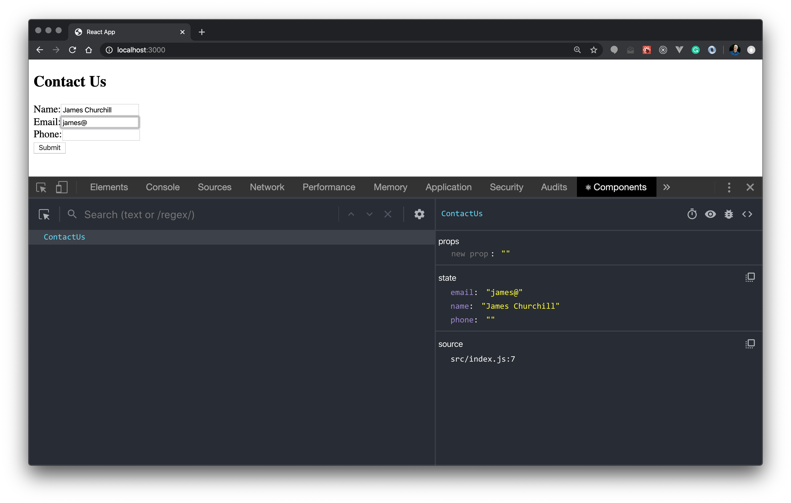

# React Forms - Intro

HTML forms are an essential and ubiquitous part of the web. Forms are used to search, create resources such as accounts and posts, update resources, and more. Learning how to create forms using React is an invaluable skill for you to learn and practice.

When you finish this practice, you should be able to

- Create a React functional component containing a simple form
- Define controlled inputs with the [`useState`] hook for different form inputs

> Upon completion, follow the steps in this [guideline](push-to-github.md) to push your code to GitHub. 


## Clarifications (Read This Once)

- This lab builds a `ContactUs` component. Each checkpoint below includes a complete `src/ContactUs.jsx` so you can compare your work or recover if you get stuck.
- In React, `<label for="name">` becomes `htmlFor="name"` because `for` is a reserved word in JavaScript.
- When you add `value={...}` to an `<input>` without an `onChange`, React makes it **read-only** and shows a console warning.
- `onChange` handlers receive an event object. The current value is usually read from `event.target.value`.
- A `<select>` also uses `value` + `onChange` to become “controlled”, just like an `<input>`.
- A `<textarea>` uses a `value` prop in React (not inner text) when controlled.
- A form submission triggers a page reload by default. Use `event.preventDefault()` in `onSubmit` to keep your SPA from reloading.

---


## Step 0: Setup

Open your terminal and run:

```sh
npx create-vite@latest forms-intro-lab --template react
cd forms-intro-lab
npm install
```

Then start the dev server:

```sh
npm run dev
```

- Recommended clean up the default styles so they do not interfere with the lab:
  - In `src/index.css`, remove the default CSS (you can leave it empty).
  - In `src/App.css`, remove the default CSS (you can leave it empty).

---

## Step 1: Create a simple form

To learn how to create HTML forms in React, you will create a `ContactUs`
functional component that will contain a simple `Contact Us` form. The form will
contain five fields:

- Name  - The name of the user filling out the form
- Email - The user's email
- Phone - The user's phone number
- Phone Type - A `select` list indicating whether the phone number is home,
  work, or mobile
- Comments - A `textarea` field for comments

### Define the `ContactUs` form component

To start, add a functional component named `ContactUs` that renders an HTML form
with `Name`, `Email`, and `Phone` fields:

```jsx
// src/ContactUs.jsx

function ContactUs() {
  return (
    <div>
      <h2>Contact Us</h2>
      <form>
        <div>
          <label htmlFor='name'>Name:</label>
          <input id='name' type='text' />
        </div>
        <div>
          <label htmlFor='email'>Email:</label>
          <input id='email' type='text' />
        </div>
        <div>
          <label htmlFor='phone'>Phone:</label>
          <input id='phone' type='text' />
        </div>
        <button>Submit</button>
      </form>
    </div>
  );
}

export default ContactUs;
```

### Add basic styles (Optional)

If you want the form to look nicer while keeping the React code focused on `useState`, add a CSS file that uses **HTML element selectors**.

Create:

- `src/ContactUs.css`

```css
body {
  font-family: system-ui, -apple-system, Segoe UI, Roboto, Arial, sans-serif;
  margin: 0;
  padding: 24px 0;
  background: #f6f7fb;
  color: #111827;
}

h2 {
  width: min(560px, 92vw);
  margin: 0 auto 12px;
}

form {
  width: min(560px, 92vw);
  margin: 0 auto;
  padding: 20px;
  background: white;
  border: 1px solid #e6e8f0;
  border-radius: 12px;
  box-shadow: 0 6px 18px rgba(0, 0, 0, 0.06);
}

form > div {
  display: grid;
  gap: 8px;
  margin-bottom: 14px;
}

label {
  font-weight: 600;
}

input,
select,
textarea {
  font: inherit;
  padding: 10px 12px;
  border: 1px solid #cfd3e1;
  border-radius: 8px;
  outline: none;
  background: #fff;
}

textarea {
  min-height: 90px;
  resize: vertical;
}

input:focus,
select:focus,
textarea:focus {
  border-color: #6b7cff;
  box-shadow: 0 0 0 3px rgba(107, 124, 255, 0.2);
}

button {
  font: inherit;
  padding: 10px 14px;
  border: none;
  border-radius: 10px;
  background: #6b7cff;
  color: white;
  font-weight: 700;
  cursor: pointer;
}

button:hover {
  background: #5566ff;
}
```

So far, there's nothing particularly interesting about this form. The only thing
that looks different from regular HTML is that the `<label>` element's `for`
attribute is `htmlFor` in React.

---

## Step 2: Render `ContactUs` in App.jsx

Be sure to update your __App.jsx__ to render the `ContactUs` component:

```jsx
// src/App.jsx

import ContactUs from './ContactUs';
import './ContactUs.css';

function App() {
  return <ContactUs />;
}

export default App;
```

Look at the form in your browser. You can fill out the form, but the component
currently doesn't know what the form input values are. To keep track of each of
the input values, you will need to initialize and maintain component state.

---

## Step 3: Add state to the component (`useState`)

To add state to the `ContactUs` component, import `useState` from React.
Initialize three state variables--`name`, `email`, and `phone`--as empty
strings. Then use them to set the `value` attributes on the corresponding form
field `<input>` elements.

For example, here is how you could do this for `Name`:

```jsx
// src/ContactUs.jsx

import { useState } from 'react';

function ContactUs() {
  const [name, setName] = useState('');

  return (
    <div>
      <h2>Contact Us</h2>
      <form>
        <div>
          <label htmlFor='name'>Name:</label>
          <input id='name' type='text' value={name} />
        </div>
        {/* ... */}
```

Go ahead and repeat the process for `Email` and `Phone`.

<details>
<summary>Complete src/ContactUs.jsx (After adding state + value props)</summary>

```jsx
import { useState } from 'react';

function ContactUs() {
  const [name, setName] = useState('');
  const [email, setEmail] = useState('');
  const [phone, setPhone] = useState('');

  return (
    <div>
      <h2>Contact Us</h2>
      <form>
        <div>
          <label htmlFor='name'>Name:</label>
          <input id='name' type='text' value={name} />
        </div>
        <div>
          <label htmlFor='email'>Email:</label>
          <input id='email' type='text' value={email} />
        </div>
        <div>
          <label htmlFor='phone'>Phone:</label>
          <input id='phone' type='text' value={phone} />
        </div>
        <button>Submit</button>
      </form>
    </div>
  );
}

export default ContactUs;
```

</details>

Once you finish, refresh the browser. You will get a warning in your console
saying:

```text
 You provided a `value` prop to a form field without an `onChange` handler. This
 will render a read-only field.
```

Also, if you try typing in any of the fields, they won't update anymore. This is
because the `value` attribute for each input will always be an empty string.

For example, the `value` attribute on the `Name` field is set to the `name`
state variable. The `name` state variable is initialized to an empty string and
is never updated. Accordingly, the `Name` field will always be an empty string.
To fix this, you need to update the `name` state variable whenever the user
types into the field.

---

## Step 4: Add `onChange` handlers (make inputs controlled)

More generally, the associated component state variable needs to be updated
whenever a user changes a form field element value. Adding or removing a
character within an `<input>` element raises the `onChange` event, which makes
it a natural choice for keeping the component state in sync:

```jsx
<input
  id='name'
  type='text'
  onChange={e => setName(e.target.value)}
  value={name}
/>
```

Remember that when an event is raised, the associated event handler method is
called and passed an instance of the `event` object. A reference to the element
that raised the event is available through the `event` object's `target`
property. Using the reference to the form field element, you can retrieve the
current value as the `value` property on the target object.

Use the same approach to add an `onChange` event handler to the `Email` and
`Phone` form fields as well.

<details>
<summary>Complete src/ContactUs.jsx (After adding onChange handlers)</summary>

```jsx
import { useState } from 'react';

function ContactUs() {
  const [name, setName] = useState('');
  const [email, setEmail] = useState('');
  const [phone, setPhone] = useState('');

  return (
    <div>
      <h2>Contact Us</h2>
      <form>
        <div>
          <label htmlFor='name'>Name:</label>
          <input
            id='name'
            type='text'
            onChange={e => setName(e.target.value)}
            value={name}
          />
        </div>
        <div>
          <label htmlFor='email'>Email:</label>
          <input
            id='email'
            type='text'
            onChange={e => setEmail(e.target.value)}
            value={email}
          />
        </div>
        <div>
          <label htmlFor='phone'>Phone:</label>
          <input
            id='phone'
            type='text'
            onChange={e => setPhone(e.target.value)}
            value={phone}
          />
        </div>
        <button>Submit</button>
      </form>
    </div>
  );
}

export default ContactUs;
```

</details>

Open the React DevTools in your browser. You should be able to see the
component's state update as you type within each of the form fields (i.e., the
`<input>` elements). You can `console.log(name)` above your return to see this
change in real time in the console.



---

## Step 5: Add a `select` list (Phone Type)

To maintain symmetry across React form element types, the `<select>` element
also uses a `value` attribute to get and set the element's selected option. To
see this in action, add a `<select>` element to the right of the `<input>`
element for the `Phone` form field. The `<select>` element should allow a user
to specify the type of phone number they're providing:

```jsx
// src/ContactUs.jsx

<div>
  <label htmlFor='phone'>Phone:</label>
  <input
    id='phone'
    name='phone'
    type='text'
    onChange={e => setPhone(e.target.value)}
    value={phone}
  />
  <select
    name='phoneType'
    onChange={e => setPhoneType(e.target.value)}
    value={phoneType}
  >
    <option value='' disabled>
      Select a phone type...
    </option>
    <option>Home</option>
    <option>Work</option>
    <option>Mobile</option>
  </select>
</div>
```

<details>
<summary>Complete src/ContactUs.jsx (After adding select list)</summary>

```jsx
import { useState } from 'react';

function ContactUs() {
  const [name, setName] = useState('');
  const [email, setEmail] = useState('');
  const [phone, setPhone] = useState('');
  const [phoneType, setPhoneType] = useState('');

  return (
    <div>
      <h2>Contact Us</h2>
      <form>
        <div>
          <label htmlFor='name'>Name:</label>
          <input
            id='name'
            type='text'
            onChange={e => setName(e.target.value)}
            value={name}
          />
        </div>
        <div>
          <label htmlFor='email'>Email:</label>
          <input
            id='email'
            type='text'
            onChange={e => setEmail(e.target.value)}
            value={email}
          />
        </div>
        <div>
          <label htmlFor='phone'>Phone:</label>
          <input
            id='phone'
            name='phone'
            type='text'
            onChange={e => setPhone(e.target.value)}
            value={phone}
          />
          <select
            name='phoneType'
            onChange={e => setPhoneType(e.target.value)}
            value={phoneType}
          >
            <option value='' disabled>
              Select a phone type...
            </option>
            <option>Home</option>
            <option>Work</option>
            <option>Mobile</option>
          </select>
        </div>
        <button>Submit</button>
      </form>
    </div>
  );
}

export default ContactUs;
```

</details>

Note that you can leave the first `Select a phone type...` `<option>` element
as an empty value element before rendering the other `<option>` elements.

---

## Step 6: Add a `textarea` (Comments)

In a regular HTML form, the value for a `<textarea>` element is defined by its
inner content:

```html
<textarea>This is the value for the text area element.</textarea>
```

In React JSX, a `<textarea>` element uses a `value` attribute instead of its
inner content to define its value. This allows the `<textarea>` element to be
handled in the same way as `<input>` elements.

To see this in action, add a `comments` state variable and add a "Comments"
field to the form:

```jsx
// src/ContactUs.jsx

<div>
  <label htmlFor='comments'>Comments:</label>
  <textarea
    id='comments'
    name='comments'
    onChange={e => setComments(e.target.value)}
    value={comments}
  />
</div>
```

<details>
<summary>Complete src/ContactUs.jsx (After adding textarea)</summary>

```jsx
import { useState } from 'react';

function ContactUs() {
  const [name, setName] = useState('');
  const [email, setEmail] = useState('');
  const [phone, setPhone] = useState('');
  const [phoneType, setPhoneType] = useState('');
  const [comments, setComments] = useState('');

  return (
    <div>
      <h2>Contact Us</h2>
      <form>
        <div>
          <label htmlFor='name'>Name:</label>
          <input
            id='name'
            type='text'
            onChange={e => setName(e.target.value)}
            value={name}
          />
        </div>
        <div>
          <label htmlFor='email'>Email:</label>
          <input
            id='email'
            type='text'
            onChange={e => setEmail(e.target.value)}
            value={email}
          />
        </div>
        <div>
          <label htmlFor='phone'>Phone:</label>
          <input
            id='phone'
            name='phone'
            type='text'
            onChange={e => setPhone(e.target.value)}
            value={phone}
          />
          <select
            name='phoneType'
            onChange={e => setPhoneType(e.target.value)}
            value={phoneType}
          >
            <option value='' disabled>
              Select a phone type...
            </option>
            <option>Home</option>
            <option>Work</option>
            <option>Mobile</option>
          </select>
        </div>
        <div>
          <label htmlFor='comments'>Comments:</label>
          <textarea
            id='comments'
            name='comments'
            onChange={e => setComments(e.target.value)}
            value={comments}
          />
        </div>
        <button>Submit</button>
      </form>
    </div>
  );
}

export default ContactUs;
```

</details>

---

## Step 7: Handle form submissions (`onSubmit` + `preventDefault`)

Now that the `ContactUs` component is initializing and updating state as form
field values change, it's time to handle form submissions! To start, create an
`onSubmit` function inside the component and attach it to the `onSubmit` event
listener for the form. Within the `onSubmit` event handler prevent the default
behavior so that the page does not reload:

```jsx
function ContactUs() {
  // ...

  const onSubmit = e => {
    // Prevent the default form behavior so the page doesn't reload.
    e.preventDefault();
  };

  return (
    <div>
      <h2>Contact Us</h2>
      <form onSubmit={onSubmit}> {/* <-- Attaching event handler */}
        {/* ... */}
      </form>
    </div>
  );
}
```

<details>
<summary>Complete src/ContactUs.jsx (After adding onSubmit + preventDefault)</summary>

```jsx
import { useState } from 'react';

function ContactUs() {
  const [name, setName] = useState('');
  const [email, setEmail] = useState('');
  const [phone, setPhone] = useState('');
  const [phoneType, setPhoneType] = useState('');
  const [comments, setComments] = useState('');

  const onSubmit = e => {
    e.preventDefault();
  };

  return (
    <div>
      <h2>Contact Us</h2>
      <form onSubmit={onSubmit}>
        <div>
          <label htmlFor='name'>Name:</label>
          <input
            id='name'
            type='text'
            onChange={e => setName(e.target.value)}
            value={name}
          />
        </div>
        <div>
          <label htmlFor='email'>Email:</label>
          <input
            id='email'
            type='text'
            onChange={e => setEmail(e.target.value)}
            value={email}
          />
        </div>
        <div>
          <label htmlFor='phone'>Phone:</label>
          <input
            id='phone'
            name='phone'
            type='text'
            onChange={e => setPhone(e.target.value)}
            value={phone}
          />
          <select
            name='phoneType'
            onChange={e => setPhoneType(e.target.value)}
            value={phoneType}
          >
            <option value='' disabled>
              Select a phone type...
            </option>
            <option>Home</option>
            <option>Work</option>
            <option>Mobile</option>
          </select>
        </div>
        <div>
          <label htmlFor='comments'>Comments:</label>
          <textarea
            id='comments'
            name='comments'
            onChange={e => setComments(e.target.value)}
            value={comments}
          />
        </div>
        <button>Submit</button>
      </form>
    </div>
  );
}

export default ContactUs;
```

</details>

---

## Step 8: Build and log a submission object

Still in `onSubmit`, use the `name`, `email`, `phone`, `comments`, and
`phoneType` values from state to create a new `contactUsInformation` object
literal:

```js
  const onSubmit = e => {
    e.preventDefault();

    // Create a new object for the contact information.
    const contactUsInformation = {
      name,
      email,
      phone,
      phoneType,
      comments,
      submittedOn: new Date()
    };

    console.log(contactUsInformation);
  };
```

<details>
<summary>Complete src/ContactUs.jsx (After building and logging the submission object)</summary>

```jsx
import { useState } from 'react';

function ContactUs() {
  const [name, setName] = useState('');
  const [email, setEmail] = useState('');
  const [phone, setPhone] = useState('');
  const [phoneType, setPhoneType] = useState('');
  const [comments, setComments] = useState('');

  const onSubmit = e => {
    e.preventDefault();

    const contactUsInformation = {
      name,
      email,
      phone,
      phoneType,
      comments,
      submittedOn: new Date()
    };

    console.log(contactUsInformation);
  };

  return (
    <div>
      <h2>Contact Us</h2>
      <form onSubmit={onSubmit}>
        <div>
          <label htmlFor='name'>Name:</label>
          <input
            id='name'
            type='text'
            onChange={e => setName(e.target.value)}
            value={name}
          />
        </div>
        <div>
          <label htmlFor='email'>Email:</label>
          <input
            id='email'
            type='text'
            onChange={e => setEmail(e.target.value)}
            value={email}
          />
        </div>
        <div>
          <label htmlFor='phone'>Phone:</label>
          <input
            id='phone'
            name='phone'
            type='text'
            onChange={e => setPhone(e.target.value)}
            value={phone}
          />
          <select
            name='phoneType'
            onChange={e => setPhoneType(e.target.value)}
            value={phoneType}
          >
            <option value='' disabled>
              Select a phone type...
            </option>
            <option>Home</option>
            <option>Work</option>
            <option>Mobile</option>
          </select>
        </div>
        <div>
          <label htmlFor='comments'>Comments:</label>
          <textarea
            id='comments'
            name='comments'
            onChange={e => setComments(e.target.value)}
            value={comments}
          />
        </div>
        <button>Submit</button>
      </form>
    </div>
  );
}

export default ContactUs;
```

</details>

Notice that an additional property, `submittedOn`, is being added to the
`contactUsInformation` object literal to indicate the date/time that the
information was submitted. Ideally, the `contactUsInformation` object would be
persisted to a database using a RESTful API, but for now, you can just log the
object to the console.

---

## Step 9: Reset the form after submit

Once the form submission has been processed, reset all the state values to empty
strings:

```js
  const onSubmit = e => {
    e.preventDefault();

    const contactUsInformation = {
      name,
      email,
      phone,
      phoneType,
      comments,
      submittedOn: new Date()
    };

    console.log(contactUsInformation);

    // Reset the form state.
    setName('');
    setEmail('');
    setPhone('');
    setPhoneType('');
    setComments('');
  };
```

<details>
<summary>Complete src/ContactUs.jsx (After resetting form state on submit)</summary>

```jsx
import { useState } from 'react';

function ContactUs() {
  const [name, setName] = useState('');
  const [email, setEmail] = useState('');
  const [phone, setPhone] = useState('');
  const [phoneType, setPhoneType] = useState('');
  const [comments, setComments] = useState('');

  const onSubmit = e => {
    e.preventDefault();

    const contactUsInformation = {
      name,
      email,
      phone,
      phoneType,
      comments,
      submittedOn: new Date()
    };

    console.log(contactUsInformation);

    setName('');
    setEmail('');
    setPhone('');
    setPhoneType('');
    setComments('');
  };

  return (
    <div>
      <h2>Contact Us</h2>
      <form onSubmit={onSubmit}>
        <div>
          <label htmlFor='name'>Name:</label>
          <input
            id='name'
            type='text'
            onChange={e => setName(e.target.value)}
            value={name}
          />
        </div>
        <div>
          <label htmlFor='email'>Email:</label>
          <input
            id='email'
            type='text'
            onChange={e => setEmail(e.target.value)}
            value={email}
          />
        </div>
        <div>
          <label htmlFor='phone'>Phone:</label>
          <input
            id='phone'
            name='phone'
            type='text'
            onChange={e => setPhone(e.target.value)}
            value={phone}
          />
          <select
            name='phoneType'
            onChange={e => setPhoneType(e.target.value)}
            value={phoneType}
          >
            <option value='' disabled>
              Select a phone type...
            </option>
            <option>Home</option>
            <option>Work</option>
            <option>Mobile</option>
          </select>
        </div>
        <div>
          <label htmlFor='comments'>Comments:</label>
          <textarea
            id='comments'
            name='comments'
            onChange={e => setComments(e.target.value)}
            value={comments}
          />
        </div>
        <button>Submit</button>
      </form>
    </div>
  );
}

export default ContactUs;
```

</details>

You can now fill out each form field in your browser. When you click `Submit`,
an object containing your `Contact Us` information should appear in the console!
Also, note that the page doesn't reload.

---

## Step 10: Controlled components (concept)

You now have a functioning React form! In creating it, you used what are known
as _controlled components_.

HTML form elements naturally maintain their own state. For example, an `input`
element will track the state of the value that's typed within it (without any
help from libraries like React). But a React component keeps track of its own
internal state. To keep a component's state as the "one source of truth",
`onChange` event handlers are used on form field elements to update the
component's state when a form element's state has changed.

This approach of making the component's state the "one source of truth" is
called _controlled components_. Inputs in a controlled component are called
_controlled inputs_.

To help you understand how this works, here's an overview of the flow:

1. A user types a character within a form `<input>` element.
2. The `<input>` element's `onChange` event is raised.
3. The event handler method associated with the `<input>` element's `onChange`
   event is called.
4. The event handler method updates the form field's value in state.
5. Updating the component's state causes React to re-render the component, i.e.,
   the `render` method is called.
6. The form `<input>` element is rendered with its `value` attribute set to the
   updated value from the state.

While the above steps might **feel** like a lot, in reality, the entire process
happens very quickly. You can test this yourself by playing around with the
`ContactUs` component. Typing within each of the form fields feels completely
natural; you won't notice the difference!


---

> For a review and optional exercises on this topic, you can refer to the following link: [State: A Component's Memory](https://react.dev/learn/state-a-components-memory#challenges).

## Ref

- https://github.com/appacademy/aa34-react-forms-intro
- [Previous activity](./fe-react-activity2-old.md)


[`useState`]: https://react.dev/reference/react/useState
[event handler]: https://react.dev/learn/responding-to-events#adding-event-handlers

