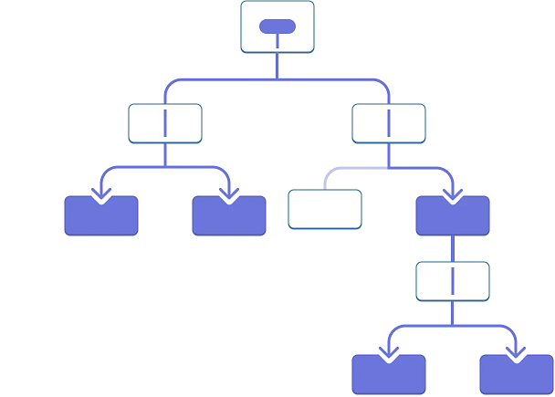

# Understanding `useContext`

In React development, managing state and passing data between components can become cumbersome, especially when deeply nested components need access to the same data. A common issue in such cases is "prop drilling." Let’s explore what prop drilling is, how it can be solved using `useContext`, and provide both simple and more complex examples of how context can enhance a React project.

<!-- Rewrite the 4 steps of using context in React -->
---

### What is Prop Drilling?

Prop drilling happens when you pass props down through several levels of components, even if only a few deeply nested components need the data. This can lead to repetitive, error-prone code and make it harder to maintain or scale an application.

For example, if you need to pass user information from a top-level component (like `App.js`) down to a deeply nested component (like `Profile.js`), you might find yourself passing the user data through several intermediate components that don’t even use it, just so that `Profile.js` can access it. This is what we call "prop drilling."

Here’s an example of prop drilling:

```javascript
function App() {
  const user = { name: 'John' };
  return <Parent user={user} />;
}

function Parent({ user }) {
  return <Child user={user} />;
}

function Child({ user }) {
  return <Profile user={user} />;
}

function Profile({ user }) {
  return <div>Hello, {user.name}</div>;
}
```

In this example, the `user` prop gets passed from `App` to `Parent`, then to `Child`, and finally to `Profile`, even though only `Profile` needs it. As your app grows, prop drilling can lead to cluttered and difficult-to-manage code.

<!-- **Visual Aid**: A diagram showing a component tree with arrows representing props passed from one component to the next, emphasizing the redundant passing of props through intermediate components. -->




### When Prop Drilling Is OK

Before jumping to `useContext`, it’s important to note that prop drilling isn’t always a problem. If you only need to pass data through a shallow component tree (e.g., one or two levels deep), regular prop passing is often simpler and clearer. Overusing context can make it harder to trace where data is coming from, leading to increased complexity.

**Use props when:**
- The component hierarchy is shallow.
- The data being passed is specific to a small part of the app.
- It’s more intuitive to pass data explicitly.

### Solving Prop Drilling with `useContext`

When you need to pass data deeply, React’s `useContext` hook allows you to share state more efficiently by creating a "context." Context lets you provide data to components at any depth in your component tree without explicitly passing props down through every level.


---

### Common Use Cases for Context

1. **Theming**: Manage light/dark mode in your app, as shown in the example below.
2. **Authentication**: Share user authentication data across multiple components.
3. **Global Settings**: Store and share configuration or settings throughout the app.
4. **Language/Localization**: Pass the app's current language or translations to components.
5. **User Preferences**: Persist user settings like layout preferences or notification preferences.

---

### Three Steps to Use `useContext`

Let’s break down the process of using `useContext` to replace prop drilling with context, using the code example below.

#### 1. **Create a Context**

The first step is to create a context that will hold the shared data (in this case, the app’s theme). This context serves as the shared source of truth that any component can subscribe to.

```javascript
// Context/ThemeContext.js
import { createContext } from 'react';

const ThemeContext = createContext('light'); // 'light' is the default value
export default ThemeContext;
```

#### 2. **Provide the Context in a Parent Component**

Next, we need a provider to wrap the components that need access to the shared data. This is done in `ThemeProvider.js`. The `ThemeProvider` component holds the state (the theme) and makes it available to any component within the tree.

```javascript
// Context/ThemeProvider.js
import { useState } from 'react';
import ThemeContext from './ThemeContext';

export default function ThemeProvider({ children }) {
  const [theme, setTheme] = useState('light'); // default theme is 'light'

  const toggleTheme = () => {
    setTheme((prevTheme) => (prevTheme === 'dark' ? 'light' : 'dark'));
  };

  return (
    <ThemeContext.Provider value={{ theme, toggleTheme }}>
      {children}
    </ThemeContext.Provider>
  );
}
```

#### 3. **Consume the Context in Child Components**

Finally, any deeply nested component can access the `theme` and `toggleTheme` values using `useContext`. No need to pass props through intermediate components!

```javascript
// Components/Panel.js
import { useContext } from 'react';
import ThemeContext from '../Context/ThemeContext';

export default function Panel({ title, children }) {
  const { theme } = useContext(ThemeContext); // consuming the theme context
  const className = 'panel-' + theme;

  return (
    <section className={className}>
      <h1>{title}</h1>
      {children}
    </section>
  );
}
```

In this example, `useContext(ThemeContext)` gives access to the theme without needing to pass it explicitly through intermediate components.

---

### Performance Considerations

While `useContext` is powerful, there are performance considerations to keep in mind. When the context value changes, **all** components that consume the context will re-render, even if only one component’s state changed. This can lead to performance issues if many components subscribe to the same context.

Here’s how you can optimize performance:
<!-- 1. **Memoization**: Use `React.memo()` to prevent unnecessary re-renders of components that don’t depend on the context values. -->
**Splitting Context**: If a context holds multiple values, and only one frequently changes, consider splitting the context into multiple smaller contexts so that components only re-render when the specific value they use changes.

**Example**: In a more complex app with both theme and user authentication, you might split the context into separate `ThemeContext` and `AuthContext` to prevent re-renders when the theme changes but authentication data doesn't.

---

### A More Complex Example: Authentication

Let’s extend the context example to handle user authentication. Here, we’ll create an `AuthContext` to provide the current user’s data across the app without passing it through intermediate components.

```javascript
// Context/AuthContext.js
import { createContext } from 'react';

const AuthContext = createContext(null); // No user by default
export default AuthContext;
```

```javascript
// Context/AuthProvider.js
import { useState } from 'react';
import AuthContext from './AuthContext';

export default function AuthProvider({ children }) {
  const [user, setUser] = useState(null);

  const login = (userData) => {
    setUser(userData);
  };

  const logout = () => {
    setUser(null);
  };

  return (
    <AuthContext.Provider value={{ user, login, logout }}>
      {children}
    </AuthContext.Provider>
  );
}
```

Now, any component in the app can consume the `user` value or call the `login` or `logout` functions.

```javascript
// Components/UserProfile.js
import { useContext } from 'react';
import AuthContext from '../Context/AuthContext';

export default function UserProfile() {
  const { user } = useContext(AuthContext);

  if (!user) {
    return <div>Please log in</div>;
  }

  return <div>Hello, {user.name}!</div>;
}
```

This avoids the need to pass user authentication data through intermediate components, improving maintainability and reducing prop drilling.

---

### Error Handling with Context

What happens if a component tries to access context outside a provider? React will use the default value specified in `createContext`. However, this can lead to unexpected behavior if the component expects the context to be non-null.

To handle this gracefully, you can throw an error if a component is trying to access context outside the provider:

```javascript
// useAuth.js (Custom Hook for AuthContext)
import { useContext } from 'react';
import AuthContext from './AuthContext';

export default function useAuth() {
  const context = useContext(AuthContext);

  if (!context) {
    throw new Error('useAuth must be used within an AuthProvider');
  }

  return context;
}
```

This custom hook checks whether the component is within an `AuthProvider` and throws an error if not. It’s a good practice to avoid subtle bugs in larger applications.


---


### Context and the Publish-Subscribe Pattern

React’s Context API functions similarly to the **publish-subscribe pattern**. In this pattern:
- **Publisher**: The `Provider` component serves as the "publisher," holding state and making it available to subscribed components.
- **Subscribers**: Components that call `useContext` are "subscribers," meaning they access the published data and automatically re-render when the provider's state changes.

For example, in a theme switcher:
- **ThemeProvider** is the publisher, managing the current theme and exposing a function to toggle it.
- Any component that uses `useContext(ThemeContext)` subscribes to this data and updates when the theme changes, mimicking the pub-sub model.


---

### Context and CSS Property Inheritance

The way React Context provides values down the component tree mirrors **CSS property inheritance**. In CSS, properties such as `color` set on a parent element are automatically applied to its children unless explicitly overridden.

In React:
- A **Context Provider** passes values to its descendants. These components automatically inherit the context unless a nested provider overrides it, much like how a CSS property like `color` cascades down through child elements.

---

### Recap

- **Context vs. Prop Drilling**: `useContext` helps avoid prop drilling in deep component trees by providing global data without explicitly passing props.
- **Performance**: Beware of unnecessary re-renders when using context. Split contexts and use memoization to optimize performance.
- **Error Handling**: Ensure components are wrapped by their respective providers, and handle errors when accessing context improperly.
- **Complex Use Cases**: For features like authentication, splitting context and using custom hooks can help maintain clean, scalable code.

---
### Key Steps:

In the [React documentation](https://react.dev/learn/passing-data-deeply-with-context), the three steps listed are:

1. **Create a context** using `React.createContext()`.
2. **Use the context** with `useContext()` or `Context.Consumer` in the component that needs it.
3. **Provide the context** by using `Context.Provider`.

Note that the last: step "Provide the context" implies wrapping a parent component with the `Context.Provider`. The documentation groups this into the broader "Provide the context" step rather than splitting it into two separate ones. This simplifies the explanation and focuses more on the logical flow of using context rather than detailing every technical action as a separate step.

However, rember that "wrapping the parent with `Context.Provider`" is a critical part of using context, and it could arguably be considered its own distinct step. The documentation keeps it concise, but breaking it out might help some learners.

So, while React documentation condenses it into three steps for simplicity, you could consider it an additional "4th" step if that helps clarify the process for you.

---

### Links

- [Passing Data Deeply with Context](https://react.dev/learn/passing-data-deeply-with-context)
- [React `useContext` Reference](https://react.dev/reference/react/useContext)
- [Publish–subscribe pattern](https://en.wikipedia.org/wiki/Publish%E2%80%93subscribe_pattern)
- [Scaling Up with Reducer and Context](https://react.dev/learn/scaling-up-with-reducer-and-context)
- [w3schools:usecontext](https://www.w3schools.com/react/react_usecontext.asp)
- [Integration Patterns – Publish/Subscribe (Part2)](https://techtrantor.com/integration-patterns-publishsubscribe_25/)
<!-- - [App Academy React Context Greenhouse Example](https://github.com/appacademy/aa14-react-context-greenhouse/tree/full-time) -->
<!-- - [App Academy React Context Introduction](https://github.com/appacademy/aa34-react-context-intro) -->

<!-- 
---
### Misc.
### Export Components and Hot Module Replacement (HMR) in React

When developing React applications with Vite, how you export components or objects significantly impacts how Hot Module Replacement (HMR) and React Fast Refresh function. HMR allows developers to update modules in real time without reloading the entire page, speeding up the development process. However, incorrect exports can cause HMR issues, affecting Vite's ability to track and refresh components properly.

#### Why Vite Complains with `export { AuthProvider, AuthProvider };`

In JavaScript, it's common to use object shorthand to export multiple components in one line, like:

```javascript
export { AuthContext, AuthProvider };
```

While this works in most cases, Vite's HMR system requires **consistent and unique exports** to correctly identify and track changes. For instance, using:

```javascript
export { AuthProvider, AuthProvider };
```

Although this is valid syntax in JavaScript, you're exporting the same component twice under the same name (`AuthProvider`). This causes confusion for Vite's HMR and React Fast Refresh because they expect distinct named exports. As a result, module updates won't be handled correctly, and HMR might not refresh components as expected.

#### Why Separate Exports Work Better

When you export components or context values separately, like this:

```javascript
export const AuthContext = createContext();
export function AuthProvider(props) {
  // component logic
}
```

It becomes easier for Vite to track each export individually. React Fast Refresh depends on such **explicit named exports** to apply updates without reloading the app. With clear separation, Vite can correctly apply HMR changes only where needed, improving the development experience.

### Key Takeaways for HMR and Exports:
- Exporting components in a single line, like `export { AuthProvider, AuthProvider }`, can confuse Vite's HMR system.
- Using **separate named exports** (e.g., `export const AuthContext`) ensures proper tracking and module updates in React apps.
- To avoid issues, always export components individually when working with Vite and React Fast Refresh.

---

### `Context.Consumer` vs `useContext` in React

React provides two ways to consume context: the `Context.Consumer` component and the `useContext` hook. However, the introduction of hooks in React 16.8 has made `useContext` the preferred method for accessing context, largely replacing the older `Context.Consumer` pattern.

#### 1. **Simplified Syntax**

The biggest advantage of `useContext` over `Context.Consumer` is its cleaner and simpler syntax. With `useContext`, you can access context values directly inside a functional component with a single function call:

```jsx
const { user, login } = useContext(AuthContext);
```

In contrast, `Context.Consumer` requires you to wrap your component's JSX in a render prop function, leading to more verbose code:

```jsx
<AuthContext.Consumer>
  {({ user, login }) => (
    <div>
      {user ? <h1>Welcome, {user.name}!</h1> : <h1>Please log in.</h1>}
      <button onClick={login}>Log In</button>
    </div>
  )}
</AuthContext.Consumer>
```

#### 2. **Improved Readability and Maintainability**

Using `useContext` reduces the nesting of JSX elements, making your code easier to read and maintain. With `Context.Consumer`, every context value requires wrapping JSX inside a function, leading to more complex and deeply nested code, especially when consuming multiple contexts.

#### 3. **Designed for Functional Components**

`useContext` is designed to be used in **functional components**, which are now the standard in React development. In contrast, `Context.Consumer` is part of the class component model and is less intuitive for modern React codebases, which heavily favor hooks and functional components.

#### 4. **Direct Access to State and Flexibility with Other Hooks**

With `useContext`, you can directly access context values as variables, allowing more flexibility, especially when working with other hooks like `useEffect` or `useState`. This flexibility is not as easily achievable with `Context.Consumer`, which follows a more rigid pattern based on render props.

#### 5. **No Additional Performance Overhead**

Both `useContext` and `Context.Consumer` re-render components when context values change. However, `useContext` simplifies this process, fitting better into React's declarative state management without introducing extra performance overhead. Hooks like `useMemo` can further optimize performance when used with `useContext`, something that's harder to achieve with `Context.Consumer`.

#### 6. **Consistency with Other Hooks**

`useContext` integrates seamlessly with other React hooks (`useState`, `useEffect`, `useReducer`), promoting a more consistent code style. Using hooks across your components creates a unified approach to state, context, and side effects management, aligning with modern React development practices.

### When Would You Still Use `Context.Consumer`?

`Context.Consumer` might still be useful in rare cases where you are working with class components, as hooks are not available in that context. However, with React’s move towards functional components and hooks, this use case is becoming increasingly uncommon.

### Advantages of `useContext` Over `Context.Consumer`:
1. **Simpler and less verbose** syntax.
2. **Easier to read and maintain** due to less nesting and cleaner structure.
3. **Better support for functional components**, which are now the standard in React development.
4. **Direct integration with other hooks**, allowing more flexible and dynamic logic.
5. **Consistency with React's hooks paradigm**, leading to more predictable and efficient code.

In summary, `useContext` has become the preferred method for working with context in React due to its simplicity, flexibility, and alignment with modern functional programming patterns. While `Context.Consumer` is still supported, it's rarely used in new projects and has been largely replaced by the more efficient `useContext` hook.
-->
