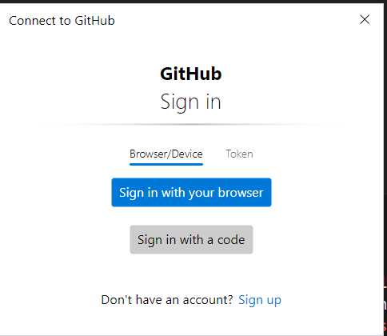
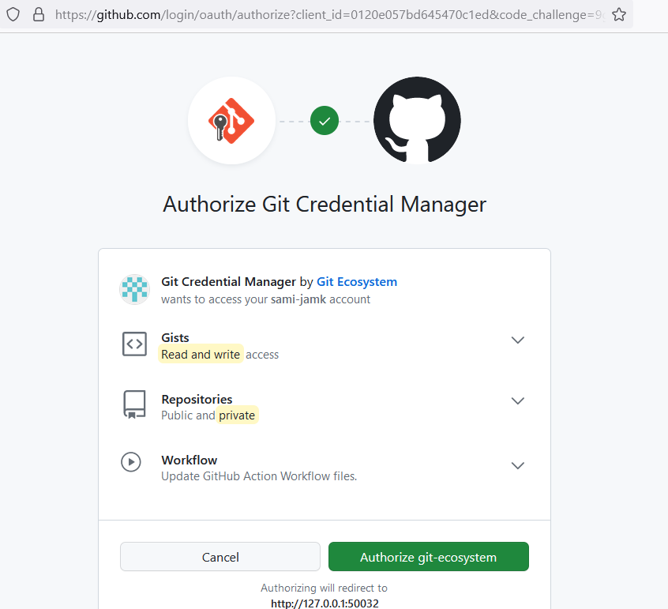
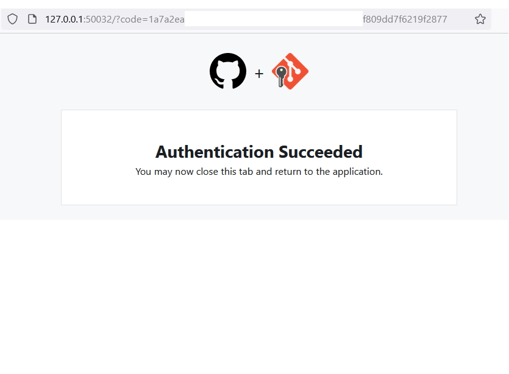

# Activity: Getting Started with Git

In this lab, you'll get hands-on experience with the fundamental Git commands.

**Step 1: Setting Up Your Environment**

> You can skip this step, if you have already configured Git in your machine

Before you can start using Git, you need to install it and configure some basic settings. Follow these steps to get Git up and running on your system.

1. Install Git (*If you have not done this already*)

- Windows: You can easily install `Git` in Windows by using the installer found at [https://git-scm.com/](https://git-scm.com/).

Once you've downloaded one of the "Git for Windows Setup" distributions (either
32-bit or more likely 64-bit) you can launch the installer and accept all the
defaults.

- Mac: Mac comes with some tools by default. Git is one that you want to make sure is up to date so you can run the following in your terminal.

```shell
xcode-select --install
```
   
2. Configure Git

Once you have installed git, configure the information that gets logged for each of your commits by updating the default (global) credentials that git uses. (You could overwrite these credentials temporarily per local repo. While that
shouldn't be necessary, it is helpful to know that it is an option.) You will also want to set the default branch to `main`.

In your terminal, run

```shell
git config --global user.name "Your Name"
git config --global user.email "Your Email"
git config --global init.defaultBranch main
```

Check that your name and email have been set up correctly by using the following commands:

```shell
git config user.name
git config user.email
```

You should see your name and email address returned. Repeat this step if there
are any errors.

<!-- - Show hidden files in MacOS Command (⌘) + Shift + . -->

**Step 2: Initializing a Git Repository**

1. **Create a New Project Directory:**
Open your terminal and navigate to a directory where you want to create your project. Create a new folder for your project using:
```sh
mkdir git-basics-lab
cd git-basics-lab
```


2. **Initialize Git Repository:**
Run the following command to initialize a new Git repository in your project folder:
```sh
git init
```

**Step 3: Making and Committing Changes**

1. **Create Files:**
Create a new file named `README.md` in your project folder. Open the file in a text editor and add some content, e.g. "Welcome to My Git Basics Lab."

2. **Stage Changes:**
Use the following command to stage the changes you've made:
```sh
git add README.md
```

3. **Commit Changes:**
Commit the staged changes with a descriptive message using the following command:
```sh
git commit -m "Initial commit: Added README.md"
```

**Step 6:Push to GitHub**

1. Create a new repository on GitHub:

- Go to the GitHub website .
- Click on the plus sign icon in the top right corner of the page, and then select "New repository."
- Fill in the details for your new repository:
   - Repository name: Choose a name for your new repository.
   - Description (optional): Add a short description to explain the repository's purpose.
   - Visibility: Choose between "Public" or "Private," depending on who should have access.
   - Do not initialize the repository with a `README` file or a `.gitignore` file.
- Click the "Create repository" button to create your new repository.


2. Connect your local repository to the GitHub repository by following the steps provided by GitHub. There are three commands as shown in the screenshot below, in the green block diagram. You'll need to copy and paste the commands into your terminal, one at a time:


3. For your first push to GitHub, the simplest method is through VSCode. Follow the authentication process as demonstrated in the screenshots below:

- Screenshot 1: 


- Screenshot 2: 


- Screenshot 3: 



<!-- 


**Step 4: Basic Git Operations**

1. **View Repository Status:**
Use the following command to see the current status of your repository:
```sh
git status
```

2. **View Commit History:**
View the commit history to see your commit using:
```sh
git log
```

**Step 5: Making and Committing More Changes**

1. **Modify `README.md`:**
Open `README.md` again in a text editor and make some changes to the content.

2. **Stage and Commit Changes:**
Repeat the steps to stage and commit the changes you've made to `README.md`.


 -->
