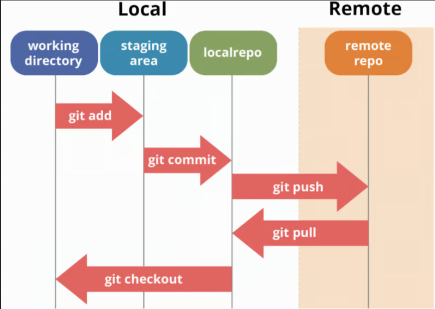

# Theory: Getting Started with Git

> We will go through these commands as we progress through the course. For now we only need: `git init`, `git status`, `git add <file-name>`, `git commit -m <message>` and git push


----

### Introduction to Git

**What is Git?**

Git is a powerful distributed version control system that allows developers to collaborate efficiently on projects of any size. It was created by Linus Torvalds, the developer of the Linux kernel, in 2005 to manage the development of the Linux kernel.

**Understanding Distributed Version Control**

A distributed version control system like Git helps you track changes to files in your project. It allows multiple people to work on the same project simultaneously without overwriting each other’s work.

### Configuring Git

**Setting Up Your Git Username**

You can configure your Git username with the following command:

```bash
git config --global user.name "Your Name"
```

**Setting Up Your Git Email**

To set up the email address associated with your Git commits, use:

```bash
git config --global user.email "your.email@example.com"
```

**Checking Your Git Configuration**

To view your Git configuration, including your username and email, use:

```bash
git config -l
```

- To proceed: Press Enter.
- To cancel: Press q.

### Working with Git

**Initializing a Git Repository**

To start tracking your project with Git, initialize a new Git repository in your project’s root directory:

```bash
git init
```

**Adding Files to the Staging Area**

To add a specific file to the staging area, use:

```bash
git add filename_here
```

**Adding All Files to the Staging Area**

To add all files in your project to the staging area, use:

```bash
git add .
```

**Checking the Status of Your Repository**

To see the status of your repository, including which files are staged, unstaged, or untracked, use:

```bash
git status
```

**Committing Changes with a Message**

To commit your changes with a brief message, use:

```bash
git commit -m "Your commit message here"
```

**Viewing Commit History**

To view the commit history of your repository, use:

```bash
git log
```

### Managing Git Repositories

**Ignoring Files in Git**

To ignore certain files or directories, create a `.gitignore` file in your project’s root directory and list the patterns of files you want to ignore.

**Listing Git Branches**

To list all branches in your repository and see the current branch highlighted, use:

```bash
git branch
```

**Adding a Remote Repository**

To link your local repository to a remote repository, use:

```bash
git remote add origin https://repo_here
```

**Viewing Remote URLs**

To see all remote URLs associated with your local repository, use:

```bash
git remote -v
```

**Renaming the Current Branch to "main"**

To rename the current branch to "main", use:

```bash
git branch -M main
```

**Pushing a New Branch to a Remote Repository**

To push a branch to a remote repository and set it as the upstream branch, use:

```bash
git push -u origin branch_name
```

<details>

<summary>Why the `-u` option?</summary>

The `-u` option in the command `git push -u origin branch_name` stands for `--set-upstream`. When you use this option, it sets the specified remote branch (in this case, `branch_name` on `origin`) as the upstream branch for your local branch. This means that future `git push` and `git pull` commands will automatically use this remote branch as the default, simplifying your workflow.

Here's a breakdown of the command:

- **`git push`**: Pushes your local changes to the remote repository.
- **`-u` or `--set-upstream`**: Sets the upstream branch for the local branch.
- **`origin`**: The name of the remote repository (usually the default name for the main remote repository).
- **`branch_name`**: The name of the branch you are pushing to the remote repository.

By setting the upstream branch, you won't need to specify the remote and branch name in future push or pull commands. For example, after running `git push -u origin branch_name`, you can simply use `git push` or `git pull` without additional arguments, and Git will know which remote branch to use.

</details>

### Git Workflow

The diagram below illustrates the typical workflow of a project using Git and GitHub:



Note that:
- **`git pull`**: This command is used to fetch and download content from a remote repository and immediately update the local repository to match that content. 
- **`git checkout`**: This command lets you navigate between the branches created by git branch. 

------
<details>

<summary>Git Cheat Sheet</summary>


- [Local Repo Commands 1](#local-repo-commands-1)
- [Local Repo Commands 2](#local-repo-commands-2)
- [Local Reset Commands](#local-reset-commands)  
- [Branching Commands](#branching-commands)
- [Remote Commands 1](#remote-commands-1)
- [Remote Commands 2](#remote-commands-2)
- [Links](#links)

----
## Local Repo Commands 1

+ `git init`
  + initiates local Git repository
+ `git status`
  + see current changes from last commit
+ `git log`
  + see list of commits
+ `git stash`
  + stash changes so they do not persist when switching branches
+ `git stash list`
  + gives list of all the changes that you have stashed
+ `git stash apply <stash number>`
  + allows you to apply a stash based on what numbered stash it is.
  + stash number starts at 0 

## Local Repo Commands 2

+ `git add <file-name>`
  + add a single file to the staging area
+ `git add .`
  + add all files from current directory (and all child directories)
+ `git add -A`
  + add all files in the entire working tree
+ `git commit -m <message>`
  + moves updates from staging area to `.git`
  + Start with a verb; imperative mood; _no_ emoji; no ending punctuation
+ `git diff`
  + show what changed from last commit to staged changes

## Local Reset Commands

+ `git reset <filename>`
  + remove a file from staging area
+ `git reset`
  + unstage everything
+ `git reset --hard`
  + wipe out everything back to your last commit (or a specified commit)

## Branching Commands

+ `main`
  + default main branch
+ `git branch`
  + lists branches
+ `git checkout <branch-name>`
  + switch to branch
+ `git checkout -b <branch-name>`
  + create and immediately switch to branch
+ `git branch -d <branch-name>`
  + deletes branch
+ `git merge <branch-name>`
  + merge `<branch-name>` into current branch

### Remote Commands 1

+ `origin`
  + default remote repo
+ `git remote`
  + List Remotes
+ `git remote add <remote> <url>`
  + Adds a remote
+ `git push <remote> <branch-name>`
  + moves updates from `.git` to remote repository
+ `git push -u <remote> <branch-name>`
  + moves updates from `.git` to remote repository, sets upstream branch

---

## Remote Commands 2

+ `git clone <url>`
  + copies the remote repo to your local machine
+ `git fetch`
  + gets updated info from the remote repo
+ `git pull <remote> <branch-name>`
  + gets updates AND merges from remote repository

## Keep your options open

+ `git push --force <remote> <branch>`
  + or `-f` force option, be careful
+ `git push --all`
  + pushes _all_ branches
+ `git push origin <branch name>`

</details>

-----
## Links

- [50 Git Commands You Should Know](https://www.freecodecamp.org/news/git-cheat-sheet/)
- [Git Commands](https://github.com/appacademy/cohort-resources/tree/master/study_guides/git)
- [Git Intro](https://www.atlassian.com/git/tutorials/setting-up-a-repository)
- [Working Tree, Staging Area, and Local Repo](https://medium.com/@lucasmaurer/git-gud-the-working-tree-staging-area-and-local-repo-a1f0f4822018)
- [Staging vs. Committing](https://practicalgit.com/blog/staging-vs-commit.html)
- Git how-to: 
  - [www](https://githowto.com)
  - [src](https://github.com/GitHowTo/githowto-content)
- More on Git later (e.g Branching)
- [visualizing-git](https://git-school.github.io/visualizing-git/)
- [Git Workflow](https://dev.to/mollynem/git-github--workflow-fundamentals-5496)
- [Part 1: Git (Duration **36 min**)](https://www.youtube.com/watch?v=hrTQipWp6co)
- [Part 2: GitHub (Duration **56 min**)](https://www.youtube.com/watch?v=1ibmWyt8hfw)


