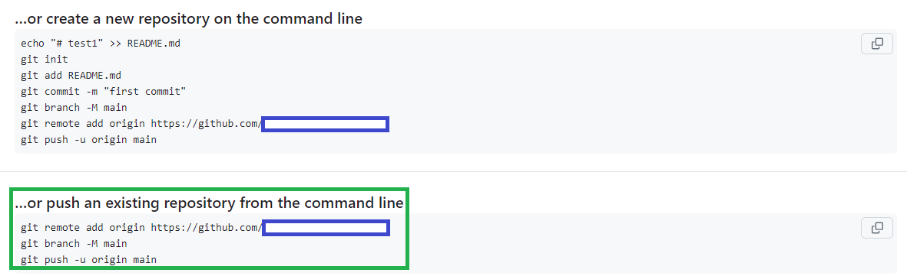

# Activity: npm

> Before starting this activity, ensure you have a folder named "Dev" in your Documents directory. Inside the "Dev" folder, create another folder called "week1" if it doesn't already exist.

----
## Part 1/2: Using a Third-Party Module

In this activity, we'll walk through the process of installing a third-party module (`funct-dates`) using npm and using it in a Node.js project. We'll also initialize a new Node.js project using `npm init -y` for managing dependencies.

#### Step 1: Initialize a Node.js Project

1. Open VSCode within the `week1` directory and launch your terminal.

2. Create a new directory for your project:
   ```bash
   mkdir my-node-project
   cd my-node-project
   ```

3. Initialize a new Node.js project using the `-y` flag to accept all default settings:
   ```bash
   npm init -y
   ```

This will create a `package.json` file with default settings

#### Step 2: Install the Third-Party Module

1. Install the `npm install date-fns` module using npm:
   ```bash
   npm install date-fns
   ```

   This command will download and install the `date-fns` module into the `node_modules` directory of your project and add it as a dependency in your `package.json` file.

#### Step 3: Write Code to Use the Module

1. Create a new JavaScript file named `app.js` in your project directory.

2. Write code to use the `date-fns` module in `app.js`:
   ```javascript
      // Import specific functions from date-fns
   const { format, addDays } = require('date-fns');

   // Get the current date
   const currentDate = new Date();

   // Format the current date
   const formattedDate = format(currentDate, 'MMMM dd, yyyy');
   console.log('Formatted Date:', formattedDate);

   // Add 7 days to the current date
   const futureDate = addDays(currentDate, 7);
   console.log('Future Date:', format(futureDate, 'MMMM dd, yyyy'));
   ```

#### Step 4: Run the Application

1. Run your Node.js application using the following command:
   ```bash
   node app.js
   ```

   This command will execute the `app.js` file and display the formatted date in the console.

2. To install the necessary dependencies, users of your project can run the following command:
   ```bash
   npm install
   ```

   This command will install all dependencies listed in the `package.json` file.


#### Step 5: Additional Steps

1. When sharing your project or deploying it to a production environment, it's recommended to add the `node_modules` directory to your `.gitignore` file to prevent it from being tracked by version control.

   Example `.gitignore` entry:
   ```
   node_modules/
   ```

> You've successfully installed and used a third-party module (`date-fns`) in a Node.js project using npm.

------
## Part 2/2: Git/GitHub

#### Step 1: Local Git Repository

1. Make the project directory a Git repository by running:

```bash
git init
```

2. Make sure that you have the `.gitignore` file and exclude the `node_modules` directory from version control:

```
node_modules/
``` 

3. Stage all the changes:

```bash
git add .
```

4. Commit the changes:

```bash
git commit -m  "Add message here"

```

#### Step 2:  Push to GitHub

1. Create a new repository on GitHub:

- Go to the GitHub website .
- Click on the plus sign icon in the top right corner of the page, and then select "New repository."
- Fill in the details for your new repository:
   - Repository name: Choose a name for your new repository.
   - Description (optional): Add a short description to explain the repository's purpose.
   - Visibility: Choose between "Public" or "Private," depending on who should have access.
   - Do not initialize the repository with a `README` file or a `.gitignore` file.
- Click the "Create repository" button to create your new repository.

2. Connect your local repository to the GitHub repository by following the steps provided by GitHub. There are three commands as shown in the screenshot below, in the green block diagram. You'll need to copy and paste the commands into your terminal, one at a time:


```bash
git remote add origin <GitHub Repository URL>
git branch -M main
git push -u origin main 
```



4. Refresh the GitHub repository page to see your changes.

