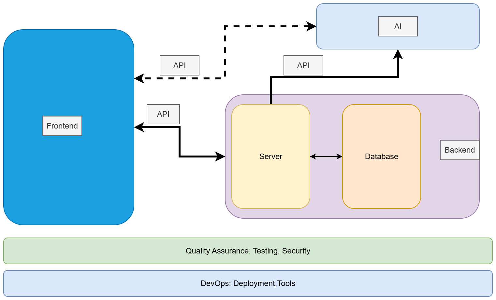

# Project Ideas

> **If you don’t already have a project idea**, you can consider one of the following MERN fullstack + AI‑powered applications.  
> These are **examples to inspire your group** — you may use one as‑is, adapt it, or take it in a completely new direction.

- [Note‑taking Web App](./ideas/note.md)
- [AI‑Powered Blogging Platform](./ideas/blog.md)
- [E‑commerce Store with Admin Dashboard](./ideas/e-commerce.md)
- [URL Shortening API Landing Page](./ideas/url.md)
- [Bookmarks](./ideas/bookmarks.md)
- [E‑Learning Platform](./ideas/e-learning.md)
- [A cloud‑based storage and collaboration](./ideas/fylo.md)
- [ Job Listings with Filtering](./ideas/jobs.md)
- [Additional Brainstorming Ideas](./ideas/other.md)

----

### Block Diagram Fullstack Application

<!-- 
- **AI Job Board & Career Assistant**: Develop a **MERN job board platform** where employers post jobs and seekers apply. Add **LLM API features** like resume/job matching, AI-generated resume improvement suggestions, and an interview-prep chatbot. 
-->