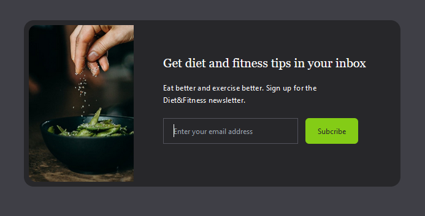

# Tailwind CSS Tutorial Series: A Practical Guide for Beginners

This four-part series will introduce you to Tailwind CSS through hands-on tutorials, step-by-step guides, and links to deepen your understanding. By the end, you’ll be comfortable building and styling responsive, customizable projects with Tailwind.


- Motivation
  - **[My Tailwind Journey (7 min)](https://www.youtube.com/watch?v=5MKw-wOpJR8)**: Discover how Tailwind CSS can simplify your development process and design workflow.
  - **[Why is everyone talking about Tailwind? (5 min)](https://www.youtube.com/watch?v=gtb9OBhra5c)**: A quick overview of why Tailwind is a popular choice among developers.
  - **[Tailwind and the beauty of ugly code](https://www.youtube.com/watch?v=t-eR4hA7obg)**

Here's the final code for reference:

```sh
git clone https://github.com/tx00-resources-en/tailwind-tutorial1
```


---

### Part 0: A very Gentle introduction to Tailwind

This [tutorial](./part0.md) will cover the basics of Tailwind CSS, including the box model, colors, responsive breakpoints, and Emmet shortcuts,

---

### Part 1: Building a Simple Header

In this [tutorial](./part1.md), we’ll build a *Simple Header* using Tailwind.

**Final Project Preview**  


---

### Part 2: Building a Simple Subscription Form

In this tutorial, we’ll build an *email subscription card* using Tailwind. You can follow the [written tutorial](./part2.md) or watch the [video tutorial](https://metropoliafi-my.sharepoint.com/:f:/g/personal/samiben_metropolia_fi/EnB31m4zjXdLjQWvpk1lt8ABKDZMbvkeOlY_jKsLAF_awQ?e=zKIFJ2).

**Final Project Preview**  


---

### Part 3: Landing Page using Tailwind

> Coming up soon!

**Final Project Preview**  


<!-- 
- [Video](https://www.youtube.com/watch?v=dFgzHOX84xQ)
- [src](https://github.com/bradtraversy/tailwind-landing-page)
 -->


<!-- Stay tuned for the next tutorial, where we’ll build a landing page with Tailwind CSS. -->


---
### Links

- CSS Refresher
  - [Flexbox (30min read)](https://internetingishard.netlify.app/html-and-css/flexbox/)
  - [Responsive Design (30min read)](https://internetingishard.netlify.app/html-and-css/responsive-design/)
  - [The Box Model (30min read)](https://internetingishard.netlify.app/html-and-css/css-box-model/)
- Tailwind
  - [Tailwind CSS Cheat Sheet](https://flowbite.com/tools/tailwind-cheat-sheet/)
  - [Tailwind Colors](https://tailwindcolor.com/)
  - [Tailwind colors online tool](https://github.com/ameistad/tailwind-colors) 
  - [Tailwind Starter Kit](https://tailwind-starter-kit.vercel.app/learn): A library of components made with Tailwind CSS to bootstrap your projects
  - [Documentation](https://tailwindcss.com/docs/) 
- VSCode extensions
  - [Tailwind CSS IntelliSense](https://marketplace.visualstudio.com/items?itemName=bradlc.vscode-tailwindcss)
  - [Tailwind Fold](https://marketplace.visualstudio.com/items?itemName=stivo.tailwind-fold)
  - [Tailwind Documentation](https://marketplace.visualstudio.com/items?itemName=alfredbirk.tailwind-documentation)
  - [Tailwind Config ViewerPreview](https://marketplace.visualstudio.com/items?itemName=KalimahApps.tailwind-config-viewer)
- Full Courses (Free for Metropolia's students)
  - [Tailwind CSS From Scratch - Learn by Building Projects](https://metropolia.finna.fi/Record/nelli15.5680000000060713?sid=4846325380)
  - [Book: Tailwind CSS, Ivaylo Gerchev](https://learning.oreilly.com/library/view/tailwind-css)
- [Story: the birth of Tailwind ](https://adamwathan.me/css-utility-classes-and-separation-of-concerns/)


<!-- - [UI Tips](https://www.youtube.com/@KevinPowell/videos) -->
