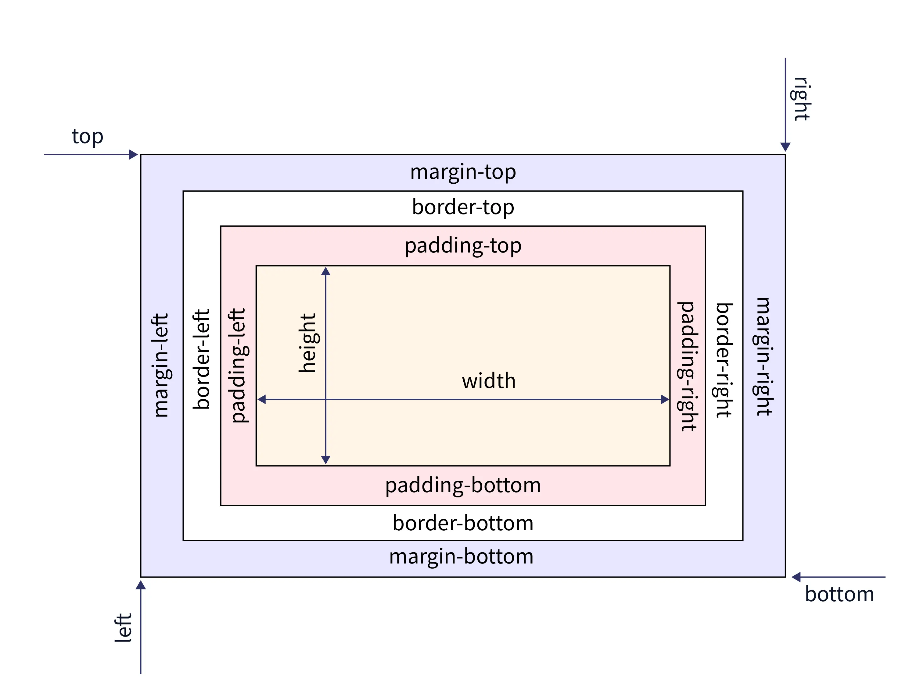

## Getting Started with Tailwind CSS from a CDN

In this tutorial, we’ll explore the basics of Tailwind CSS, its advantages, and the practical steps for using it directly from a CDN. We’ll also cover a sample project to help you dive right in.

---
> 
<details>
<summary>To write HTML structure faster, you can use [Emmet](https://docs.emmet.io/abbreviations/syntax/#id-and-class), a shorthand system for quickly generating HTML and CSS.  </summary>
For example:

```html
p#header.nav
.page
#footer.class1.class2.class3
```

...will expand to:

```html
<p id="header" class="nav"></p>
<div class="page"></div>
<div id="footer" class="class1 class2 class3"></div>
```
</details>

---

### Why Tailwind CSS? Differences from Bootstrap and Vanilla CSS

When choosing a CSS framework or library, developers often compare three main approaches: vanilla CSS, Bootstrap, and Tailwind.

- **Vanilla CSS**: Writing CSS without any framework gives complete control but can be time-consuming and challenging to maintain for complex UIs, especially when styling for responsiveness and theme consistency.
  
- **Bootstrap**: Bootstrap is a popular CSS framework offering ready-made UI components (buttons, navbars, grids, etc.) that are easy to use. However, customizing Bootstrap styles can be challenging if you want to break out of its predefined look.
  
- **Tailwind CSS**: Tailwind takes a unique approach by providing utility-first classes (e.g., `p-4` for padding, `text-center` for alignment) rather than pre-built components. This approach lets developers quickly style any element directly in HTML without needing custom CSS files. 

### Why Developers Love Tailwind

Tailwind’s utility classes make it a favorite among developers, even for those without UI experience:

- **Ease of Use**: Tailwind's classes are simple and descriptive, making it easy for developers to create complex layouts without needing in-depth CSS knowledge.
- **Consistency**: The predefined utility classes make it easy to maintain consistency across different sections of a project.
- **Flexibility**: Developers can mix and match classes to build any design without needing to override predefined component styles, as is common with frameworks like Bootstrap.

### Using Tailwind with Large Language Models (LLMs)

With Tailwind CSS’s descriptive classes, developers can even use large language models (LLMs) to generate HTML/CSS code based on descriptive prompts. For example, a prompt like *"use tailwind css to create a centered card with rounded corners, a heading, and a subscribe button"* can easily be translated into Tailwind classes, streamlining the development process for responsive and attractive UIs.

---

### Getting Started with Tailwind CSS from a CDN

To use Tailwind CSS quickly without setup, you can include it directly via a CDN link in the `<head>` section of your HTML file:

```html
<script src="https://cdn.tailwindcss.com"></script>
```

This approach is perfect for smaller projects, quick prototypes, and when you want to experiment with Tailwind before setting up a full project. Part 3 will dive into using Tailwind with the CLI for custom configurations.

---

### Prerequisites: Understanding the CSS Box Model and Flexbox

Before starting with Tailwind, it’s helpful to understand the **CSS box model** and **Flexbox layout**. Here are some foundational concepts:

- **Padding (`p-*`)**: Padding adds space inside the border of an element, pushing its content inward.
  - Example: `p-4` adds a uniform padding of 1 rem (16px by default) around an element.
  
- **Margin (`m-*`)**: Margin creates space outside the element’s border, separating it from adjacent elements.
  - Example: `m-4` adds a uniform margin of 1 rem (16px) around an element.

- **Flexbox (`flex`, `items-center`, etc.)**: Flexbox is a CSS layout model that helps align items in a container. Tailwind uses `flex`, `items-center`, and `justify-center` to manage layouts effectively.


---

### Step-by-Step Guide to Building an Email Subscription Card with Tailwind CSS

Here's the [source code for this mini project](./html/part2.html) and here’s a breakdown of the HTML/CSS code for building a subscription card using Tailwind from a CDN.

#### 1. Basic HTML Structure

The code below creates an HTML file with Tailwind CDN included and an overall structure for a subscription card.

```html
<!DOCTYPE html>
<html lang="en">
  <head>
    <meta charset="UTF-8" />
    <meta name="viewport" content="width=device-width, initial-scale=1.0" />
    <script src="https://cdn.tailwindcss.com"></script>
    <title>Email Subscribe</title>
  </head>
  <body>
    <div class="flex items-center justify-center h-screen bg-zinc-700">
      <!-- Card structure here -->
    </div>
  </body>
</html>
```

- Background Container

```html
<div class="flex items-center justify-center h-screen bg-zinc-700">
```

This line creates a **full-screen centered container**. The `h-screen` class ensures the container covers the full viewport height, while `bg-zinc-700` sets a dark gray background color. `flex items-center justify-center` centers all content both vertically and horizontally.

colors fo from 100 till 1000. You can review them [here](https://tailwindcolor.com/).

### 3. Card Container

```html
<div class="bg-zinc-800 p-2 mx-6 rounded-2xl">
```

The card container uses `bg-zinc-800` for a slightly darker background. `p-2` adds padding, `mx-6` provides horizontal margins, and `rounded-2xl` applies large rounded corners.

### 4. Flex Container

```html
<div class="flex flex-col md:flex-row rounded-l-xl">
```

This container uses `flex` for a flexible layout. By default, it stacks elements vertically (`flex-col`), but on medium screens and above (`md:flex-row`), it arranges them in a row. The `rounded-l-xl` class rounds only the left corners, useful for a split design.

### 5. Image

```html

```

The image is styled with:
- `object-fit`: Ensures the image scales properly.
- `rounded-xl`: Rounds all corners.
- `h-80`: Sets a fixed height of 80 (20 rem), adapting to medium screens (`md:h-64`).
- `hover:scale-105 hover:rounded-xl duration-200`: On hover, the image slightly scales up (`scale-105`) and applies animation with `duration-200` for smooth transition.

### 6. Content Container

```html
<div class="p-6 md:p-12">
```

The content container provides padding of `p-6` (1.5 rem) on smaller screens and `p-12` (3 rem) on medium and larger screens.

### 7. Title

```html
<h2 class="font-serif text-xl font-medium text-center text-white md:text-left">
  Get diet and fitness tips in your inbox
</h2>
```

The title uses:
- `font-serif`: Sets a serif font style.
- `text-xl font-medium`: Controls font size and weight.
- `text-center text-white`: Centers text on smaller screens, switches to left alignment on medium screens (`md:text-left`).

### 8. Description

```html
<p class="max-w-xs my-4 text-xs leading-5 tracking-wide text-center text-white md:text-left">
  Eat better and exercise better. Sign up for the Diet&Fitness newsletter.
</p>
```

This description uses:
- `max-w-xs`: Limits width for readability.
- `my-4`: Adds vertical margin.
- `text-xs leading-5 tracking-wide`: Controls font size, line height, and letter spacing.

### 9. Email Input and Button

```html
<div class="flex flex-col mt-5 space-y-4 md:space-x-3 md:flex-row md:space-y-0">
  <input type="text" placeholder="Enter your email address" class="p-2 px-4 text-center text-white bg-zinc-800 border border-zinc-600 placeholder:text-xs placeholder:text-center md:text-left focus:outline-none" />
  <button class="px-5 py-3 text-xs rounded-md text-zinc-800 bg-lime-500 hover:bg-lime-700 hover:text-white duration-500">
    Subscribe
  </button>
</div>
```

This section features:
- **Input Field**: Styled with `p-2 px-4` for padding, `text-center` for centered placeholder text, `bg-zinc-800` for background, and `border-zinc-600` for a border.
- **Button**: Styled with `px-5 py-3` padding, `text-xs`, `rounded-md` for rounded corners, `bg-lime-500` for background, and hover effects with a smooth transition.

---

### Conclusion

Using Tailwind CSS via CDN is a quick way to start prototyping with utility-based styling. In our next article, we’ll explore how to set up Tailwind CSS locally, which allows more advanced configurations, like customizing the color palette and building reusable components. Happy coding!